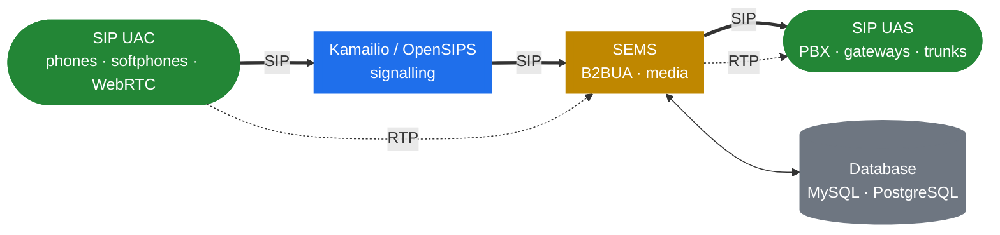

<h1 align="center">SEMS Handbook</h1>

  <em>How SEMS is built on the inside — a bilingual deep-dive into the thread model, the session core, the media pipeline, and the B2BUA machinery that make SEMS behave the way it does.</em>

  
  
  
  
  
  
  

  
  &nbsp;
  

---

> [!IMPORTANT]
> This is **not** a re-telling of the official SEMS documentation. The in-tree `doc/` files, the doxygen output and the readthedocs site already cover installation and per-application configuration. This handbook focuses on what they don't: the **internals**.
>
> If you want to know which threads SEMS starts and what each one does, how an event reaches a session, why there is no shared-memory allocator, how the media processor's tick drives `AmRtpStream`, how `AmB2BMedia` decides between relay and transcode, or what the DSM state engine actually executes — you're in the right place.

> [!NOTE]
> The subject of this handbook is **[sems-server/sems](https://github.com/sems-server/sems)**. The other branches of the family — [sipwise/sems](https://github.com/sipwise/sems), [yeti-switch/sems](https://github.com/yeti-switch/sems), and FRAFOS's commercial line — get a part of their own (Part 12) rather than being blended into the main text.

## Where SEMS sits

A proxy routes signalling and then steps out of the media path. SEMS does the opposite: it terminates signalling as a **B2BUA** and carries the **media** as well. Understanding that inversion is the foundation for everything else in the handbook.

> [!TIP]
> The companion volume — the [Kamailio Handbook](https://github.com/denyspozniak/kamailio-handbook) — covers the signalling side. Kamailio is multi-process, fork-per-worker, driven by a config DSL; SEMS is multi-threaded, event-driven, thread-per-session, driven by plug-ins. Read together, they cover both planes.

## What's inside

<table>
  <thead>
    <tr><th align="left">#</th><th align="left">Part</th><th align="left">What's in it</th></tr>
  </thead>
  <tbody>
    <tr><td>1</td><td><b>Preface</b></td><td>Mental model, the B2BUA-vs-proxy inversion, a SIP/SDP/RTP primer</td></tr>
    <tr><td>2</td><td><b>The Runtime</b></td><td>Thread model · event system · ownership · lifecycle · sizing</td></tr>
    <tr><td>3</td><td><b>The SIP Layer</b></td><td>SEMS' own stack: transport · parser · transactions · dialogs</td></tr>
    <tr><td>4</td><td><b>Session Core</b></td><td><code>AmSession</code> · factories · offer/answer · event handlers</td></tr>
    <tr><td>5</td><td><b>The Media Plane</b></td><td>Media processor · RTP streams · audio pipeline · codecs · DTMF</td></tr>
    <tr><td>6</td><td><b>B2BUA</b></td><td><code>AmB2BSession</code> · <code>AmB2BMedia</code> · the SBC framework</td></tr>
    <tr><td>7</td><td><b>Application Framework</b></td><td>Plug-ins · DSM · IVR and Python · tradeoffs</td></tr>
    <tr><td>8</td><td><b>Control Plane</b></td><td>DI interface · XML-RPC and JSON-RPC · monitoring · app timers</td></tr>
    <tr><td>9</td><td><b>Architectural Tricks</b></td><td>Registrar client · conferencing · voicemail · RTP mux · SIPREC · ZRTP</td></tr>
    <tr><td>10</td><td><b>Security &amp; Hardening</b></td><td>Attack surface · media-plane abuse · blacklists and limits</td></tr>
    <tr><td>11</td><td><b>In Production</b></td><td>SEMS with Kamailio · topologies and HA · a reproducible lab</td></tr>
    <tr><td>12</td><td><b>The SEMS Family</b></td><td>sipwise · yeti-switch · FRAFOS — what differs and why</td></tr>
    <tr><td>13</td><td><b>Where It Could Go</b></td><td>HEP · metrics · streaming to STT/TTS · peer dispatching</td></tr>
    <tr><td>14</td><td><b>Reference</b></td><td>Term map (incl. Kamailio↔SEMS) · what's new in 2.x</td></tr>
  </tbody>
</table>

Full ToC: [English](docs/en/README.md) · [Українська](docs/uk/README.md)

## Conventions

> [!TIP]
> Each chapter lives in **both** `docs/en/` and `docs/uk/` under the same filename. Fix a typo in one tree, please mirror it in the other.

- **Diagrams** use [Mermaid](https://mermaid.js.org/) — renders natively on GitHub and on the docs site.
- **Callouts** (`> [!NOTE]`, `> [!TIP]`, `> [!IMPORTANT]`, `> [!WARNING]`) flag the parts you can't skim past.
- **Code blocks** are language-tagged for syntax highlighting.
- The companion site at [denyspozniak.github.io/sems-handbook](https://denyspozniak.github.io/sems-handbook/) is auto-built from `main` via GitHub Actions (MkDocs Material).

## Sources

| Priority | Source | Used for |
|---|---|---|
| 1 | [github.com/sems-server/sems](https://github.com/sems-server/sems) | Source of truth — the actual implementation in C++ |
| 2 | in-tree `doc/Readme.*.txt`, `doc/doxygen_proj` | Application behaviour, configuration semantics |
| 3 | [sems.readthedocs.io](https://sems.readthedocs.io/) | Narrative documentation, operational know-how |
| 4 | [sipwise/sems](https://github.com/sipwise/sems), [yeti-switch/sems](https://github.com/yeti-switch/sems) | Fork divergence — Part 12 only |

## License

[MIT](LICENSE) — use it, fork it, translate it.
