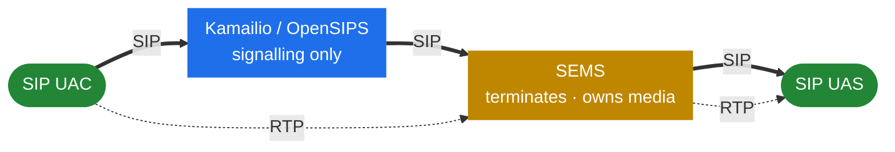

# 1.1 Introduction

> [!IMPORTANT]
> SEMS is **not** a proxy. A proxy forwards a request and then gets out of the way. SEMS
> *terminates* the call — it answers as a user agent, owns the dialog, and usually carries the
> audio too. Almost every wrong assumption people bring to SEMS traces back to expecting
> proxy behaviour from something that is fundamentally an endpoint.

## What SEMS is

The project describes itself plainly in its own `README.md`:

> SEMS is a free, high performance, extensible media server for SIP (RFC3261) based VoIP
> services. It is intended to **complement** proxy/registrar servers in VoIP networks for all
> applications where **server-side processing of audio** is required […] Another use case is
> for interconnecting SIP networks, where a back-to-back user agent (B2BUA) is required.

Two jobs, then. SEMS is a **media server** — it produces, consumes, records and mixes audio —
and it is a **B2BUA** — it sits between two call legs it owns independently. Everything in
this handbook is one of those two jobs, or the machinery that makes them possible.

The word *complement* matters. SEMS was designed to live next to a proxy, not to replace one.
It has no registrar, no user location database, no routing logic worth the name. Hand it a
call and it will do something interesting with the audio; ask it to decide where a call
should go and you are using the wrong tool.

## The plane split



The proxy touches signalling and stays out of the media path. SEMS is on **both** paths: it
answers the SIP dialog and the RTP flows through it. That inversion is the organising idea of
this book — Parts 3–4 cover the signalling half, Parts 5–6 the media half.

## When you need Kamailio, and when you need SEMS

This is the first question everyone asks, so here is the short answer before the long one.

> [!TIP]
> **The rule:** if the call can be routed by rewriting headers and forwarding, you want a
> **proxy**. If something has to *answer* — produce audio, record it, mix it, or bridge two
> legs that must not see each other — you want a **media server**.

| You need to… | Kamailio | SEMS | Why |
|---|:---:|:---:|---|
| Register users, keep user location | ✅ | ❌ | SEMS has no registrar; it is a *client* of one at most (`AmSipRegistration`) |
| Route by number, prefix, LCR, dispatcher | ✅ | ❌ | Routing logic lives in the proxy's config; SEMS has no routing DSL |
| Authenticate subscribers, rate-limit, blocklist | ✅ | ❌ | Proxy sees every request cheaply; SEMS pays for a session per call |
| Handle 10k+ registrations, high CPS forwarding | ✅ | ❌ | Stateless or transaction-stateful forwarding is far cheaper than terminating |
| Play an announcement, ringback, prompt | ❌ | ✅ | Requires answering and generating audio |
| Voicemail, recording, IVR menus | ❌ | ✅ | Requires audio capture, prompts and DTMF collection |
| Conference bridge / mixing | ❌ | ✅ | Requires an N-way mixer on the media path |
| Transcode between codecs | ❌ | ✅ | Requires decoding and re-encoding RTP payloads |
| Hide your topology from the far end | ✅ | ✅ | Kamailio has `topoh` and `topos`; SEMS gets it free by terminating — compared in [11.1](40-with-kamailio.md) |
| Full B2BUA: separate dialogs, timers, headers per leg | ❌ | ✅ | Two independent dialogs is what `AmB2BSession` *is* |
| SBC duties: NAT, media relay, header rewrite, call control | ⚠️ | ✅ | Kamailio needs an external relay for media; SEMS' `sbc` app does both ([6.3](23-sbc.md)–[6.5](23c-sbc-call-control.md)) |
| Relay RTP without touching the codec | ⚠️ | ✅ | Kamailio delegates this to rtpengine; SEMS can do it in-process |

Read the ⚠️ rows as "possible, but with a second component". Kamailio can do media-adjacent
work only by driving an external relay such as rtpengine — the media never flows through
Kamailio itself.

Two rows deserve a word now, because they are where people most often pick the wrong tool.

**Topology hiding.** Kamailio solves it with a module: `topoh` rewrites the dialog-identifying
headers in place so the far end cannot read your internal addressing, and `topos` goes further
by stripping them and keeping the originals in storage. Both keep the proxy's cheap forwarding
path. SEMS needs no module at all — a B2BUA starts a *new* dialog towards the callee, so
nothing from the caller's side is there to leak in the first place. It is free, but it is only
free because you already paid for a full session. The three are compared properly in
[11.1](40-with-kamailio.md).

**SBC duties.** "Be an SBC" is not one feature but a bundle: header rewriting, NAT handling,
media relay, transcoding, call admission, CDRs. Kamailio does the signalling half natively and
delegates the media half to rtpengine. SEMS' `sbc` application does the whole bundle in one
process — it is the largest application in the tree at roughly 14 000 lines, and it is built as
a *configurable framework* rather than a fixed program. Part 6 takes it apart across three
chapters: [architecture](23-sbc.md), [call profiles](23b-sbc-profiles.md) and
[call control modules](23c-sbc-call-control.md).

### The answer is usually "both"

In any production network of interesting size, the two sit together: the proxy owns
registration, authentication, routing and the high-CPS path, and hands the small subset of
calls that need audio work to SEMS. The in-tree `doc/Howtostart_simpleproxy.txt` shows exactly
this handoff, using Kamailio to tag the call with an application name and forward it:

```text
route[SERVICES] {
     if ($rU=~"^300.*") {
             remove_hf("P-App-Name");
             append_hf("P-App-Name: conference\r\n");
             $ru = "sip:" + $rU + "@" + "127.0.0.1:5070";
             route(RELAY);
             exit;
     }
}
```

The proxy decided *which* application; SEMS decides what the audio does. That header is how
the request reaches a session factory — the mechanism is in [4.2](13-session-container-and-factories.md),
and the deployment shapes are in [11.1](40-with-kamailio.md).

> [!NOTE]
> SEMS can also run with no proxy at all. `doc/Howtostart_noproxy.txt` describes registering
> SEMS to a public SIP service like any softphone would, which is enough to try a service out
> — but not enough for anything that needs subscriber data, since there is none.

## SEMS is threads, not processes

If you arrive from Kamailio, this is the single largest adjustment. Kamailio forks a pool of
worker processes at startup and shares state through a shared-memory allocator. SEMS does
neither. It is **one process, many threads**, and state lives on the ordinary C++ heap.

The startup sequence in `core/sems.cpp` is a list of thread pools coming up:

```cpp
  INFO("Starting application timer scheduler\n");
  AmAppTimer::instance()->start();

  INFO("Starting session container\n");
  AmSessionContainer::instance()->start();

#ifdef SESSION_THREADPOOL
  INFO("Starting session processor threads\n");
  AmSessionProcessor::addThreads(AmConfig::SessionProcessorThreads);
#endif

  INFO("Starting media processor\n");
  AmMediaProcessor::instance()->init();

  INFO("Starting RTP receiver\n");
  AmRtpReceiver::instance()->start();

  INFO("Starting SIP stack (control interface)\n");
  if(sip_ctrl.load()) {
    goto error;
  }

  INFO("Loading plug-ins\n");
  AmPlugIn::instance()->init();
```

Practical consequences, each expanded later in the book:

- **Debugging is `gdb thread apply all bt`, not `ps -ef`.** There is one PID. Attaching to it
  gets you everything ([2.1](02-thread-model.md)).
- **There is no `shm` versus `pkg` distinction** — and no cross-process state at all. Scaling
  is by adding *instances*, not workers, and two instances share nothing ([2.3](04-memory-and-ownership.md),
  [11.2](41-topologies-and-ha.md)).
- **A crash takes the whole server down.** Kamailio can lose one worker and keep serving; SEMS
  cannot. This raises the stakes on plug-in quality ([7.4](27-app-tradeoffs.md)).
- **Work is dispatched as events into per-session queues**, not by a worker picking up the next
  packet ([2.2](03-event-system.md)).

## What SEMS is capable of

The README reports the project's own benchmark figures: roughly 1200 G.711 conference channels
on a quad-core 2 GHz Xeon (700 with GSM, 280 with iLBC), up to 5000 channels on a dual quad-core
2.9 GHz machine, and the B2BUA sustaining around 19 000 transactions per second on the same
hardware. Treat these as order-of-magnitude guidance rather than a promise — the numbers are
old and codec choice dominates them, which is exactly the point. Sizing is
[2.5](06-sizing-and-tuning.md).

## What this handbook is not

There is no installation walkthrough here, no per-application configuration reference, no
option tables. The in-tree `doc/Readme.*.txt` files and the doxygen output already do that job
and do it better, because they ship with the code. This book answers the questions those files
do not: *why is it built this way, and what happens when it is under load or under attack.*

## How to read it

Parts 2 through 6 are the spine and are meant to be read in order — the runtime explains the
SIP layer, which explains the session core, which explains the media plane and the B2BUA.
Parts 7 through 10 are largely independent and can be read as needed. Part 11 is deployment,
Part 12 covers the other branches of the SEMS family, and Part 13 is reference material —
including a [Kamailio↔SEMS term map](47-term-map.md) worth skimming early if you are coming
from the proxy side.

> [!NOTE]
> The subject throughout is [sems-server/sems](https://github.com/sems-server/sems) at
> `VERSION` 2.1.0. It is dual-licensed — GPL v2+ or a proprietary license from FRAFOS GmbH,
> per the project's `README.md`. That licensing arrangement is not an accident of history; it
> is explained in [12.4](46-frafos-and-the-sbc.md).
