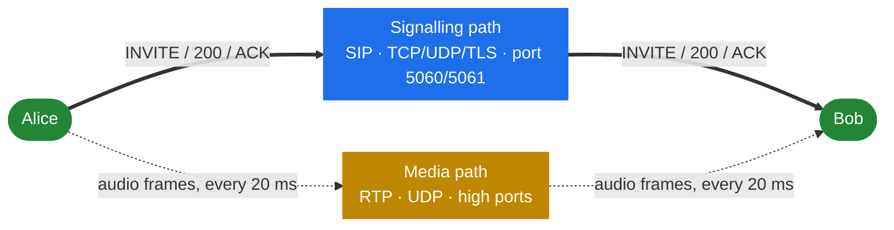
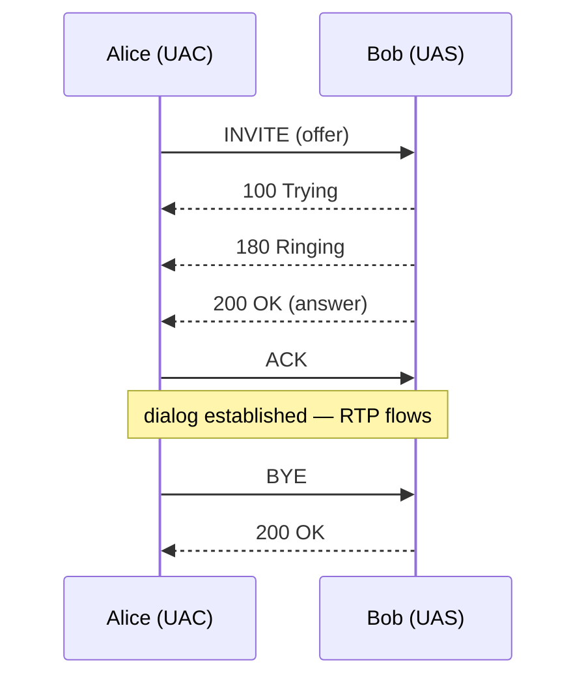

# 1.2 SIP and media — a primer

> [!NOTE]
> This chapter exists so the rest of the book can assume a shared vocabulary. If you already
> know the difference between a transaction and a dialog, and can explain why an offer can
> arrive in an ACK, skip it — nothing here is SEMS-specific.

## Two protocols, two paths

A SIP call is two loosely-coupled conversations running at once.

**Signalling** is SIP: text messages that set up, modify and tear down the call. It answers
*who is calling whom, and on what terms*.

**Media** is RTP: a continuous stream of small packets carrying encoded audio. It answers
*what does it sound like*.

They travel independently. They may take different routes, cross different networks, and fail
independently — a call that is "up" according to SIP but silent is the single most common
production complaint in VoIP, and it exists precisely because these two paths are separate.



## Requests, responses, transactions, dialogs

A **request** is a method plus headers plus an optional body: `INVITE`, `ACK`, `BYE`, `CANCEL`,
`REGISTER`, `OPTIONS`, `INFO`, `UPDATE`, `PRACK`, `REFER`, `SUBSCRIBE`, `NOTIFY`. A **response**
is a three-digit code in one of six classes:

| Class | Meaning | Notable examples |
|---|---|---|
| 1xx | Provisional — still working | `100 Trying`, `180 Ringing`, `183 Session Progress` |
| 2xx | Success | `200 OK` |
| 3xx | Redirect | `302 Moved Temporarily` |
| 4xx | Client error | `404 Not Found`, `407 Proxy Authentication Required`, `486 Busy Here` |
| 5xx | Server error | `500 Server Internal Error`, `503 Service Unavailable` |
| 6xx | Global failure | `603 Decline` |

A **transaction** is one request plus all its responses. It is short-lived — seconds — and it
is the unit that retransmission and timeouts operate on. SEMS implements transactions in
`core/sip/trans_layer.cpp` and stores them in `core/sip/trans_table.cpp`; timers are driven by
a wheel timer ([3.4](10-transaction-layer.md)).

A **dialog** is the longer-lived relationship between two user agents, created by a successful
`INVITE` and destroyed by a `BYE`. It is identified by the triple **Call-ID + From tag + To
tag**, and it carries the state that must survive across transactions: the CSeq counters, the
route set, the remote target. SEMS implements it in `core/AmSipDialog.cpp`
([3.5](11-dialog-layer.md)).



One dialog above; three transactions inside it — the INVITE transaction (which ends at the
ACK), and the BYE transaction. `ACK` for a 2xx is special: it is a transaction of its own, not
part of the INVITE transaction. That quirk causes real bugs and is why the code treats it
separately.

> [!TIP]
> Kamailio readers: a proxy can be *stateless* and forget everything between messages. A media
> server cannot — it must be an endpoint, so it always holds dialog state. This is why "SEMS
> costs more per call" is structural rather than an implementation detail.

## SDP and the offer/answer model

The media path has to be negotiated over the signalling path, and SDP (RFC 4566) is the
description language used to do it. A typical body:

```text
v=0
o=sems 1234 1234 IN IP4 192.0.2.10
s=session
c=IN IP4 192.0.2.10
t=0 0
m=audio 34567 RTP/AVP 8 0 101
a=rtpmap:8 PCMA/8000
a=rtpmap:0 PCMU/8000
a=rtpmap:101 telephone-event/8000
a=sendrecv
```

Read it as: *send me audio at `192.0.2.10:34567`; I understand G.711 A-law, G.711 µ-law and
RFC 2833 tones, in that order of preference; and I intend to both send and receive.*

The negotiation itself is **offer/answer** (RFC 3264), and it is a state machine, not a single
exchange:

- One side sends an **offer** listing what it supports.
- The other replies with an **answer** — a subset it accepts, plus its own address and port.
- Either side can start a new offer/answer later to change the call: put it on hold
  (`a=sendonly`), add a codec, move the media address, re-invite after a transfer.

The two legal placements of the first offer are what trip people up:

| Pattern | Offer in | Answer in |
|---|---|---|
| Normal | `INVITE` | `200 OK` |
| Late offer | `200 OK` | `ACK` |

Both are valid, both occur in the wild, and a B2BUA has to cope with either arriving on either
leg — including the case where the two legs disagree about which pattern they are using. SEMS
concentrates this in one place, `core/AmOfferAnswer.cpp` ([4.3](14-offer-answer.md)).

> [!WARNING]
> A codec appearing in an SDP means only "I can decode this". It says nothing about whether
> the other end will actually send it, or whether a middlebox will pass it. Negotiation
> narrows the possibilities; it does not guarantee audio.

## RTP, RTCP and the 20 ms tick

RTP (RFC 3550) carries the media. Each packet has a small header — payload type, sequence
number, timestamp, SSRC — followed by one frame of encoded audio. For the common case of
G.711 at 8 kHz, a packet every **20 ms** carries 160 samples, which is 160 bytes of payload.

Three consequences that shape the whole media plane:

- **Fifty packets per second, per direction, per call.** A thousand calls is 100 000 packets a
  second through one process. This is why the media path is built around a fixed tick rather
  than per-packet work ([5.1](16-media-processor.md)).
- **UDP loses and reorders packets.** The sequence number lets a receiver detect it; the
  timestamp lets it place audio correctly in time. Smoothing this out is the jitter buffer's
  job ([5.5](20-dtmf-and-jitter.md)).
- **Ports are allocated per stream, from a configured range.** How that range is sized and
  defended is [5.2](17-rtp-stream.md) and [10.2](38-security-media.md).

**RTCP** rides alongside on the adjacent port and carries quality reports — loss, jitter,
round-trip estimates. It is the only in-band signal you get about how the audio is actually
doing.

**DTMF** — the digits a caller presses — can arrive three different ways: as RFC 2833 events in
the RTP stream (the usual case, payload type 101 above), as inband tones mixed into the audio,
or as SIP `INFO` requests on the signalling path. A media server has to handle all three
because it cannot choose what the far end does ([5.5](20-dtmf-and-jitter.md)).

## Proxy, B2BUA, media server

Three roles, easily confused, distinguished by how much of the call each one owns:

| Role | Dialogs | On media path | Example |
|---|---|---|---|
| **Proxy** | zero — it forwards other people's | no | Kamailio, OpenSIPS |
| **B2BUA** | two — one per leg, independent | optionally | SEMS `sbc`, SEMS `ann_b2b` |
| **Media server** | one per leg it answers | yes, always | SEMS `conference`, `voicemail` |

A proxy may rewrite headers, but the dialog belongs to the endpoints. A **B2BUA** answers the
caller as a user agent and separately places a call to the callee as a user agent; the two
dialogs are independent, so it can apply different timers, different codecs and different
headers to each, and neither side learns anything about the other. A **media server** answers
and produces or consumes audio itself.

SEMS is the second and third of these, and never the first. Parts 4 through 6 are essentially
the story of how it implements them.

## Terms used throughout this book

| Term | Meaning here |
|---|---|
| **UAC / UAS** | The client (request-sending) and server (request-answering) roles. A B2BUA is both at once |
| **Leg** | One dialog of a B2BUA pair. "A leg" faces the caller, "B leg" the callee |
| **Offer / answer** | The SDP exchange that establishes the media path (RFC 3264) |
| **Early media** | Audio flowing before the call is answered, alongside a `183 Session Progress` |
| **Session** | In SEMS specifically: the `AmSession` object plus its thread and event queue ([4.1](12-amsession.md)) |
| **Relay** | Forwarding RTP without decoding it. Cheap, and the default in `sbc` ([9.4](34-rtp-mux-and-relay.md)) |
| **Transcoding** | Decoding and re-encoding audio to bridge two codecs. Expensive ([5.4](19-codecs-and-plugins.md)) |

A fuller list, including the Kamailio↔SEMS translations, is in [13.1](47-term-map.md).
