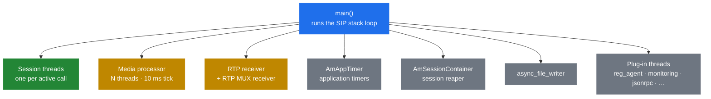

# 2.1 Thread model

> [!IMPORTANT]
> SEMS is **one process with many threads**. Every "SEMS is doing X" statement really means
> "some specific thread inside the single SEMS process is doing X". If you come from Kamailio,
> invert everything you know: there is one PID, no `fork()` of workers, and no shared-memory
> allocator, because there is nothing to share memory *between*.

## What you see when it's running

`ps -ef | grep sems` shows **one** process. That is the whole story at the OS level, and it is
why the Kamailio habit of counting processes tells you nothing here. To see what is actually
running you need the thread list:

```bash
ps -L -p "$(pgrep -x sems)" -o tid,pcpu,comm
# or, from a debugger:
gdb -p "$(pgrep -x sems)" -batch -ex 'thread apply all bt'
```

A healthy server has something like this inside it:



| Thread | Started in | What it does |
|---|---|---|
| `main()` | — | After startup it *becomes* the SIP stack: `sip_ctrl.run()` never returns until shutdown |
| Session threads | `AmSession::start()` | One per active call by default. Runs the application logic |
| Media processor | `AmMediaProcessor::init()` | Fixed 10 ms tick; pulls and pushes audio for every media session |
| RTP receiver | `AmRtpReceiver::start()` | Reads RTP sockets and hands packets to the owning stream |
| `AmAppTimer` | `AmAppTimer::start()` | Fires application timers into session queues |
| `AmSessionContainer` | `AmSessionContainer::start()` | Reaps finished sessions; see [2.3](04-memory-and-ownership.md) |
| `async_file_writer` | in `main()` | Off-thread disk writes so a session never blocks on I/O |
| Plug-in threads | `AmPlugIn::load()` | Whatever the loaded modules start themselves |

## Thread-per-session is the default

This surprises people, so it is worth being exact. `AmSession` derives from `AmThread`, and
`AmSession::run()` is an ordinary thread body:

```cpp
void AmSession::run() {
  ...
  if (!startup())
    return;

  while (...) {
    if (!processingCycle())
      break;
  }
  ...
}
```

There *is* a pooled alternative — `AmSessionProcessor`, which multiplexes many sessions onto a
fixed set of `AmSessionProcessorThread`s — but it is compiled out. In `CMakeLists.txt`:

```cmake
# ADD_DEFINITIONS(-DSESSION_THREADPOOL)
```

> [!WARNING]
> Everything guarded by `#ifdef SESSION_THREADPOOL` — including the whole of
> `AmSessionProcessor.h` and the `session_processor_threads` configuration knob — is **inactive
> in a stock build**. Reading that code and assuming it runs is a common and expensive mistake.
> If you need the pooled model, you are rebuilding SEMS, not reconfiguring it.

So in the default build: **one call, one thread, one stack.** The upside is that application
code can be written straight-line — block, wait, sleep — without starving anyone else. The
downside is a real OS thread (and its stack) per call, which is what caps concurrency long
before CPU does. Sizing is [2.5](06-sizing-and-tuning.md).

### The two models side by side

| | Thread-per-session (default) | `SESSION_THREADPOOL` (compile-time) |
|---|---|---|
| Threads | One per active call | `session_processor_threads`, fixed |
| Blocking in app code | Costs one thread | Stalls every session on that thread |
| Memory per call | One thread stack | Shared |
| Ceiling | Thread count / RAM | CPU |
| Debug | One thread per call, readable backtraces | Interleaved, harder to read |

## The concurrency primitives

`core/AmThread.h` is a thin, deliberately small wrapper over pthreads. Four things, and
essentially nothing else:

- **`AmMutex`** — `pthread_mutex_t`, optionally recursive.
- **`AmLock`** — RAII scope guard. Locks on construction, unlocks on destruction. This is what
  you should be using; a bare `lock()`/`unlock()` pair around code that can `return` or throw
  is how deadlocks get written.
- **`AmSharedVar<T>`** — a value plus its own mutex, with `get()`/`set()`. Also exposes
  `lock()`, `unlock()`, `unsafe_get()`, `unsafe_set()` for read-modify-write sequences that
  must be atomic as a whole.
- **`AmCondition<T>`** — a condition variable married to a value, with `set()`, `get()` and
  `wait_for()`. `set()` broadcasts when the value is truthy. This is the wakeup mechanism used
  throughout: workers block in `wait_for()` and someone else flips the flag.

```cpp
void set(const T& newval)
{
  pthread_mutex_lock(&m);
  t = newval;
  if(t)
    pthread_cond_broadcast(&cond);
  pthread_mutex_unlock(&m);
}
```

Note `broadcast`, not `signal` — every waiter wakes. That is fine for the small waiter counts
SEMS uses it with, and it avoids a class of lost-wakeup bugs.

There is no lock-free machinery beyond the atomics in `core/atomic_types.h`, which exist mainly
to serve reference counting ([2.3](04-memory-and-ownership.md)).

## What this changes in practice

**Debugging.** There is one PID. `gdb -p` attaches to everything at once, and
`thread apply all bt` is the single most useful command in a SEMS incident. Kamailio's
"which worker got this call" question does not exist; the equivalent is "which thread holds
this session", and the session's local tag is how you find it.

**Blast radius.** A segfault in any thread kills the process, and with it every call on the
box. Kamailio survives losing one worker; SEMS does not. This raises the bar for plug-in code
sharply, and it is the main argument in [7.4](27-app-tradeoffs.md) for keeping risky logic out
of C++ modules.

**No shared memory, and no cross-process anything.** There is no `shm_malloc`, no `pkg_malloc`,
no memory dump command, because there is a single ordinary heap. Two SEMS instances share
nothing at all — which decides how the thing scales ([11.2](41-topologies-and-ha.md)).

**Locking is your problem.** Sessions mostly avoid contention by owning their state and
communicating through events ([2.2](03-event-system.md)) rather than shared structures. When a
plug-in reaches across sessions, it takes locks, and it can deadlock the whole server. The
event system exists largely to make that unnecessary.
