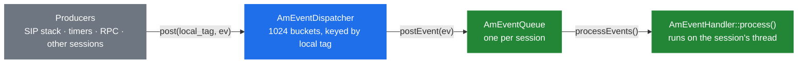
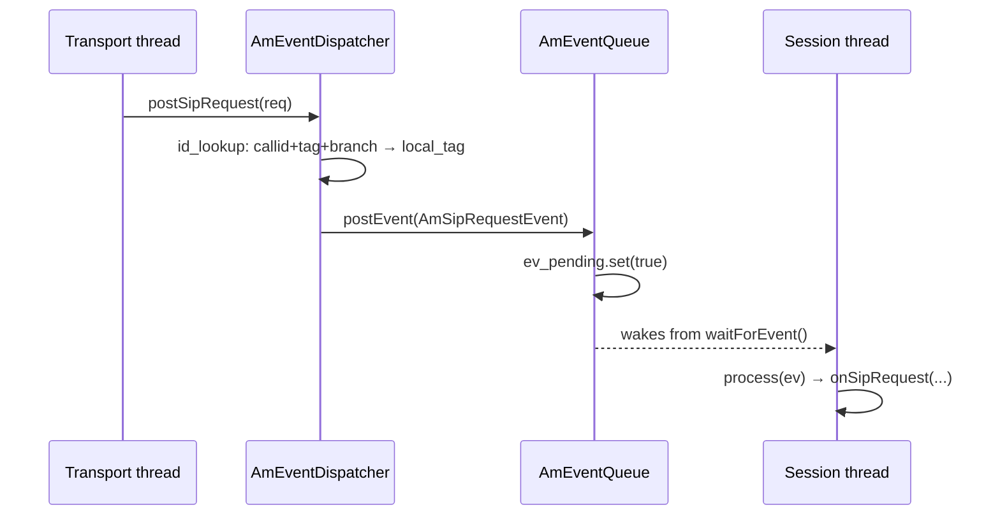

# 2.2 The event system

> [!IMPORTANT]
> Threads are how SEMS *runs*; events are how it *communicates*. Nothing reaches a session by
> calling a method on it from another thread. It arrives as an `AmEvent` posted into that
> session's queue and is processed on the session's own thread. Getting this wrong — reaching
> into another session's state directly — is the most common way to introduce a race into SEMS.

## The four pieces



| Piece | File | Role |
|---|---|---|
| `AmEvent` | `AmEvent.h` | The message. A tag (`event_id`) plus whatever the subclass adds |
| `AmEventQueue` | `AmEventQueue.h` | A mailbox: a `std::queue`, a mutex, a condition variable |
| `AmEventDispatcher` | `AmEventDispatcher.h` | The address book: local tag → queue |
| `AmEventHandler` | `AmEvent.h` | The consumer interface — one method, `process(AmEvent*)` |

## The event itself

`AmEvent` is deliberately minimal:

```cpp
struct AmEvent
{
  int event_id;
  bool processed;
  AmEvent(int event_id);
  virtual ~AmEvent();
  virtual AmEvent* clone();
};
```

`event_id` is a plain integer with a handful of reserved ranges declared right above it:

```cpp
#define E_PLUGIN           100
#define E_SYSTEM           101
#define E_SIP_SUBSCRIPTION 102
#define E_B2B_APP          103
#define E_IVR              104
```

The `processed` flag lets a handler chain mark an event as consumed so later handlers skip it —
the same idea as the session event handler chain in [4.4](15-session-event-handlers.md).
`clone()` exists because `broadcast()` must hand a *separate* object to every queue; one event
object cannot be owned by two consumers.

Two subclasses matter immediately:

- **`AmPluginEvent`** — a `string name` plus an `AmArg data`. This is the generic
  "something happened, here is a bag of values" event, and it is how modules talk to sessions
  without a shared header. `AmTimeoutEvent` is an `AmPluginEvent` named `timer_timeout`.
- **`AmSystemEvent`** — `ServerShutdown`, `User1`, `User2`. Broadcast to every session; this is
  how a graceful shutdown asks calls to end ([2.4](05-lifecycle.md)).

## The queue

```cpp
class AmEventQueue
  : public AmEventQueueInterface,
    public atomic_ref_cnt
{
protected:
  AmEventHandler*           handler;
  AmEventNotificationSink*  wakeup_handler;
  std::queue<AmEvent*>      ev_queue;
  AmMutex                   m_queue;
  AmCondition<bool>         ev_pending;
  bool finalized;
public:
  void postEvent(AmEvent*);
  void processEvents();
  void waitForEvent();
  ...
};
```

Three things worth noticing.

**It is reference counted.** `AmEventQueue` derives from `atomic_ref_cnt`, so a producer can
hold a queue alive while posting even as the session decides to end
([2.3](04-memory-and-ownership.md)). Without this, "post to a session that just finished" would
be a use-after-free rather than a no-op.

**It has two wakeup paths.** `waitForEvent()` blocks the *owning* thread on `ev_pending` — the
thread-per-session model. Alternatively a `AmEventNotificationSink` can be installed, and then
`postEvent()` calls `notify(this)` so an external worker knows this queue has work — the pooled
model. The same queue class serves both.

**`finalize()` is one-way.** Once finalized, the queue is done; the reaper is free to collect
it. `is_finalized()` is the flag the session container checks.

## The dispatcher

`AmEventDispatcher` is the singleton that turns an identifier into a queue. It is a **sharded
hash map**:

```cpp
#define EVENT_DISPATCHER_POWER   10
#define EVENT_DISPATCHER_BUCKETS (1<<EVENT_DISPATCHER_POWER)

EvQueueMap queues[EVENT_DISPATCHER_BUCKETS];
AmMutex    queues_mut[EVENT_DISPATCHER_BUCKETS];
Dictionnary id_lookup[EVENT_DISPATCHER_BUCKETS];
AmMutex     id_lookup_mut[EVENT_DISPATCHER_BUCKETS];
```

1024 buckets, each with **its own mutex**. Posting to a session locks exactly one bucket, so
1024 concurrent posts to different sessions do not contend. This is the single most important
scalability decision in the event system, and it is why a global lock never shows up in
profiles here.

There are two indexes, not one:

- `queues[]` maps **local tag → queue**. The local tag is the session's own `From`/`To` tag, so
  anything holding it can post directly.
- `id_lookup[]` maps **Call-ID + remote tag + via branch → local tag**. This is the path used
  when a SIP message arrives and the only identity available is what the far end put in the
  headers.

Hence the two `post()` overloads:

```cpp
bool post(const string& local_tag, AmEvent* ev);
bool post(const string& callid,
          const string& remote_tag,
          const string& via_branch,
          AmEvent* ev);
```

Both return `bool`. **`false` means "no such session"** — the dispatcher does not throw and does
not queue for later. A module that ignores that return value silently drops events, which is a
recurring bug pattern worth grepping your own code for.

`broadcast(AmEvent*)` walks every bucket and `clone()`s the event per queue. `addEventQueue()`
and `delEventQueue()` are how a session registers and unregisters; `delEventQueue()` returns the
queue so the caller can decide what to do with it.

## How a SIP request becomes an event

`postSipRequest(const AmSipRequest&)` is the bridge from [Part 3](07-sip-stack-overview.md) into
the session world:



The transport thread never executes application logic. It parses, identifies, posts, and goes
back to reading the socket. Everything after the post happens on the session's thread. That
boundary is what makes it possible to write ordinary blocking code inside an application
([7.4](27-app-tradeoffs.md)).

If the lookup fails — no dialog matches — the request is not an in-dialog message, and it goes
to `AmSessionContainer` to create a *new* session instead
([4.2](13-session-container-and-factories.md)).

## The pooled worker path

When queues are not owned by their own thread, `AmEventQueueProcessor` drives them:

```cpp
class EventQueueWorker
: public AmThread,
  public AmEventNotificationSink
{
  AmSharedVar<bool> stop_requested;
  AmCondition<bool> runcond;
  std::deque<AmEventQueue*> process_queues;
  AmMutex process_queues_mut;
  ...
  void notify(AmEventQueue* sender);
};
```

A worker sleeps on `runcond`. `notify()` appends the queue to `process_queues` and wakes it.
`AmEventQueueProcessor::getWorker()` hands out workers **round-robin** via a stored iterator —
there is no load-aware placement, so one heavy queue can sit next to nine idle ones on the same
worker. Worth knowing before you conclude a worker is "stuck".

> [!NOTE]
> This machinery is used by components that are not sessions — and by sessions only in a
> `SESSION_THREADPOOL` build, which is not the default ([2.1](02-thread-model.md)).

## Rules that follow

- **Never touch another session's members.** Post an event. The session's own thread will
  process it, and you avoid needing a lock at all.
- **Check the return of `post()`.** `false` means the session is gone. Decide what that means;
  do not ignore it.
- **Ownership transfers on post.** The queue deletes the event after `process()` returns. Do not
  keep the pointer, and do not post the same object twice.
- **`process()` runs on the consumer's thread, and blocks it.** Slow work in an event handler
  delays every other event for that session — and in a pooled build, for every session sharing
  the worker.
