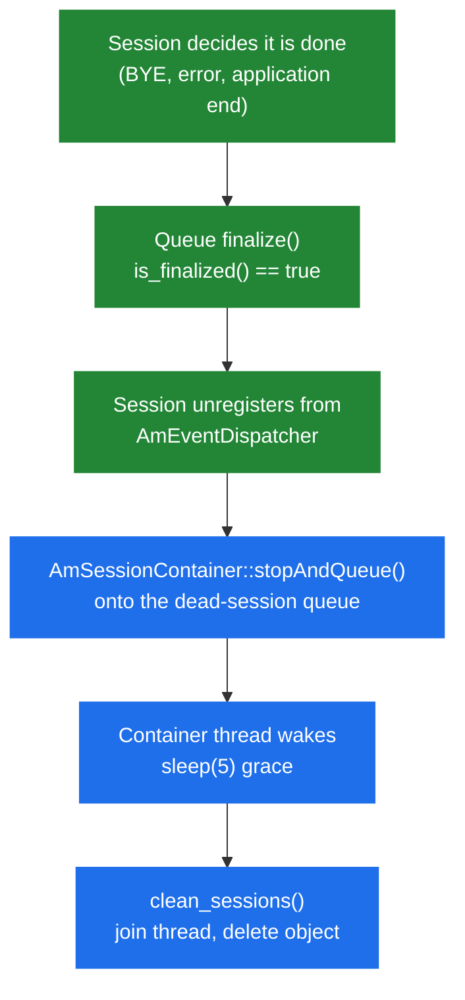

# 2.3 Memory and ownership

> [!IMPORTANT]
> There is no shared-memory allocator in SEMS. No `shm_malloc`, no `pkg_malloc`, no memory
> dump RPC, no "out of shm" panic. There is one process and one ordinary C++ heap. Everything
> in this chapter follows from that.

## What Kamailio has and SEMS does not

Kamailio splits memory in two because it is split into processes: `pkg` is private to a
worker, `shm` is the pool every worker can see, and getting an object into the right one is a
constant design concern. Sizing those pools is a tuning task, exhausting one is a known
failure mode, and there are RPC commands to inspect both.

None of that exists here, and the reason is structural rather than a design preference: with a
single process there is nothing to share memory *between*. Threads already see the same address
space. `new` is enough.

What replaces the `shm`/`pkg` question is a different one: **who owns this object, and who
deletes it?**

## Reference counting

The core mechanism is in `core/atomic_types.h`:

```cpp
class atomic_ref_cnt
{
  atomic_int ref_cnt;

protected:
  atomic_ref_cnt() {}

  void _inc_ref() { ref_cnt.inc(); }
  bool _dec_ref() { return ref_cnt.dec_and_test(); }

  virtual ~atomic_ref_cnt() {}
  virtual void on_destroy() {}

  friend void inc_ref(atomic_ref_cnt* rc);
  friend void dec_ref(atomic_ref_cnt* rc);
};
```

Inherit from it, and `inc_ref(p)` / `dec_ref(p)` manage the lifetime; the last `dec_ref` calls
`on_destroy()` and deletes. The counter is atomic, so the calls are safe from any thread.

The important user is `AmEventQueue`, which is itself an `atomic_ref_cnt`. That is what makes
the event system safe against the obvious race: a producer resolves a session's queue from the
dispatcher, and before it can post, the session ends. Holding a reference keeps the queue
alive; the post lands in a queue nobody will drain, and the object is freed when the last
reference goes ([2.2](03-event-system.md)).

> [!TIP]
> `on_destroy()` is a virtual hook that runs *before* deletion, while the object is still
> fully formed. Use it for unregistering; a destructor is too late to safely call back into
> code that might re-reference you.

## Singletons

Most long-lived services are singletons, and they share one template in `core/singleton.h`:

```cpp
template<class T>
class singleton
  : public T
{
public:
  static singleton<T>* instance()
  {
    _inst_m.lock();
    if(NULL == _instance) {
      _instance = new singleton<T>();
    }
    _inst_m.unlock();
    return _instance;
  }
  static void dispose()
  {
    _inst_m.lock();
    if(_instance != NULL){
      _instance->T::dispose();
      delete _instance;
      _instance = NULL;
    }
    _inst_m.unlock();
  }
  ...
};
```

Two things to note. The lock is taken on **every** `instance()` call, not just the first — this
is not double-checked locking, so `Foo::instance()` in a hot loop is a real mutex acquisition.
Hoist it into a local. And `dispose()` calls the wrapped type's own `dispose()` before deleting,
which is how shutdown ordering is expressed ([2.4](05-lifecycle.md)).

`AmEventDispatcher`, `AmSessionContainer`, `AmMediaProcessor`, `AmRtpReceiver`, `AmAppTimer` and
`AmPlugIn` are all reached this way.

## Who deletes a session

A session is a thread and an object at once, so it cannot simply `delete this`. The sequence is
deliberately indirect:



`AmSessionContainer` runs its own thread whose only job is collecting the dead:

```cpp
void AmSessionContainer::run()
{
  while(!_container_closed.get()){

    _run_cond.wait_for();

    if(_container_closed.get())
      break;

    // Give the Sessions some time to stop by themselves
    sleep(5);

    bool more = clean_sessions();

    DBG("Session cleaner finished\n");
    if(!more  && (!_container_closed.get()))
      _run_cond.set(false);
  }
  DBG("Session cleaner terminating\n");
}
```

That literal `sleep(5)` is worth internalising. **A finished session is not freed immediately**
— it sits on the dead queue for at least five seconds while its thread winds down and any
in-flight references drain. Under high call churn there is always a population of
finished-but-not-yet-freed sessions, and it is proportional to your call rate. If you are
reading RSS and wondering why it does not track active calls, this is why.

## Practical consequences

**Memory grows with concurrency, and it is a normal heap.** There is no pool to size in advance
and no pool to exhaust. The tools are the ordinary ones: `valgrind`, ASan, `massif`, `pmap`.
That is a genuine advantage over debugging a custom allocator.

**A leak is a process-lifetime leak.** Kamailio's `pkg` is per-worker and effectively bounded by
the worker's lifetime; a leaking SEMS plug-in leaks until restart. Long-running boxes make
small leaks visible.

**Fragmentation is real.** Thousands of short sessions each allocating audio buffers will
fragment glibc's heap over weeks. If RSS climbs while active calls do not, suspect
fragmentation before suspecting a leak, and check whether the dead-session queue is draining.

**Thread stacks are memory too.** In the default thread-per-session build, every call carries a
thread stack. That is often the dominant per-call cost and the real ceiling on concurrency
([2.1](02-thread-model.md), [2.5](06-sizing-and-tuning.md)).

**Nothing survives the process.** No shared segment means no state to recover and nothing to
inspect post-mortem beyond a core file. Two SEMS instances share nothing whatsoever, which is
what makes clustering a deployment question rather than a configuration one
([11.2](41-topologies-and-ha.md)).
