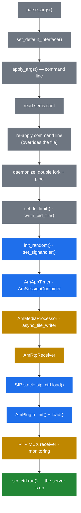

# 2.4 Process lifecycle

> [!NOTE]
> The whole of startup and shutdown lives in one readable function: `main()` in
> `core/sems.cpp`. If you only ever read one file in the core, read that one — the order of
> operations in it explains several behaviours that look arbitrary from the outside.

## Startup, in order



### Configuration is applied twice

The command line is parsed, applied, then applied **again** after the configuration file is
read:

```
/* apply command-line options */
/* load and apply configuration file */
/* re-apply command-line options to override configuration file */
```

That double application is what makes `-D` and friends win over `sems.conf` regardless of
ordering. It also means an option that is only handled in the first pass will silently lose to
the file — a real trap when adding new options.

### Daemonising

Unless built with `DISABLE_DAEMON_MODE`, SEMS does the textbook double fork: fork to stop being
a group leader, `setsid()` to drop the controlling terminal, fork again so it cannot reacquire
one, then replace stdin/stdout/stderr with `/dev/null` (stderr only if `log_stderr=0`).

The interesting detail is the **pipe**. The first parent creates one and waits on it; the
grandchild writes its PID through it once startup has actually succeeded:

```cpp
  if(fd[1]) {
    if (write(fd[1], &main_pid, sizeof(int))<0) {
       DBG("error writing main_pid to parent\n");
    }
    close(fd[1]); fd[1] = 0;
  }
```

This is why `sems` exiting zero from an init script means "it really came up", not merely "it
forked". The write happens *after* plug-ins have loaded — a plug-in that fails to load fails the
whole start, and the supervisor learns about it.

### Order matters, twice

**The SIP stack starts before the plug-ins.** `sip_ctrl.load()` runs at line ~656, and
`AmPlugIn::load()` after it. There is therefore a brief window where sockets exist but no
application is registered. Requests arriving in it find no factory and are rejected — visible as
a handful of odd 5xx responses in the first moments after a restart.

**Media infrastructure starts before the SIP stack.** `AmMediaProcessor` and `AmRtpReceiver` are
already running when the first INVITE can arrive, so a session never has to wait for media
threads to spin up.

## Signals

Signal handling is deliberately not done in the handler. `signal_handler()` records what
happened and returns; the actual work is deferred to the main thread:

```cpp
  // Register signal processing callback so signals are handled
  // safely from the main thread rather than from signal context.
  sip_ctrl.on_idle_cb = process_pending_signals;
```

`process_pending_signals()` is called from the SIP stack's idle loop. The payoff is that signal
handling can take locks, log, and touch the session container — none of which is legal from a
real signal context. The cost is that signals are only processed when the stack goes idle; on a
completely saturated box, a `SIGTERM` can take a moment to be noticed.

`AmSystemEvent` carries `User1` and `User2`, which is how `SIGUSR1`/`SIGUSR2` reach applications
that want them.

## Shutdown

Graceful shutdown is a broadcast, not a kill:

```cpp
void AmSessionContainer::broadcastShutdown() {
  DBG("brodcasting ServerShutdown system event to %u sessions...\n",
      AmSession::getSessionNum());
  AmEventDispatcher::instance()->
    broadcast(new AmSystemEvent(AmSystemEvent::ServerShutdown));
}
```

Every session gets its own cloned `AmSystemEvent::ServerShutdown` and is expected to finish
what it is doing — send a `BYE`, flush a recording, hang up cleanly. The container then waits
for the event queues to stop.

Two escape hatches exist:

| Mechanism | Default | Effect |
|---|---|---|
| `max_shutdown_time` | **10** seconds (`DEFAULT_MAX_SHUTDOWN_TIME`) | Upper bound on waiting for sessions to end |
| `enableUncleanShutdown()` | off | Skip the broadcast entirely and go straight down |

```cpp
void AmSessionContainer::on_stop()
{
  _container_closed.set(true);

  if (enable_unclean_shutdown) {
    INFO("unclean shutdown requested - not broadcasting shutdown\n");
  } else {
    broadcastShutdown();

    DBG("waiting for active event queues to stop...\n");
    ...
```

> [!WARNING]
> Ten seconds is the default ceiling, and calls do not care about your maintenance window. A
> box carrying long calls will either drop them at the deadline or hold the restart open. If
> you need real drain semantics, stop *new* calls upstream at the proxy first and let the box
> empty before signalling it — SEMS has no "stop accepting, keep serving" mode of its own.

After the wait, teardown runs in reverse dependency order — session container, then transaction
table dump, then the RTP receiver:

```cpp
  INFO("Disposing session container\n");
  AmSessionContainer::dispose();

  DBG("** Transaction table dump: **\n");
  dumps_transactions();
  DBG("*****************************\n");

  INFO("Disposing RTP receiver\n");
  AmRtpReceiver::dispose();
```

That transaction table dump is genuinely useful: it prints whatever was still in flight when
the server went down, which is often the fastest way to see what a shutdown interrupted
([3.4](10-transaction-layer.md)).

## What "it started" actually means

`INFO("SEMS " SEMS_VERSION " (" ARCH "/" OS") started")` is logged **after** plug-ins have
loaded and immediately before `sip_ctrl.run()`. So that line means:

- configuration parsed and applied twice,
- media processor, RTP receiver and timers running,
- SIP sockets open,
- every configured plug-in loaded successfully,
- and the process is about to enter the SIP loop.

If the line is absent, compare the log against the order in the diagram above; the last stage
that logged tells you exactly where it stopped.
