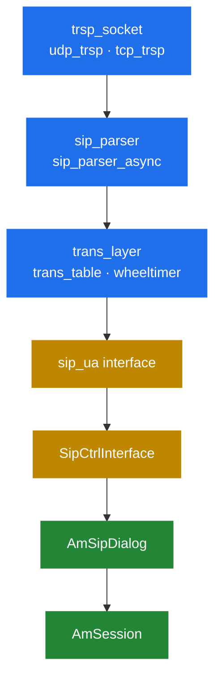
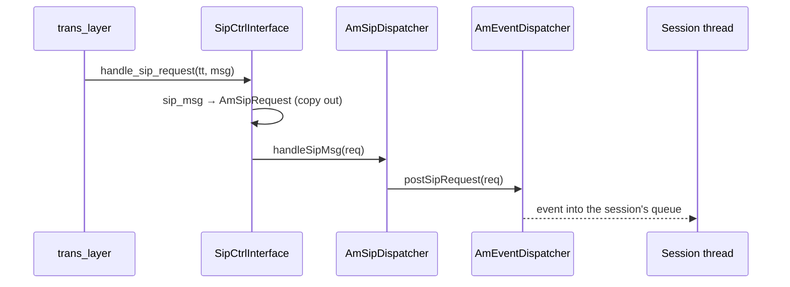

# 3.1 The SIP stack

> [!IMPORTANT]
> SEMS does not link a third-party SIP stack. It carries its own, in `core/sip/`, written in C
> against raw buffers. That directory is a different codebase in style from the rest of the
> tree — `cstring` instead of `std::string`, hand-rolled hash tables, explicit state machines —
> and it is worth reading on its own terms.

## Why a stack of its own

By the time SEMS was written there was no SIP library worth depending on that was both fast
enough and permissively licensed. The same reasoning produced Kamailio's stack, and OpenSIPS',
and Asterisk's. Nobody set out to write four SIP stacks; everybody needed one that could be
tuned to their own memory and threading model, and a general-purpose library cannot be.

What SEMS gained by owning it:

- **Zero-copy parsing.** Headers point into the receive buffer rather than being copied out
  ([3.3](09-parser.md)). A library with a `std::string`-based API cannot offer that.
- **A timer wheel matched to SIP.** RFC 3261's timers are coarse and numerous; a wheel at 20 ms
  resolution fits them exactly ([3.4](10-transaction-layer.md)).
- **Control over threading.** The stack decides which thread parses and which thread runs
  application code — the boundary that makes thread-per-session viable
  ([2.1](02-thread-model.md)).

What it costs: RFC coverage is what someone implemented, not what the standard says. Anything
outside the common path — unusual header forms, exotic transports, newer RFCs — is your problem
to add.

## The layers



Everything from `trsp_socket` down to `trans_layer` is the C world in `core/sip/`. Everything
from `AmSipDialog` up is the C++ session world. `sip_ua` and `SipCtrlInterface` are the seam.

| Layer | Files | Owns |
|---|---|---|
| Transport | `transport.*`, `udp_trsp.*`, `tcp_trsp.*`, `resolver.*` | Sockets, connections, DNS ([3.2](08-transport.md)) |
| Parser | `sip_parser.*`, `sip_parser_async.*`, `parse_*.{h,cpp}` | Turning bytes into `sip_msg` ([3.3](09-parser.md)) |
| Transaction | `trans_layer.*`, `trans_table.*`, `sip_trans.*`, `wheeltimer.*`, `sip_timers.*` | Retransmission, matching, timeouts ([3.4](10-transaction-layer.md)) |
| Seam | `sip_ua.h`, `SipCtrlInterface.*` | Handing a matched message to a dialog |
| Dialog | `AmSipDialog.*`, `AmBasicSipDialog.*`, `Am100rel.*` | Long-lived call state ([3.5](11-dialog-layer.md)) |

## The seam: `sip_ua`

The entire contract between the stack and everything above it is three pure virtual methods:

```cpp
class sip_ua
{
public:
    virtual ~sip_ua() {}
    virtual void handle_sip_request(const trans_ticket& tt, sip_msg* msg)=0;
    virtual void handle_sip_reply(const string& dialog_id, sip_msg* msg)=0;
    virtual void handle_reply_timeout(AmSipTimeoutEvent::EvType evt,
        sip_trans *tr, trans_bucket *buk=0)=0;
};
```

That is the whole interface. Three observations follow from it.

**Requests carry a `trans_ticket`, replies carry a `dialog_id`.** An incoming request may not
belong to any dialog yet, so the stack hands back an opaque handle to the transaction it just
created; you use that ticket later to reply into the right transaction. An incoming reply, by
contrast, always belongs to a UAC transaction that *we* started, so the stack already knows the
dialog and passes its id as a plain string.

**Timeouts are a first-class callback.** A reply that never comes is an event, not a silence.
`handle_reply_timeout()` is how "the far end stopped answering" reaches the application.

**The stack does not know what a session is.** It knows transactions and it knows a string id.
Everything about `AmSession`, applications and media lives above this line, which is why the
stack can be read and reasoned about entirely on its own.

## `SipCtrlInterface`

`SipCtrlInterface` is the single implementation of `sip_ua`, and the bridge into the session
world. It appears in `main()` three times ([2.4](05-lifecycle.md)):

```cpp
  INFO("Starting SIP stack (control interface)\n");
  if(sip_ctrl.load()) {
    goto error;
  }
```

```cpp
  sip_ctrl.on_idle_cb = process_pending_signals;

  // running the server
  if(sip_ctrl.run() != -1)
    success = true;
```

`load()` binds sockets and starts the transport threads. `run()` **is the server** — it does not
return until shutdown, which is why `main()` has no loop of its own. And `on_idle_cb` is the hook
that lets deferred signal processing happen on the main thread, safely outside signal context.

From `handle_sip_request()`, the path onward is:



The copy out of `sip_msg` into `AmSipRequest` is where zero-copy ends. It has to: `sip_msg`
points into a receive buffer that the transport thread is about to reuse, and the session will
look at the request much later on a different thread. Parse cheaply, copy once at the boundary,
then work with ordinary C++ objects — that is the design ([3.3](09-parser.md)).

## Reading `core/sip/`

A few conventions that will otherwise slow you down:

- **`cstring` is a view, not a string.** `{const char* s; unsigned int len;}` pointing into a
  buffer somebody else owns. Never outlives that buffer.
- **`c2stlstr()` / `stl2cstr()`** are the macros that cross into and out of `std::string`.
  Their appearance marks a copy.
- **Hash tables are hand-rolled and bucket-locked.** `hash_table.h` plus `ht_bucket<T>`; the
  transaction table is `1<<10` buckets, each with its own lock — the same sharding idea as
  `AmEventDispatcher` ([2.2](03-event-system.md)).
- **State machines are integer enums and `switch`.** `TS_TRYING`, `TS_PROCEEDING`,
  `TS_COMPLETED` … There is no class hierarchy to follow; grep the enum and read the switch.
