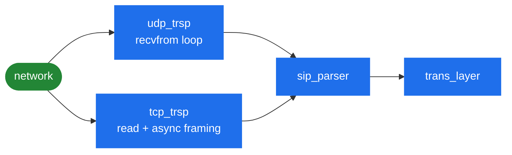

# 3.2 Transport

> [!NOTE]
> The transport layer's job is narrow: get bytes on and off the wire, and work out where to
> send them. Everything about what those bytes *mean* belongs to the parser
> ([3.3](09-parser.md)) and the transaction layer ([3.4](10-transaction-layer.md)).

## `trsp_socket`

Every listener is a `trsp_socket`, and — like the event queue — it is reference counted:

```cpp
class trsp_socket
    : public atomic_ref_cnt
{
public:
    enum socket_options {
	force_via_address       = (1 << 0),
	force_outbound_if       = (1 << 1),
	use_raw_sockets         = (1 << 2),
	no_transport_in_contact = (1 << 3)
    };
    ...
protected:
    int sd;                       // socket descriptor
    sockaddr_storage addr;        // bound address
    string           ip;          // bound IP
    unsigned short   port;        // bound port number
    string      public_ip;        // public IP (Via-HF)
    unsigned short   if_num;      // internal interface number
    unsigned int sys_if_idx;      // network interface index
    unsigned int socket_options;
};
```

Reference counting matters because a transaction can outlive the decision to use a socket: a
retransmission fires from the timer thread long after the request was sent, and the socket must
still be there.

### The four socket options

These are the multihoming knobs, and each exists to solve a specific deployment problem.

| Option | What it does | When you need it |
|---|---|---|
| `force_via_address` | Put `public_ip` in `Via` instead of the bound address | Behind 1:1 NAT — you bind a private address but must advertise the public one |
| `force_outbound_if` | Pin egress to this interface rather than letting routing choose | Multihomed boxes where the kernel would otherwise pick the wrong source |
| `use_raw_sockets` | Send through `raw_sender`/`raw_sock` instead of the bound socket | Sending with a source address you did not bind — see below |
| `no_transport_in_contact` | Omit `;transport=` from `Contact` | Peers that mishandle the parameter |

Note the separation between `ip` (bound) and `public_ip` (advertised). Getting these two
confused is the classic cause of one-way audio and unanswerable in-dialog requests behind NAT.

### Raw sockets

`raw_sock.*` and `raw_sender.*` exist so SEMS can emit a UDP datagram whose source address it
did not `bind()`. On a box carrying many addresses, binding one socket per address and choosing
between them is expensive; a raw socket lets a single sender write with an arbitrary source.

The cost is that raw sockets need `CAP_NET_RAW`. That interacts directly with running the
daemon unprivileged ([10.3](39-security-hardening.md)) — you either grant the capability on the
binary or you do not use this path.

## UDP and TCP

**`udp_trsp`** is the simple case. A datagram is a message: receive, parse, dispatch. No framing
problem, no connection state, no partial reads.

**`tcp_trsp`** carries all the complexity, because a stream has none of those guarantees. One
`read()` may return half a message, or three messages, or a message split across two reads. The
consequences:

- Framing is the async parser's job — `skip_sip_msg_async()` and its `parser_state`
  ([3.3](09-parser.md)).
- Connections are long-lived and must be tracked, reused for in-dialog traffic, and eventually
  reclaimed.

Two timeouts govern that, both defined in `transport.h`:

```cpp
#define DEFAULT_TCP_CONNECT_TIMEOUT 2000 /* 2 seconds */
#define DEFAULT_TCP_IDLE_TIMEOUT 3600000 /* 1 hour */
```

They are configurable per interface (`tcp_connect_timeout`, `tcp_idle_timeout` in `AmConfig`).

> [!TIP]
> **Two seconds to connect** is aggressive on a congested or long-haul path — a TCP handshake
> to a peer three continents away can legitimately exceed it, and you will see failures that
> look like the peer being down. **One hour idle** is generous in the other direction: with many
> peers, idle connections accumulate against your fd limit ([2.5](06-sizing-and-tuning.md)).
> Both defaults suit a datacentre and neither suits every deployment.

## DNS resolution

`core/sip/resolver.*` is a full SIP resolver, not a `gethostbyname()` wrapper, and it is a
larger piece of code than people expect. The entry points:

```cpp
int resolve_name(const char* name, ...);
int resolve_targets(const list<sip_destination>& dest_list, ...);
```

The type hierarchy tells you what it handles:

| Type | Record | Purpose |
|---|---|---|
| `dns_ip_entry` | A / AAAA | Plain address lookup |
| `dns_srv_entry` | SRV | Service location with **priority and weight** |
| `dns_naptr_entry` | NAPTR | Transport selection — which of UDP/TCP/TLS the peer prefers |
| `dns_entry_map` | — | The cache |
| `dns_handle` | — | Per-resolution cursor: **remembers where you are in the result list** |

`address_type` distinguishes `IPv4` from `IPv6`, and `proto_type` the transports.

`dns_handle` is the important one. RFC 3263 resolution does not produce *an* address; it
produces an ordered list, and a target may legitimately fail over to the next entry. The handle
carries that cursor, which is what makes the transaction layer's failover timer possible:

```cpp
    // Transport address failover timer:
    // - used to cycle throught multiple addresses
    //   in case the R-URI resolves to multiple addresses
    STIMER_M,
```

> [!IMPORTANT]
> This is the closest thing SEMS has to a peer group. If an R-URI resolves via SRV to several
> targets, timer M cycles through them on failure — priority and weight are honoured because
> they are in the DNS record. What it cannot do is *know* a peer is down before trying it: there
> is no health probing, no runtime peer state, no administrative enable/disable. That gap, and
> what Kamailio's `dispatcher` does instead, is [13.5](51-peer-dispatching.md).

Resolution results are cached in `dns_entry_map`, respecting record TTLs. A peer that changes
address is picked up when the TTL expires — so a short TTL is your failover budget, and there
is no way to flush the cache administratively.

## Blacklisting

`tr_blacklist.*` holds destinations that have recently failed, so the stack stops hammering a
dead peer. `STIMER_BL` is its grace timer. It is a client-transaction mechanism and it is
reactive — it learns from failures rather than probing.

Configuration and the security angle are in [10.3](39-security-hardening.md).

## What arrives where



Both transports converge on the same parser and the same transaction layer. From
`trans_layer` upward nothing knows or cares which transport a message arrived on — the
application asks the dialog if it needs to know.
