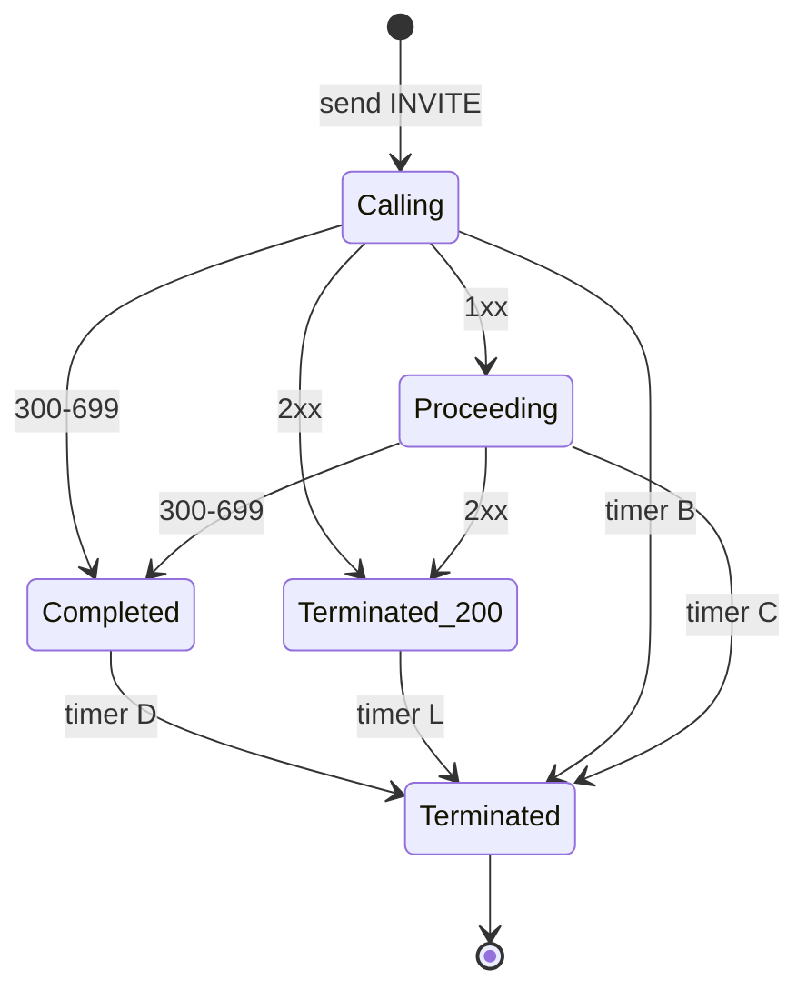

# 3.4 The transaction layer

> [!IMPORTANT]
> This is where RFC 3261 actually lives. Retransmission, matching, the seven timers with letter
> names, and the state machines that make an unreliable transport look reliable — all of it is
> `core/sip/trans_layer.cpp`, `trans_table.cpp`, `sip_trans.cpp` and `wheeltimer.cpp`.

## The table

Transactions are kept in a sharded hash table, the same pattern as the event dispatcher
([2.2](03-event-system.md)):

```cpp
#define H_TABLE_POWER   10
#define H_TABLE_ENTRIES (1<<H_TABLE_POWER)

class trans_bucket:
    public ht_bucket<sip_trans>
{
    ...
};

trans_bucket* get_trans_bucket(const cstring& callid, const cstring& cseq_num);
unsigned int hash(const cstring& ci, const cstring& cs);
```

1024 buckets, each independently locked, keyed on **Call-ID plus CSeq number**. Two different
calls essentially never contend; two transactions of the same call share a bucket, which is
harmless because they are usually sequential anyway.

Matching an incoming message to an existing transaction is the bucket's job, and there are four
distinct matchers because SIP needs four:

```cpp
    sip_trans* match_request(sip_msg* msg, unsigned int ttype);
    sip_trans* match_1xx_prack(sip_msg* msg);
    sip_trans* match_reply(sip_msg* msg);
    sip_trans* find_uac_trans(const cstring& dialog_id, unsigned int inv_cseq);
private:
    sip_trans* match_200_ack(sip_trans* t, sip_msg* msg);
```

`match_200_ack` being private and separate is the code admitting the awkwardness described in
[1.2](01b-sip-media-primer.md): an ACK to a 2xx is *not* part of the INVITE transaction, so it
cannot be matched the ordinary way. `match_1xx_prack` exists because PRACK references an RSeq
rather than the usual coordinates ([3.5](11-dialog-layer.md)).

Branch parameters are generated, not random:

```cpp
#define BRANCH_BUF_LEN 8
void compute_branch(char* branch, const cstring& callid, const cstring& cseq);
```

Eight bytes derived from Call-ID and CSeq. Deterministic, so a retransmission of the same
request produces the same branch — which is exactly what RFC 3261 matching requires.
`compute_sl_to_tag()` does the equivalent for stateless replies, where there is no transaction
to remember a tag in.

## Types and states

```cpp
enum {
    TT_UAS=1,
    TT_UAC
};

enum {
    TS_TRYING=1,   // UAC:!INV;     UAS:!INV
    TS_CALLING,    // UAC:INV
    TS_PROCEEDING, // UAC:INV,!INV; UAS:INV,!INV
    TS_PROCEEDING_REL, // UAS:INV
    TS_COMPLETED,  // UAC:INV,!INV; UAS:INV,!INV
    TS_CONFIRMED,  //               UAS:INV
    TS_TERMINATED_200,
    TS_TERMINATED, // UAC:INV,!INV; UAS:INV,!INV

    TS_ABANDONED,
    TS_REMOVED
};
```

The comments are the specification: each state is annotated with which of the four machines
(UAC/UAS × INVITE/non-INVITE) can be in it. Four state machines, one enum.

Three states are not in RFC 3261:

- **`TS_PROCEEDING_REL`** — a UAS INVITE transaction that has sent a reliable provisional and is
  waiting for its PRACK.
- **`TS_TERMINATED_200`** — a UAC INVITE transaction that got its 2xx and is now only waiting to
  absorb retransmissions, driven by timer L.
- **`TS_ABANDONED` / `TS_REMOVED`** — bookkeeping for teardown.



## Timers

Each transaction may hold at most three timers at once:

```cpp
/**
 * We support at most 3 timer per transaction,
 * which is okay according to the standard
 */
#define SIP_TRANS_TIMERS 3
```

The full set, with SEMS' defaults from `sip_timers.h`:

```cpp
#define T1_TIMER  500 /* 500 ms */
#define DEFAULT_T2_TIMER 4000 /*   4 s  */
#define T4_TIMER 5000 /*   5 s  */
```

| Timer | Default | Machine | Purpose |
|---|---|---|---|
| A | T1 = 500 ms | UAC INVITE | Retransmit INVITE, doubling |
| B | 64·T1 = **32 s** | UAC INVITE | Calling → Terminated. The classic "call attempt gave up" |
| C | **3 min** | UAC INVITE | Proceeding → Terminated. Caps a call ringing forever |
| D | 64·T1 = 32 s | UAC INVITE | Completed → Terminated; absorbs response retransmissions |
| E | T1 = 500 ms | UAC non-INVITE | Retransmit request |
| F | 64·T1 = 32 s | UAC non-INVITE | Give up |
| G | T1 = 500 ms | UAS INVITE | Retransmit the final response until ACK |
| H | 64·T1 = 32 s | UAS INVITE | Give up waiting for ACK |
| I | T4 = 5 s | UAS INVITE | Confirmed → Terminated; absorbs ACK retransmissions |
| J | 64·T1 = 32 s | UAS non-INVITE | Completed → Terminated |
| L | 64·T1 = 32 s | UAC INVITE | **Not in RFC 3261** — absorbs 200 retransmissions after 2xx |
| M | B/4 = **8 s** | UAC | **Not in RFC 3261** — DNS address failover |
| BL | — | UAC | Blacklist grace ([3.2](08-transport.md)) |

Two of these deserve attention in operations.

**Timer B is 32 seconds.** That is how long a request to an unresponsive peer occupies a
transaction, and with it the session and its thread. On a box that is losing a route, 32 seconds
of accumulated dead transactions is how "we ran out of threads" happens
([2.5](06-sizing-and-tuning.md)).

**Timer M is the failover timer.** At 8 seconds it cycles to the next address when an R-URI
resolved to several ([3.2](08-transport.md)). Combined with timer B's 32 seconds, you get at
most four addresses tried before giving up — a real constraint if you were hoping SRV would give
you a large peer pool ([13.5](51-peer-dispatching.md)).

## The wheel

All of those timers are driven by one thread and one data structure:

```cpp
#define BITS_PER_WHEEL 8
#define ELMTS_PER_WHEEL (1 << BITS_PER_WHEEL)

// 20 ms == 20000 us
#define TIMER_RESOLUTION 20000

// do not change
#define WHEELS 4
```

A **hierarchical timing wheel**: four wheels of 256 slots each, ticking at 20 ms. Together they
cover 2³² ticks — years — at constant cost.

The point of a wheel is that inserting, removing and expiring a timer are all O(1). A heap or a
sorted list would be O(log n) per operation, and with three timers per transaction and thousands
of transactions the difference is the difference between a working server and a profile
dominated by timer bookkeeping. The `// do not change` on `WHEELS` is not decorative — the
cascade arithmetic assumes four.

```cpp
class timer: public base_timer
{
public:
    base_timer*  prev;
    u_int32_t    expires;
    virtual void fire()=0;
};
```

Timers are an intrusive doubly-linked list (`next` in `base_timer`, `prev` in `timer`), so
removing one is a pointer update with no search. `trans_timer` adds the transaction back-pointer
and its bucket id, so `fire()` can find and lock the right bucket.

Insertions and removals go through a request queue (`timer_req`) rather than touching the wheel
directly, which keeps the wheel single-threaded and lock-light.

> [!NOTE]
> **20 ms resolution.** Every SIP timer is quantised to it. That is far finer than any RFC 3261
> timer needs — the shortest is T1 at 500 ms — and it is the same order as the media tick
> ([2.5](06-sizing-and-tuning.md)), which is a coincidence rather than a coupling: the two
> clocks are independent.

## Reading the table at runtime

`dumps_transactions()` prints the whole table. It is called at shutdown
([2.4](05-lifecycle.md)):

```
DBG("** Transaction table dump: **\n");
dumps_transactions();
```

Anything still listed was in flight when the server stopped. Stuck transactions in a running
system show up the same way — a growing population in `TS_COMPLETED` or `TS_PROCEEDING` usually
means a peer that stopped answering, and the state plus the timer tells you which one.
