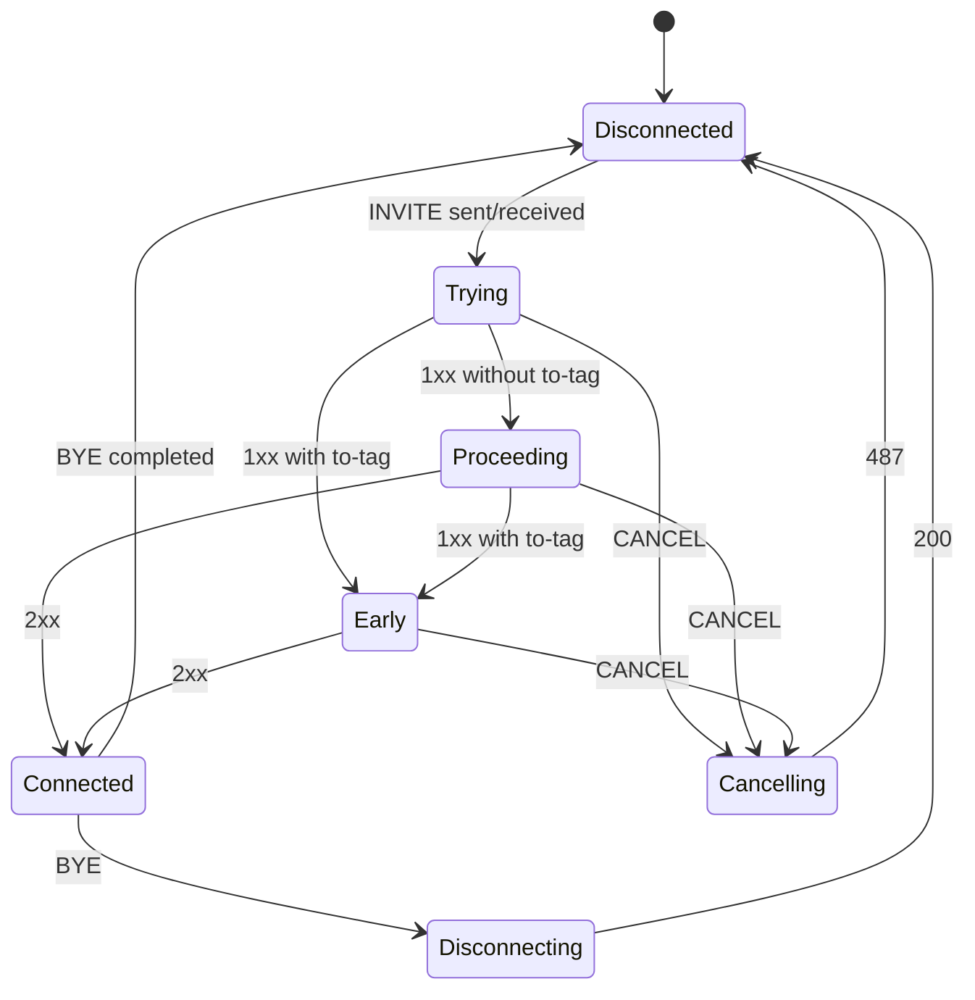

# 3.5 The dialog layer

> [!NOTE]
> The dialog is the first object in the stack that thinks in *calls* rather than messages. It
> is also the boundary where `core/sip/`'s C ends and the C++ session world begins — the files
> here are `AmSipDialog.*`, not `sip_*.cpp`.

## Two classes, deliberately split

`AmBasicSipDialog` holds everything a SIP dialog needs. `AmSipDialog` adds the INVITE-specific
call semantics on top. The split exists because SEMS has dialogs that are not calls —
subscriptions ([9.1](31-registrar-client.md)), registrations, `SUBSCRIBE`/`NOTIFY` — and they
need identity, sequencing and routing without any notion of "connected".

The identity and routing state lives in the basic class:

```cpp
  string callid;
  string local_tag;
  string ext_local_tag;
  string remote_tag;
  string first_branch;

  string local_uri;      // local uri
  string remote_uri;     // remote uri
  string remote_party;   // To/From
  string local_party;    // To/From
  string remote_ua;      // User-Agent/Server

  string route;

  string next_hop;
  bool next_hop_1st_req;
  bool patch_ruri_next_hop;
  bool next_hop_fixed;

  int outbound_interface;
  ...
  string outbound_proxy;
  bool   force_outbound_proxy;
  bool nat_handling;
  bool r_cseq_i;
```

Several of these are worth naming explicitly.

**`local_tag` is the session's address.** It is the key `AmEventDispatcher` indexes on
([2.2](03-event-system.md)), so the dialog's tag and the session's mailbox address are the same
string. When you see a local tag in a log line, you can post to that session.

**`route` is the route set** — the `Record-Route` stack learned during dialog establishment,
replayed as `Route` on every subsequent in-dialog request. Getting it wrong is why in-dialog
`BYE`s go to the wrong place.

**The `next_hop` family is a four-way knob**, and it reappears verbatim in the SBC's call
profile ([6.4](23b-sbc-profiles.md)):

| Field | Effect |
|---|---|
| `next_hop` | Send here regardless of what the R-URI resolves to |
| `next_hop_1st_req` | Apply it only to the first request of the dialog |
| `patch_ruri_next_hop` | Rewrite the R-URI to match, rather than only the destination |
| `next_hop_fixed` | Do not let anything later change it |

**`r_cseq_i`** tracks whether the remote CSeq has been initialised — the guard against accepting
an in-dialog request with a CSeq lower than one already seen.

## Dialog status

```cpp
  enum Status {
    Disconnected=0,
    Trying,
    Proceeding,
    Cancelling,
    Early,
    Connected,
    Disconnecting,
    __max_Status
  };
```

Seven states, and note that they are **not** the transaction states from
[3.4](10-transaction-layer.md). A dialog outlives many transactions; the two machines run in
parallel and mean different things. `TS_PROCEEDING` says "this request has had a provisional
response"; `Proceeding` says "this call is being set up".



`Early` versus `Proceeding` is the distinction that matters in practice: a provisional response
carrying a To-tag creates an **early dialog**, which can carry early media and can be
established or cancelled independently. A `183 Session Progress` with a tag is a different
situation from a `180 Ringing` without one, and the enum records that.

`Cancelling` exists because CANCEL is genuinely awkward — you are asking to abandon a
transaction that may already have succeeded, and the dialog has to hold that ambiguity until a
`487` or a `200` resolves it.

## The event handler interface

`AmSipDialogEventHandler` is what the dialog calls into as state changes. It is the mechanism by
which a session learns that its call moved:

```cpp
  virtual void onEarlySessionStart()=0;
```

The comment on the class is precise about the division of labour:

> and executes onSessionStart/onEarlySessionStart when required.

The dialog decides *when* a session has started; the session decides *what that means*. Media
attachment, for instance, hangs off `onSessionStart` — which is why early media requires
`onEarlySessionStart` to exist as a separate hook rather than being folded in.

## Reliable provisionals: `Am100rel`

PRACK (RFC 3262) gets its own small class, because it adds a second sequence space to the
dialog:

```cpp
class Am100rel
{
public:
  enum State {
    REL100_DISABLED=0,
    REL100_SUPPORTED,
    REL100_REQUIRE,
    //REL100_PREFERED, //TODO
    REL100_IGNORED,
    REL100_MAX
  };
private:
  State reliable_1xx;
  // UAS
  unsigned rseq;          // RSeq for next request
  bool rseq_confirmed;    // latest RSeq is confirmed
  unsigned rseq_1st;      // value of first RSeq (init value)
  // UAC
  unsigned rseq_last;     // last accepted RSeq
  ...
};
```

Four policies:

| State | Meaning |
|---|---|
| `REL100_DISABLED` | Do not offer or accept it |
| `REL100_SUPPORTED` | Advertise `100rel` in `Supported`; use it if the peer asks |
| `REL100_REQUIRE` | Put it in `Require` — the peer must PRACK or fail |
| `REL100_IGNORED` | Pretend not to see it |

`REL100_PREFERED` is commented out with a `//TODO`, which is a fair summary of how much demand
there was for it.

The four hooks — `onRequestIn`, `onReplyIn`, `onRequestOut`, `onReplyOut`, plus `onTimeout` —
mean every message passing through the dialog gets inspected for RSeq/RAck bookkeeping.
`rseq_confirmed` is the important flag: with `REQUIRE`, you may not send another reliable
provisional until the previous one has been PRACKed, which paces a UAS that wants to send
several.

> [!TIP]
> `REL100_REQUIRE` against a peer that does not implement PRACK fails the call outright rather
> than degrading. `REL100_SUPPORTED` is the interoperable default; reach for `REQUIRE` only when
> you control both ends, which in practice means an internal trunk.

## `AmSipDispatcher`

The last hop before the session world is a very small class:

```cpp
class AmSipDispatcher
{
  public:
    void handleSipMsg(AmSipRequest &);
    void handleSipMsg(const string& dialog_id, AmSipReply &);
    static AmSipDispatcher* instance();
};
```

Two methods, mirroring the two `sip_ua` callbacks ([3.1](07-sip-stack-overview.md)). Requests
arrive without a dialog id — they may be creating one — so they go to
`AmEventDispatcher::postSipRequest()`, and if no dialog matches, on to `AmSessionContainer` to
create a session ([4.2](13-session-container-and-factories.md)). Replies always have a dialog
id, because we started the transaction, so they are posted straight to that session's queue.

That asymmetry — requests may create, replies never do — is the whole of the class, and it is
the last thing that happens before [Part 4](12-amsession.md) takes over.
