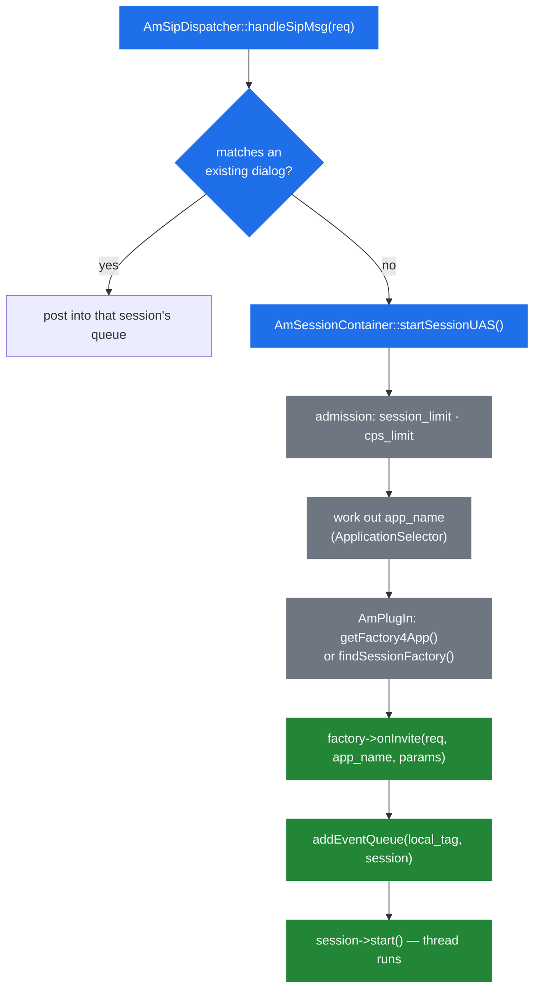

# 4.2 Session container and factories

> [!NOTE]
> This chapter answers one question: an INVITE arrived and matched no dialog — how does it
> become a running application? The answer is a lookup, a factory, and a registration in the
> event dispatcher.

## `AmSessionContainer`

The container is the singleton that owns every session's existence. It has three jobs, and they
are only loosely related:

1. **Create sessions** — `startSessionUAS()`, `startSessionUAC()`, `createSession()`.
2. **Reap them** — the `sleep(5)` cleaner thread from [2.3](04-memory-and-ownership.md).
3. **Enforce admission** — `check_and_add_cps()`, `setCPSLimit()`, `setCPSSoftLimit()` and the
   session limit from [2.5](06-sizing-and-tuning.md).

The two entry points are named for who initiated the call:

```cpp
  void startSessionUAS(AmSipRequest& req);
  string startSessionUAC(const AmSipRequest& req,
                         string& app_name, AmArg* session_params);
```

`startSessionUAS()` handles an inbound INVITE. `startSessionUAC()` is used when *we* place the
call, and it returns the new session's local tag so the caller can address it
([2.2](03-event-system.md)).

## From INVITE to session



Registration in the dispatcher happens **before** the thread starts. It has to: the moment the
session is running it may receive a reply, and the dispatcher must already know where to put it.

## Choosing the application

This is the part that surprises people coming from a proxy, where routing is explicit. In SEMS
the application is chosen by a configured *strategy*:

```cpp
  enum ApplicationSelector {
    App_RURIUSER,
    App_RURIPARAM,
    App_APPHDR,
    App_MAPPING,
    App_SPECIFIED
  };
```

set by one line in `sems.conf`:

```
# examples:
# application = conference
# application = $(mapping)
# application = $(ruri.user)
# application = $(ruri.param)
# application = $(apphdr)
application=webconference
```

| Value | Selector | Where the name comes from |
|---|---|---|
| a literal name | `App_SPECIFIED` | Fixed. Every call runs the same application |
| `$(ruri.user)` | `App_RURIUSER` | The user part of the R-URI |
| `$(ruri.param)` | `App_RURIPARAM` | A URI parameter, e.g. `;app=conference` |
| `$(apphdr)` | `App_APPHDR` | The **`P-App-Name`** header |
| `$(mapping)` | `App_MAPPING` | A configured regex mapping over the R-URI |

`$(apphdr)` is the one used by the in-tree Kamailio example ([1.1](01-introduction.md)):

```text
append_hf("P-App-Name: conference\r\n");
$ru = "sip:" + $rU + "@" + "127.0.0.1:5070";
```

The proxy decides the application and states it in a header; SEMS obeys. That division —
routing in the proxy, execution in the media server — is the whole integration pattern
([11.1](40-with-kamailio.md)).

> [!WARNING]
> With `$(apphdr)`, **anyone who can reach your SIP port can choose which application runs** by
> setting the header themselves. It is trusted input from an untrusted source unless the port is
> reachable only from your proxy. Firewall the signalling interface, or use `$(mapping)` where
> the pattern is under your control ([10.1](37-security-surface.md)).

The lookup itself is straightforward:

```cpp
  if(!app_name.empty())
      session_factory = AmPlugIn::instance()->getFactory4App(app_name);
  else
      session_factory = AmPlugIn::instance()->findSessionFactory(req,app_name);
```

A named application goes straight to `getFactory4App()`. With no name, `findSessionFactory()`
asks the registered factories whether any of them wants the request.

## The factory hierarchy

`core/AmApi.h` defines what a plug-in can be. Everything derives from one base:

```cpp
class AmPluginFactory
{
  ...
  virtual int onLoad()=0;
};
```

`onLoad()` runs once at startup ([2.4](05-lifecycle.md)); returning non-zero fails the load, and
a failed load fails the whole process start.

| Factory | Produces | Used for |
|---|---|---|
| `AmSessionFactory` | An `AmSession` | Applications: `conference`, `voicemail`, `sbc`, … |
| `AmSessionEventHandlerFactory` | An `AmSessionEventHandler` | Interceptors, e.g. `uac_auth` ([4.4](15-session-event-handlers.md)) |
| `AmDynInvokeFactory` | A DI object | Callable modules, the basis of RPC ([8.1](28-rpc-architecture.md)) |
| `AmLoggingFacility` | A log sink | Alternative logging back-ends |

`AmSessionFactory` has four creation methods — two for INVITE and two for REFER, each in a
plain and a parameterised form:

```cpp
  virtual AmSession* onInvite(const AmSipRequest& req, const string& app_name,
                              const map<string,string>& app_params);
  virtual AmSession* onInvite(const AmSipRequest& req, const string& app_name,
                              AmArg& session_params);
  virtual AmSession* onRefer(const AmSipRequest& req, const string& app_name, ...);
```

The `map<string,string>` form receives parameters parsed from the request; the `AmArg` form is
used when a caller inside SEMS creates the session and can pass structured data
([7.1](24-plugin-architecture.md)).

`onRefer()` existing alongside `onInvite()` means an application can be started by a transfer,
not only by a call.

## Exporting a factory

A plug-in is a shared object with a known symbol, produced by a macro:

```cpp
#define EXPORT_SESSION_FACTORY(class_name,app_name) \
            EXPORT_FACTORY(FACTORY_SESSION_EXPORT,class_name,app_name)

#define EXPORT_SESSION_EVENT_HANDLER_FACTORY(class_name,app_name) \
            EXPORT_FACTORY(FACTORY_SESSION_EVENT_HANDLER_EXPORT,class_name,app_name)

#define EXPORT_PLUGIN_FACTORY(class_name,app_name) \
            EXPORT_FACTORY(FACTORY_PLUGIN_EXPORT,class_name,app_name)
```

One line at the bottom of a module registers it. `AmPlugIn` dlopens the `.so`, looks up the
symbol, calls it to get the factory, calls `onLoad()`, and files it under `app_name`
([7.1](24-plugin-architecture.md)).

## Placing an outbound call

`AmUAC` is the whole outbound API, and it is one static method:

```cpp
class AmUAC {
 public:
  static string dialout(const string& user,
			const string& app_name,
			const string& r_uri,
			const string& from,
			const string& from_uri,
			const string& to,
			const string& local_tag = "",
			const string& hdrs = "",
			AmArg*  session_params = NULL);
};
```

It returns the new session's local tag — your handle for posting events into it. Note that
`app_name` is explicit here: there is no header to read and no selector to consult, because you
are the one initiating.

This is how click-to-dial, callback and outbound announcement applications work: something
decides a call should exist, calls `dialout()`, and gets back a tag to talk to
([9.1](31-registrar-client.md)).

> [!TIP]
> Passing `local_tag` lets you choose the tag rather than receive one. Useful when an external
> system needs to know the identifier *before* the call exists — for correlation in CDRs, or so
> a controller can post events to a call it is about to create.

## Admission control in the path

Both limits are enforced here, before any factory runs:

```cpp
  void setCPSLimit(unsigned int limit);
  void setCPSSoftLimit(unsigned int percent);
  bool check_and_add_cps();
```

Rejecting at this point costs almost nothing — no session object, no thread, no dialog. That is
exactly why the limits belong in the container rather than in an application, and why setting
them is cheap insurance ([2.5](06-sizing-and-tuning.md)).
