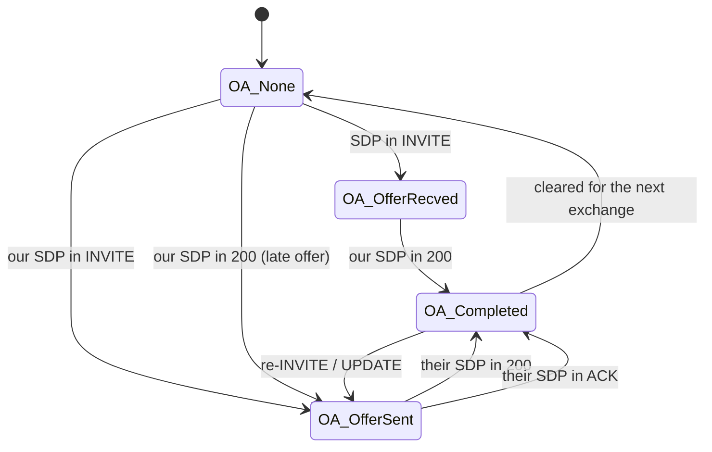

# 4.3 Offer/answer

> [!IMPORTANT]
> RFC 3264 is a state machine, not an exchange, and SEMS models it as one. `AmOfferAnswer` is a
> small class — one enum, four states, eight hooks — and it is the single place where every SDP
> decision in the system is made.

## Four states

```cpp
class AmOfferAnswer
{
public:
  enum OAState {
    OA_None=0,
    OA_OfferRecved,
    OA_OfferSent,
    OA_Completed,
    __max_OA
  };
private:
  OAState      state;
  OAState      saved_state;
  unsigned int cseq;
  AmSdp        sdp_remote;
  AmSdp        sdp_local;
  AmSipDialog* dlg;
  ...
};
```

| State | Meaning |
|---|---|
| `OA_None` | No negotiation in progress. The starting point, and the point after a completed one is cleared |
| `OA_OfferRecved` | The far end offered; we owe an answer |
| `OA_OfferSent` | We offered; we are waiting for theirs |
| `OA_Completed` | Both halves exchanged; the media description is settled |

The whole of the two patterns from [1.2](01b-sip-media-primer.md) falls out of these four:



Note that the same state serves both "we offered in an INVITE" and "we offered in a 200". From
the state machine's point of view a late offer is not a special case — that is precisely why
folding it into a state machine was worth doing.

Only **three** pieces of state accompany the enum: the two SDP bodies and a CSeq. The CSeq is
what ties a negotiation to the transaction that carries it, so a reply belonging to an older
transaction cannot corrupt a newer negotiation.

## Save and restore

```cpp
  OAState      saved_state;
  void saveState();
  int  checkStateChange();
  void clearTransitionalState();
```

`saveState()` records the state before a message is processed; `checkStateChange()` compares
afterwards and acts on the difference. This is the same "transitions matter more than states"
idea as `old_dlg_status` in `onSipReply` ([4.1](12-amsession.md)) — the session needs to know
that negotiation *completed*, not merely that it is complete.

`clearTransitionalState()` exists for the failure paths. A negotiation half-done when a request
fails must not leave the dialog believing an offer is outstanding; a re-INVITE that gets a `488`
has to roll back to the previously agreed media, not to nothing.

## Eight hooks, in two pairs of pairs

```cpp
  int onRequestIn(const AmSipRequest& req);
  int onReplyIn(const AmSipReply& reply);
  int onRequestOut(AmSipRequest& req);
  int onReplyOut(AmSipReply& reply);
  int onRequestSent(const AmSipRequest& req);
  int onReplySent(const AmSipReply& reply);
  void onNoAck(unsigned int ack_cseq);
```

Two axes: in versus out, and — for outgoing messages only — **`Out` versus `Sent`**.

`onRequestOut()` runs while the message is being built; the parameter is non-const because this
is where the SDP body gets attached. `onRequestSent()` runs after it has actually gone to the
wire.

> [!IMPORTANT]
> That distinction is not pedantry. Between `Out` and `Sent` the send can fail — no route, DNS
> failure, socket error ([3.2](08-transport.md)). If the state advanced at `Out`, a failed send
> would leave the dialog convinced it had offered when nothing left the box, and the next
> negotiation would start from a corrupt state. **The state moves at `Sent`.**

`onNoAck(ack_cseq)` closes the last gap. In the late-offer pattern the answer arrives in the
ACK — so if the ACK never comes, the negotiation is stuck in `OA_OfferSent` forever. The hook
takes the CSeq so it can tell which negotiation to abandon, and it pairs with
`AmSession::onNoAck()` ([4.1](12-amsession.md)).

The private helpers are where the real work happens:

```cpp
  int  onRxSdp(unsigned int m_cseq, const AmMimeBody& body, const char** err_txt);
  int  onTxSdp(unsigned int m_cseq, const AmMimeBody& body);
  int  getSdpBody(string& sdp_body);
```

`onRxSdp()` takes an `AmMimeBody`, not a string — the SDP may be one part of a multipart body
alongside, say, an ISUP payload, and finding the right part is the body class's job. The
`const char** err_txt` out-parameter carries a human-readable reason back to the caller so that
a rejected offer produces a meaningful SIP warning rather than a bare 488.

## Where the SDP itself lives

`AmSdp` (`core/AmSdp.h`) is the parsed representation: session-level fields, a list of media
descriptions, and per-media payload lists with their `rtpmap` and `fmtp` attributes. Two
instances hang off the offer/answer object — `sdp_local` and `sdp_remote` — and between them
they hold everything the media plane needs.

The handover is one-directional and happens once negotiation completes: the media processor and
the RTP stream read the agreed addresses, ports and payload types out of these two objects and
configure themselves ([5.1](16-media-processor.md), [5.2](17-rtp-stream.md)). Nothing in the
media plane re-parses SDP.

## Triggering a new negotiation

From an application, negotiation is started indirectly ([4.1](12-amsession.md)):

```cpp
  virtual bool refresh(int flags = 0);
  virtual int sendReinvite(bool updateSDP = true, const string& headers = "", ...);
  virtual void setOnHold(bool hold);
  virtual void setRemoteHold(bool remote_hold);

  enum SessionRefreshMethod {
    ...
  };
```

`setOnHold()` is the everyday case: hold is not a SIP feature but an SDP one — a new offer with
`a=sendonly` or a zeroed connection address. It is an ordinary re-negotiation, which is why hold
can fail the same way any re-INVITE can.

`SessionRefreshMethod` chooses between re-INVITE and `UPDATE`. `UPDATE` (RFC 3311) can change
the session without a new INVITE transaction, which matters in early dialog — you may need to
change media before the call is answered, and a re-INVITE is not available then.

## What goes wrong

**Both sides offering at once.** Legal to attempt, impossible to resolve; one side must back off
with a `491 Request Pending`. The CSeq in `AmOfferAnswer` is what detects the collision.

**A `488` to a re-INVITE.** The existing media must survive. This is what
`clearTransitionalState()` protects — without it, a rejected codec change would tear down a
working call.

**An ACK that never arrives with a late offer.** Covered by `onNoAck()`, and it is why that hook
exists on both this class and the session.

**Media before negotiation completes.** Early media is real and legitimate, which is exactly why
the dialog distinguishes `Early` from `Proceeding` ([3.5](11-dialog-layer.md)) and the session
has a separate `onEarlySessionStart`. Audio can flow in `OA_Completed` reached through a `183`,
long before anyone answers.
