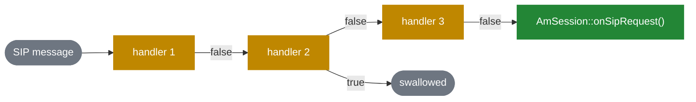
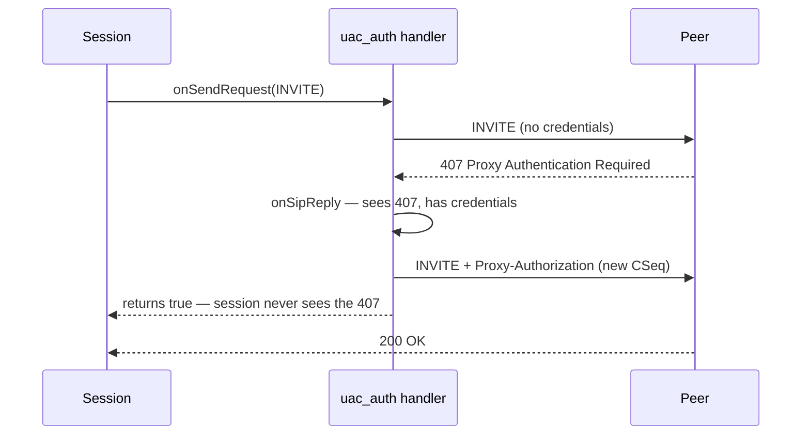

# 4.4 Session event handlers

> [!NOTE]
> A session event handler is an interceptor: a small object attached to a session that sees
> every SIP message before the session does, and may modify it, act on it, or swallow it. It is
> SEMS' answer to "I need this behaviour on many applications without editing any of them".

## The interface

The whole contract is one header, and every method has a default implementation:

```cpp
class AmSessionEventHandler
  : public AmObject
{
public:
  bool destroy;

  AmSessionEventHandler()
    : destroy(true) {}

  virtual int configure(AmConfigReader& conf) { return 0; }

  virtual bool process(AmEvent*) { return false; }

  virtual bool onSipRequest(const AmSipRequest& req) { return false; }
  virtual bool onSipReply(const AmSipRequest& req,
                          const AmSipReply& reply,
                          AmBasicSipDialog::Status old_dlg_status) { return false; }

  virtual bool onSendRequest(AmSipRequest& req, int& flags) { return false; }
  virtual bool onSendReply(const AmSipRequest& req, AmSipReply& reply, int& flags) { return false; }

  virtual void onRequestSent(const AmSipRequest& req) {}
  virtual void onReplySent(const AmSipRequest& req, const AmSipReply& reply) {}
  virtual void onRemoteDisappeared(const AmSipReply& reply) {}
  virtual void onLocalTerminate(const AmSipReply& reply) {}
  virtual void onFailure() {}
};
```

Three things to read out of this.

**Incoming hooks take `const`, outgoing hooks do not.** `onSipRequest()` may inspect but not
alter what arrived. `onSendRequest()` takes a non-const `AmSipRequest&` and an `int& flags` —
this is where a handler adds headers, rewrites a body, or changes send behaviour. Interception
is asymmetric by design: you shape what you send, not what you were sent.

**`Send` and `Sent` are separate**, for the same reason as in offer/answer
([4.3](14-offer-answer.md)): `onSendRequest()` runs while the message is being built and can
still change it; `onRequestSent()` runs after it is on the wire and returns nothing, because
there is nothing left to influence.

**The `bool` return is the important part.** It is not success or failure.

## The chain, and what `true` means

Handlers are held in a vector on the session and invoked through one macro:

```cpp
#define CALL_EVENT_H(method,...) \
            do{\
                vector<AmSessionEventHandler*>::iterator evh = ev_handlers.begin(); \
                bool stop = false; \
                while((evh != ev_handlers.end()) && !stop){ \
                    stop = (*evh)->method( __VA_ARGS__ ); \
                    evh++; \
		} \
		if(stop) \
                    return; \
            }while(0)
```

Read the last three lines carefully.

> [!WARNING]
> Returning `true` does not merely stop the chain — the macro then executes `return`, abandoning
> **the entire session method that invoked it**. A handler that returns `true` from
> `onSipRequest()` means the session's own `onSipRequest()` never runs: the application does not
> see the message at all. That is the intended power of the mechanism, and it is also how a
> subtle bug swallows traffic silently. Return `true` only when you have genuinely handled the
> message, and return it from the right hook.

Order matters, and it is registration order. There is no priority field.



## Lifetime: the `destroy` flag

```cpp
  bool destroy;
  AmSessionEventHandler() : destroy(true) {}
```

Default `true`: the session deletes the handler when it ends. That suits the common case of one
handler instance per session.

Set it to `false` and the session leaves the object alone — for a handler that is shared across
sessions, or owned by the module that created it. Getting this wrong gives you either a leak or
a double free, and since `AmSessionEventHandler` has no virtual destructor obligations beyond
the default, neither failure is loud. Decide deliberately.

## `AmUACAuth`, the worked example

Authentication is the canonical handler, because it is exactly the shape the mechanism was built
for: cross-cutting, stateful across two messages, and needed by many unrelated applications.

```cpp
class AmUACAuth {
  ...
  static UACAuthCred* unpackCredentials(const AmArg& arg);
  static bool enable(AmSession* s);
};
```

`AmUACAuth::enable(session)` is the whole public API. What it does:

1. Fetches the `uac_auth` module's `AmSessionEventHandlerFactory` from `AmPlugIn`.
2. Creates a handler instance for this session.
3. Appends it to the session's handler vector.

Thereafter the flow is:



The application asked for a call and got a call. It never learned that a challenge happened.
That is the whole value: `AmSipRegistration` ([9.1](31-registrar-client.md)), the SBC's A- and
B-leg authentication ([6.3](23-sbc.md)) and every outbound application share one implementation
of digest auth, and none of them contains a line of it.

It is also a clean illustration of the `true` return being correct: the 407 *was* fully handled,
and passing it to the application would be actively wrong — the application would conclude the
call failed.

## When to write one

A session event handler is the right tool when the behaviour is **cross-cutting, SIP-level, and
per-session**:

- adding or stripping headers on everything a session sends,
- responding to challenges, as `uac_auth` does,
- session timers, refreshes, keepalives,
- logging or CDR generation that must see every message,
- policy that can reject a message before the application sees it.

It is the wrong tool when the behaviour belongs to one application (put it in the application),
when it needs to see media (that is the `AmAudio` chain, [5.3](18-audio-pipeline.md)), or when
it is really call routing (that belongs in the proxy, or in an SBC call control module,
[6.5](23c-sbc-call-control.md)).

## Registering the factory

Handlers are plug-ins like everything else ([4.2](13-session-container-and-factories.md)):

```cpp
class AmSessionEventHandlerFactory: public AmPluginFactory
{
  ...
  virtual bool onInvite(const AmSipRequest& req, AmConfigReader& cfg)=0;
  virtual bool onInvite(const AmSipRequest& req, AmArg& session_params, AmConfigReader& cfg);
};
```

```cpp
EXPORT_SESSION_EVENT_HANDLER_FACTORY(MyHandlerFactory, "my_handler");
```

Note that the factory's `onInvite()` returns `bool`, not a handler pointer: it is being asked
"do you want to attach to this call?". A handler can decline per-call based on the request —
authenticate calls to one domain and not another, for instance — without the session needing to
know the policy.
