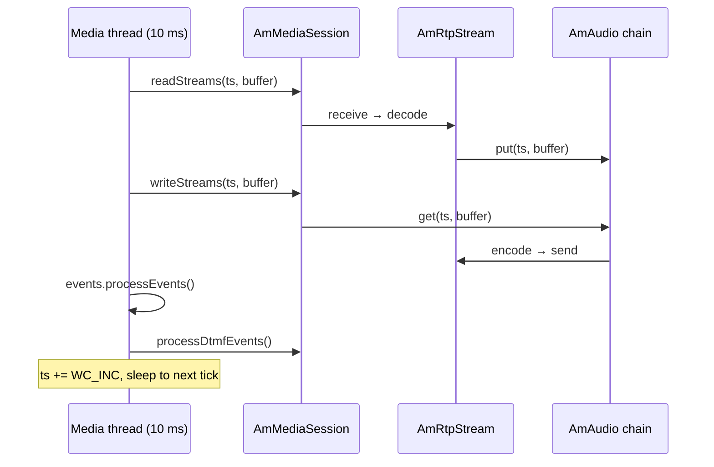

# 5.1 The media processor

> [!IMPORTANT]
> The media plane is **clock-driven**, not event-driven. Nothing in it waits for a packet.
> A fixed set of threads wakes every 10 ms, walks its list of sessions, and pulls and pushes
> audio for each one. Everything about SEMS' media behaviour under load follows from that
> single design choice.

## `AmMediaSession`

To be on the media path, an object implements one interface:

```cpp
class AmMediaSession
{
  private:
    AmCondition<bool> processing_media;
  public:
    virtual int readStreams(unsigned long long ts, unsigned char *buffer) = 0;
    virtual int writeStreams(unsigned long long ts, unsigned char *buffer) = 0;
    virtual void processDtmfEvents() = 0;
    virtual void clearAudio() = 0;
    virtual void clearRTPTimeout() = 0;
    virtual void onMediaProcessingStarted() { processing_media.set(true); }
    virtual void onMediaProcessingTerminated() { processing_media.set(false); }
    virtual bool isProcessingMedia() { return processing_media.get(); }
    virtual bool isDetached() { return !isProcessingMedia(); }
};
```

`AmSession` implements it ([4.1](12-amsession.md)), and so does `AmB2BMedia`
([6.2](22-b2b-media.md)) — which is how a B2BUA puts *one* media object on the processor for
two legs instead of two.

Note that the buffer is **passed in**, not owned. It belongs to the processor thread and is
reused for every session on that thread, every tick:

```cpp
  unsigned char   buffer[AUDIO_BUFFER_SIZE];
```

with `AUDIO_BUFFER_SIZE` defined in `amci/amci.h` as `(1<<13)` — 8 KB, one shared scratch
buffer per thread. Sessions never allocate per-tick, and nothing may retain a pointer into it
after `readStreams()`/`writeStreams()` returns.

`isDetached()` is the flag the rest of the system uses to ask "is this session's audio actually
running?" — a session can exist, hold a dialog and be on nobody's media list.

## The tick

```cpp
void AmMediaProcessorThread::run()
{
  ...
  tick.tv_sec  = 0;
  tick.tv_usec = 1000*WC_INC_MS;

  gettimeofday(&now,NULL);
  timeradd(&tick,&now,&next_tick);

  while(!stop_requested.get()){

    gettimeofday(&now,NULL);

    if(timercmp(&now,&next_tick,<)){

      struct timespec sdiff,rem;
      timersub(&next_tick,&now,&diff);

      sdiff.tv_sec  = diff.tv_sec;
      sdiff.tv_nsec = diff.tv_usec * 1000;

      if(sdiff.tv_nsec > 2000000) // 2 ms
	nanosleep(&sdiff,&rem);
    }

    processAudio(ts);
    events.processEvents();
    processDtmfEvents();

    ts = (ts + WC_INC) & WALLCLOCK_MASK;
    timeradd(&tick,&next_tick,&next_tick);
  }
}
```

Three pieces of work per tick, in order: audio, then the thread's own event queue, then DTMF.
They share one 10 ms budget ([2.5](06-sizing-and-tuning.md)).

The timestamp is not wall-clock seconds:

```cpp
#define WALLCLOCK_RATE 102400LL
#define WALLCLOCK_MASK 0xFFFFFFFFFFFFLL // 48 bit mask
#define WC_INC_MS 10LL /* 10 ms */
#define WC_INC ((WALLCLOCK_RATE*WC_INC_MS)/1000LL)
```

A 48-bit counter at 102 400 ticks per second, advancing by `WC_INC` (1024) each pass. 102 400 is
divisible by every sample rate SEMS handles — 8000, 16000, 32000, 48000 — so converting the
system timestamp to any codec's clock is exact integer arithmetic with no drift. That is the
entire reason for the odd-looking constant.

`SYSTEM_SAMPLECLOCK_RATE` is 32000: internally audio is carried at 32 kHz and resampled at the
edges ([5.3](18-audio-pipeline.md)).

## Callgroups

This is the part of the media processor that is genuinely clever, and it is invisible from the
configuration:

```cpp
class AmMediaProcessor
{
  unsigned int num_threads;
  AmMediaProcessorThread**  threads;
  std::map<string, unsigned int> callgroup2thread;
  std::multimap<string, AmMediaSession*> callgroupmembers;
  std::map<AmMediaSession*, string> session2callgroup;
  AmMutex group_mut;
  ...
public:
  void addSession(AmMediaSession* s, const string& callgroup);
  void changeCallgroup(AmMediaSession* s, const string& new_callgroup);
};
```

Sessions are not assigned to threads individually. They are assigned by **callgroup**, and every
session in a group lands on the *same* thread.

The reason is conferences. Ten participants in a mixer all read from and write to one
`AmMultiPartyMixer` ([5.3](18-audio-pipeline.md)). If they were spread across ten threads, every
sample would cross a lock. Pinned to one thread, the mixer is touched by exactly one thread and
needs no locking at all on the audio path.

The same applies to a B2BUA's two legs: same callgroup, same thread, so relaying A→B is a
memory copy rather than a synchronised handoff ([6.2](22-b2b-media.md)).

`changeCallgroup()` exists because calls move — a caller transferred into a conference must
migrate to that conference's thread.

> [!WARNING]
> Callgroups mean load is distributed **per group, not per session**. A 200-participant
> conference is one group and therefore one thread, no matter how many
> `media_processor_threads` you configured. `AmMediaProcessorThread::getLoad()` exists so the
> processor can pick the least loaded thread for a *new* group, but it cannot split an existing
> one. If a single conference saturates a thread, more threads will not help — you need fewer
> participants per mixer, or a different topology ([11.2](41-topologies-and-ha.md)).

## Attaching and detaching

```cpp
  enum { InsertSession, RemoveSession, SoftRemoveSession, ClearSession };

  void addSession(AmMediaSession* s, const string& callgroup);
  void removeSession(AmMediaSession* s);
  void clearSession(AmMediaSession* s);
  void softRemoveSession(AmMediaSession* s);
```

Four ways to leave, because leaving is genuinely delicate: the session's own thread wants to
finish, while a media thread may be mid-tick holding a pointer to it.

| Operation | Meaning |
|---|---|
| `InsertSession` | Attach, creating the callgroup if needed |
| `RemoveSession` | Detach and confirm — the caller waits until the media thread has let go |
| `SoftRemoveSession` | Detach without waiting; used when the caller cannot block |
| `ClearSession` | Detach and clear the audio |

Requests are posted as `SchedRequest` events onto the media thread's own queue rather than
mutating its session set directly. The set is therefore only ever touched by the thread that
iterates it — the same discipline as everywhere else in SEMS ([2.2](03-event-system.md)).

`onMediaProcessingStarted()` and `onMediaProcessingTerminated()` are the session's notification
that it has been attached or detached, and the `AmCondition<bool>` behind `processing_media` is
what a caller blocks on when it needs the detach to have actually happened.

## The whole tick, drawn



Read direction first, then write. That ordering matters for a relay or a conference: audio
received this tick can be forwarded in the same tick, so a mixer adds 10 ms of latency rather
than 20.

## Operating it

**One thread is the default.** `NUM_MEDIA_PROCESSORS` is `1` ([2.5](06-sizing-and-tuning.md)).
Raise it before you have real media load, not after.

**Watch for overrun, not CPU.** `next_tick` advances unconditionally; a thread that misses
deadlines simply stops sleeping and runs continuously. Average CPU can look comfortable while
bursts are already late, and late audio is audible.

**The 2 ms floor.** The thread will not `nanosleep` for less than 2 ms, on the reasoning that
scheduling jitter below that costs more than the sleep saves. So a lightly loaded thread still
spins a little; this is normal and not a bug to chase.

**Group size is the real unit of capacity.** Because of callgroups, think in "largest group"
rather than "total sessions" when sizing.
