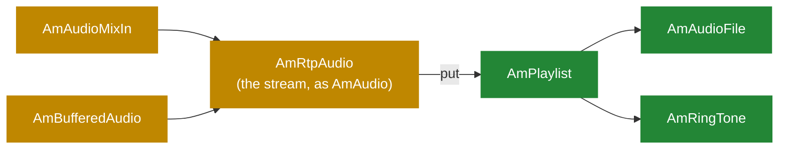

# 5.3 The audio pipeline

> [!IMPORTANT]
> Everything that produces or consumes audio in SEMS is an `AmAudio`. Files, playlists, mixers,
> tone generators, the RTP stream itself — all the same interface. An application composes them
> by chaining, and the media processor drives the chain from one end.

## The interface, and its two halves

`AmAudio` has two pairs of methods that are easy to confuse, and the difference matters:

```cpp
class AmAudio
{
  ...
protected:
  virtual int read(unsigned int user_ts, unsigned int size) = 0;
  virtual int write(unsigned int user_ts, unsigned int size) = 0;

public:
  virtual int get(unsigned long long system_ts, unsigned char* buffer, ...);
  virtual int put(unsigned long long system_ts, unsigned char* buffer, ...);
};
```

**`get()` and `put()` are the public interface**, called by the media processor. They take the
48-bit system timestamp ([5.1](16-media-processor.md)) and the thread's shared buffer.

**`read()` and `write()` are what a subclass implements.** They take a *user* timestamp — the
sample clock of this particular audio object — and a size in bytes.

Between the two layers, `get()`/`put()` do the work every audio object would otherwise repeat:
convert the system timestamp into this object's sample clock, apply the format, and resample if
the rates differ. A subclass author writes `read()` and `write()` and never thinks about clock
conversion.

Naming is from the *processor's* point of view: `get()` pulls audio out towards the network,
`put()` pushes received audio in. A subclass's `read()` is called from `get()`, and `write()`
from `put()`.

## Format and resampling

```cpp
class AmAudioFormat { ... };

class AmResamplingState { ... };
class AmLibSamplerateResamplingState: public AmResamplingState { ... };
class AmInternalResamplerState: public AmResamplingState { ... };

  enum ResamplingImplementationType {
    ...
  };
```

Two implementations. `libsamplerate` is high quality and costs more; the internal resampler is
cheaper and adequate for narrowband telephony. Which one is used is a build and configuration
choice, and it is a real CPU lever on a box doing wideband work.

Internally audio is carried at `SYSTEM_SAMPLECLOCK_RATE`, **32 000 Hz**. A G.711 stream at 8 kHz
is upsampled on the way in and downsampled on the way out. That sounds wasteful, and for a pure
8 kHz relay it would be — which is precisely why relay mode bypasses the audio chain entirely
([5.2](17-rtp-stream.md)). The moment you actually mix or process audio, a common internal rate
is what makes it possible to combine an 8 kHz caller with a 16 kHz one without special cases.

## The chain



A session sets an input and an output, each an `AmAudio`. Playing a prompt is "set the output to
an `AmAudioFile`". Playing three prompts in sequence is "set it to an `AmPlaylist` containing
three items".

## `AmPlaylist`

```cpp
struct AmPlaylistItem { ... };

class AmPlaylist: public AmAudio
{
  ...
  int read(unsigned int user_ts, unsigned int size){ return -1; }
  int write(unsigned int user_ts, unsigned int size){ return -1; }
  ...
  void addToPlaylist(AmPlaylistItem* item);
  void addToPlayListFront(AmPlaylistItem* item);
  void close();
};
```

Note the stubs: `read()` and `write()` return `-1` unconditionally. `AmPlaylist` overrides
`get()`/`put()` instead, because it does not produce audio itself — it delegates to whichever
item is current and advances when that item is exhausted. It is a router, not a source.

`addToPlayListFront()` is how you interrupt: push a prompt to the front and it plays next,
before whatever was queued.

```cpp
class AmPlaylistSeparatorEvent : ...
class AmPlaylistSeparator { ... };
```

A separator is a marker item that posts an event into the session's queue when playback reaches
it ([2.2](03-event-system.md)). That is the mechanism behind "play three prompts, then do
something": the application does not poll for completion, it receives an event on its own
thread.

## The mixer

`AmMultiPartyMixer` is the conference bridge ([9.2](32-conference-and-mixing.md)):

```cpp
class AmMultiPartyMixer
{
  ...
  unsigned int addChannel(unsigned int external_sample_rate);
  void removeChannel(unsigned int channel_id);

  void PutChannelPacket(unsigned int channel_id, ...);
  void GetChannelPacket(unsigned int channel, ...);

  void mix_add(int* dest,int* src1,short* src2,unsigned int size);
  void mix_sub(int* dest,int* src1,short* src2,unsigned int size);
  void scale(short* buffer,int* tmp_buf,unsigned int size);
};
```

The algorithm is the classic one, and `mix_sub` is the whole trick. Rather than mixing N−1
inputs separately for each of N participants — which is O(N²) — the mixer maintains **one sum of
everybody** and, for each participant, subtracts that participant's own contribution. That makes
it O(N), and it is why a mixer can hold hundreds of channels.

The intermediate sum is `int`, not `short`: adding many 16-bit samples overflows, so mixing
happens at 32 bits and `scale()` brings the result back down at the end.

```cpp
  unsigned int addChannel(unsigned int external_sample_rate);
  std::deque<MixerBufferState>::iterator findOrCreateBufferState(unsigned int sample_rate);
```

Participants may arrive at different sample rates, so the mixer keeps a `MixerBufferState` per
rate and mixes within each. `cleanupBufferStates()` retires the ones that fall idle.

This is also where callgroups pay off: every channel of a mixer is on one media thread, so none
of this needs a lock on the audio path ([5.1](16-media-processor.md)).

## The other pieces

| Class | What it does |
|---|---|
| `AmAudioFile` | Reads and writes files through the `amci` file interface ([5.4](19-codecs-and-plugins.md)) |
| `AmCachedAudioFile` | Same, but the file is held in memory — for prompts played thousands of times |
| `AmPrecodedFile` | A file already in the wire codec, so playing it skips encoding entirely |
| `AmAudioMixIn` | Mixes a second source into a primary one — background music, whisper, beep-on-record |
| `AmBufferedAudio` | Decouples a producer from the tick, absorbing jitter on the local side |
| `AmRingTone` | Generates tones from parameters rather than reading a file |
| `AmAudioFileRecorder` / `AmAudioMixer` | Recording and simpler mixing ([9.3](33-msg-storage-and-voicemail.md)) |
| `AmRtpAudio` | The RTP stream wearing the `AmAudio` interface, so it chains like anything else |

`AmPrecodedFile` deserves the attention it rarely gets. An announcement server playing the same
G.711 prompt to a thousand callers can store it already encoded and skip a thousand encodes per
tick. On an announcement-heavy box this is the difference between comfortable and saturated.

## Writing an audio source

Implement `read()`; leave `write()` returning `-1` if it is output-only. Fill `size` bytes at the
given user timestamp and return how many you produced. Return a negative value to signal end of
stream — that is what tells `AmPlaylist` to advance to the next item.

> [!WARNING]
> `read()` runs on a media processor thread inside the 10 ms budget, shared with every other
> session in the callgroup ([5.1](16-media-processor.md)). It must not block. No synchronous
> file open, no database query, no network call. If audio must come from somewhere slow, buffer
> it on another thread and let `read()` drain the buffer — `async_file_writer` is the same
> pattern for the write direction ([2.4](05-lifecycle.md)), and it is the constraint any future
> streaming sink would have to respect ([13.4](50-media-forking-stt-tts.md)).
