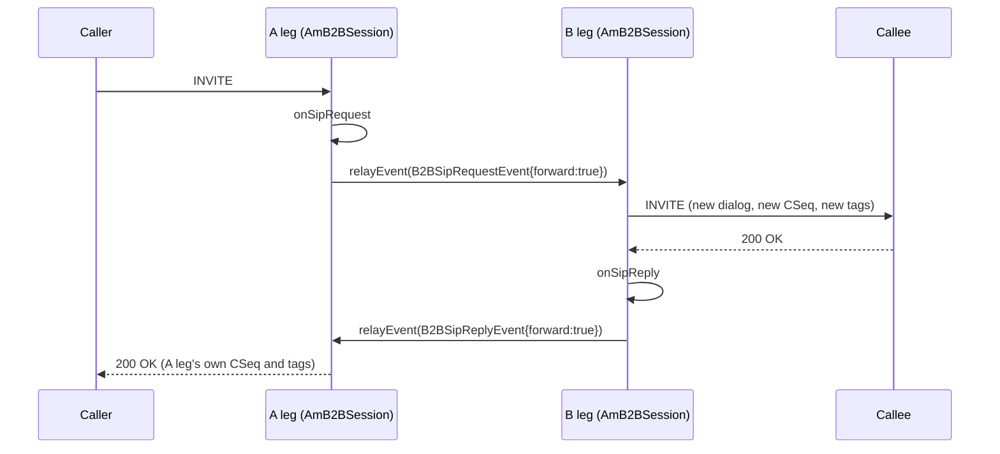

# 6.1 AmB2BSession

> [!IMPORTANT]
> A B2BUA is **two independent sessions that agree to talk to each other**. There is no shared
> dialog, no shared transaction, no shared state — only events crossing between two `AmSession`
> objects that each run their own thread. Every design decision in `AmB2BSession` follows from
> refusing to make the two legs one object.

## The shape

```cpp
class AmB2BSession: public AmSession, protected RelayController
{
  ...
  string other_id;
  bool sip_relay_only;
  bool a_leg;
  ...
};
```

Three members carry the whole relationship:

- **`other_id`** is the *local tag* of the other leg — not a pointer. The legs address each
  other through `AmEventDispatcher` exactly as any two unrelated sessions would
  ([2.2](03-event-system.md)). If the other leg has already ended, `post()` returns `false` and
  nothing dereferences a dead object.
- **`a_leg`** says which side you are. The A leg faces the caller, the B leg the callee.
- **`sip_relay_only`** switches off media handling entirely — SIP crosses, audio does not.

`RelayController` is inherited `protected` and has a single method:

```cpp
class RelayController {
    virtual void computeRelayMask(const SdpMedia &m, bool &enable, PayloadMask &mask) = 0;
};
```

Given one media description from the SDP, decide whether to relay it at all and which payload
types may cross. That `PayloadMask` is the same 128-bit bitmap the RTP stream enforces
([5.2](17-rtp-stream.md)) — this is where the policy is computed, and there it is applied.

## Events between legs

```cpp
enum { B2BTerminateLeg,
       B2BConnectLeg,
       B2BSipRequest,
       B2BSipReply,
       B2BMsgBody };

struct B2BEvent: public AmEvent
{
  enum B2BEventType {
    B2BCore,
    B2BApplication,
  } ev_type;

  map<string, string> params;
  ...
};
```

Five event ids and a two-value type tag. The `B2BCore` / `B2BApplication` split matters: core
events are the B2BUA machinery talking to itself, application events are an application's own
messages riding the same channel. An application can invent its own events and post them to the
other leg without colliding with the framework's, and `params` gives it a place to put data
without defining a new class.

`B2BSipRequestEvent` and `B2BSipReplyEvent` both carry a `bool forward`:

```cpp
struct B2BSipEvent: public B2BEvent
{
  bool forward;
  ...
};
```

That flag is the entire relay decision. The event always reaches the other leg; `forward` says
whether the other leg should put it on the wire or merely observe it. An application that wants
to see the callee's `180` without relaying it to the caller sets `forward = false`.

`B2BSipReplyEvent` additionally carries `relayed_invite`, so the receiving leg knows whether the
reply answers a request that itself came from the other side.

## `relayEvent()`

```cpp
  virtual int relayEvent(AmEvent* ev);
```

One method, and it is the only door between the legs. It resolves `other_id` through the event
dispatcher and posts. Overriding it is how a subclass intercepts everything crossing — the SBC
does exactly that ([6.3](23-sbc.md)).



Note what crosses and what does not. The *message* crosses as an event; the *dialog identity*
never does. The B leg's INVITE has its own Call-ID, its own tags, its own CSeq counter and its
own route set. That is why a B2BUA hides topology for free ([1.1](01-introduction.md)) — there
is nothing of the A leg in the B leg to leak.

## Termination

```cpp
  virtual void terminateOtherLeg();
  virtual bool onOtherBye(const AmSipRequest& req);
  virtual bool onOtherReply(const AmSipReply& reply);
```

`terminateOtherLeg()` posts `B2BTerminateLeg`. The other leg decides how to honour it — usually
by sending a `BYE` and stopping, but an application may want to do something else first.

`onOtherBye()` and `onOtherReply()` both return `bool`, and the convention is the same as
elsewhere in SEMS ([4.4](15-session-event-handlers.md)): returning `true` means "handled, stop
the default processing". An application that wants a `BYE` on one leg to *not* tear down the
other returns `true` from `onOtherBye()` and keeps the surviving leg alive — which is how call
parking and re-targeting work.

There is also a pair of helpers for the unhappy path:

```cpp
  void relayError(const string &method, unsigned cseq, bool forward, int sip_code, const char *reason);
  void relayError(const string &method, unsigned cseq, bool forward, int err_code);
```

A relayed request that cannot be sent — no route, DNS failure ([3.2](08-transport.md)) — must
still produce a response on the originating leg. Without this the caller would sit waiting for a
reply that can never come.

## Three media modes

```cpp
  enum RTPRelayMode {
    /* audio will go directly between caller and callee
     * SDP bodies of relayed requests are filtered */
    RTP_Direct,

    /* audio will be realyed through us
     * SDP bodies of relayed requests are filtered
     * and connection addresses are replaced by us
     */
    RTP_Relay,

    /*
     * similar to RTP_Relay, but additionally transcoding
     * might be used depending on payload IDs
     */
    RTP_Transcoding
  };
```

| Mode | Media path | Cost | Use |
|---|---|---|---|
| `RTP_Direct` | Caller ↔ callee, not through us | Almost nothing | Both endpoints reachable to each other |
| `RTP_Relay` | Through us, packets forwarded untouched | One read + one write per packet | NAT, topology hiding, media pinning |
| `RTP_Transcoding` | Through us, decoded and re-encoded | Four steps per packet ([5.4](19-codecs-and-plugins.md)) | The legs cannot agree on a codec |

Even in `RTP_Direct` the SDP bodies are filtered — the B2BUA still decides which codecs each
side sees. That is worth internalising: **codec policy is independent of whether media flows
through you.** You can constrain what the two ends negotiate without carrying a single packet.

The accompanying flags map one-for-one onto `AmRtpStream`'s ([5.2](17-rtp-stream.md)):

```cpp
  bool rtp_relay_force_symmetric_rtp;
  bool rtp_relay_transparent_seqno;
  bool rtp_relay_transparent_ssrc;

  bool enable_dtmf_transcoding;
  bool enable_dtmf_rtp_filtering;
  bool enable_dtmf_rtp_detection;
```

The three DTMF flags are separate because the three things are genuinely different: *detection*
means recognising a digit and delivering it to the application; *filtering* means removing RFC
2833 payloads from the relayed stream; *transcoding* means converting between DTMF carriage
methods. You might detect without filtering (observe digits, pass them through), or filter
without detecting (strip them, do not care what they were).

## Caller and callee

```cpp
class AmB2BCallerSession: public AmB2BSession
{
  enum CalleeStatus {
    None=0,
    NoReply,
    Ringing,
    Connected
  };
  ...
  bool sip_relay_early_media_sdp;
};

class AmB2BCalleeSession;
```

The caller side carries a small state machine tracking the callee: nothing yet, called but
silent, ringing, answered. This is the ancestor of the SBC's richer `CallStatus`
([6.3](23-sbc.md)), and the reason the SBC needed a richer one is visible here — `CalleeStatus`
has no way to express "connected to one of several candidates" or "disconnecting".

`sip_relay_early_media_sdp` is a policy switch on a genuinely awkward question: the callee sent
a `183` with SDP, so early media is available. Do you relay that SDP to the caller and let ringback
flow, or hold it back until the call is answered? Both are legitimate, and neither can be
inferred, so it is a flag.

## `AmB2ABSession`

`AmB2ABSession` is the other variant, and it is easy to misread as a typo. B2**A**B: the two
legs are bridged **through the audio layer** rather than by relaying RTP.

Each leg terminates media normally and the two are connected by an audio bridge in the
`AmAudio` chain ([5.3](18-audio-pipeline.md)). It costs more than relaying — both legs decode
and encode — but it puts the audio somewhere an application can reach, which relaying does not.
An announcement played into a live call, a recording tap, a whisper to one party only: those
need the audio in the chain, not in a forwarding path.

Choose `AmB2BSession` with `RTP_Relay` when the job is to move packets, and `AmB2ABSession`
when the job is to *do something* with the audio.

## What an application overrides

```cpp
  virtual void onB2BEvent(B2BEvent* ev);
  virtual bool onOtherBye(const AmSipRequest& req);
  virtual bool onOtherReply(const AmSipReply& reply);
  virtual int relayEvent(AmEvent* ev);
  virtual void terminateOtherLeg();
  virtual bool saveSessionDescription(const AmMimeBody& body);
  virtual bool updateSessionDescription(const AmMimeBody& body);
  virtual void computeRelayMask(const SdpMedia &m, bool &enable, PayloadMask &mask);
```

`saveSessionDescription()` and `updateSessionDescription()` are the hooks for holding onto the
negotiated SDP and re-applying it later — needed because a B2BUA has *two* offer/answer state
machines to keep consistent ([4.3](14-offer-answer.md)), and a re-INVITE on one leg often means
a re-INVITE on the other.

That two-machine problem is what the next chapter is about
([6.2](22-b2b-media.md)): media cannot be configured until both legs have both halves of their
negotiation, and there are four ways for that to be incomplete.
