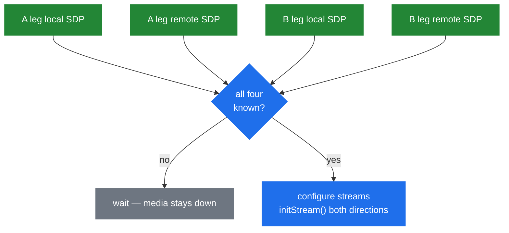

# 6.2 B2B media

> [!IMPORTANT]
> `AmB2BMedia` is **one media object serving two legs**. It implements `AmMediaSession`, so the
> media processor attaches it once and drives both directions from a single tick
> ([5.1](16-media-processor.md)). Two legs, one attachment, one callgroup, one thread — that is
> what makes B2B media cheap.

## Why one object

```cpp
class AmB2BMedia: public AmMediaSession
{
  ...
    struct AudioStreamPair {
      AudioStreamData a, b;
      ...
      bool requiresProcessing() { return a.getInput() || b.getInput(); }
    };

    struct RelayStreamPair { ... };
    ...
    std::vector<RelayStreamPair*> relay_streams;
    AmMutex mutex;
    bool a_leg_muted, b_leg_muted;
};
```

If each leg owned its own media session, a packet arriving on A and destined for B would cross
between two media threads. Callgroups already guarantee both legs share a thread
([5.1](16-media-processor.md)); making them share the media *object* removes the handoff
entirely. Relaying becomes a copy inside one tick.

The object is reference counted and holds its own `AmMutex` — the legs' own threads still touch
it when SDP changes, even though the media thread owns the audio path.

## `AudioStreamData`

One direction of one leg. The comment in the header is candid about why it exists — the
parameters that describe a stream had been scattered, and this class gathers them:

```cpp
class AudioStreamData {
    bool initialized;
    bool force_symmetric_rtp;
    bool enable_dtmf_transcoding;
    bool enable_dtmf_rtp_filtering;
    bool enable_dtmf_rtp_detection;
    bool relay_enabled;
    bool relay_paused;
    bool muted;
    bool receiving;
    ...
public:
    void setRelayStream(AmRtpStream *other);
    void setRelayPayloads(const SdpMedia &m, RelayController *ctrl);
    void setRelayDestination(const string& connection_address, int port);
    void setRelayPaused(bool paused);
    bool initStream(PlayoutType playout_type, AmSdp &local_sdp, AmSdp &remote_sdp, int media_idx);
    int writeStream(unsigned long long ts, unsigned char *buffer, AudioStreamData &src);
    void mute(bool set_mute);
    void setReceiving(bool r);
    void setInput(AmAudio *_in);
    void setDtmfSink(AmDtmfSink *dtmf_sink);
    void setLogger(msg_logger *logger);
};
```

Two things to notice.

**`setRelayPayloads()` takes the `RelayController`.** This is where the policy computed in
[6.1](21-b2b-session.md) is turned into the `PayloadMask` the RTP stream enforces
([5.2](17-rtp-stream.md)). The controller is asked per media description, so audio and video can
have different rules.

**`writeStream()` takes the *source* stream as a parameter:**

```cpp
    int writeStream(unsigned long long ts, unsigned char *buffer, AudioStreamData &src);
```

Writing one direction needs the other direction's data. That signature is the relay, expressed
in a method.

`relay_paused` is worth a note of its own: a stream can be relay-enabled but temporarily not
forwarding — during hold, or while a leg is being re-targeted — without tearing down and
rebuilding the relay.

## Two containers, two costs

```cpp
    struct AudioStreamPair { AudioStreamData a, b; ... };
    struct RelayStreamPair { ... };

    std::vector<RelayStreamPair*> relay_streams;
```

`AudioStreamPair` is the full path: both directions available to the audio chain, decode and
encode, playout buffers, everything in [Part 5](16-media-processor.md).

`RelayStreamPair` is the cheap path: two RTP streams wired to each other, nothing else.

And the test that chooses between them:

```cpp
      bool requiresProcessing() { return a.getInput() || b.getInput(); }
```

**Processing is needed only if something is feeding audio in.** No input on either side means
nothing is being generated or inspected, so the whole audio chain is unnecessary and the pair
can relay. That single line is why an SBC carrying ten thousand calls does almost no work: none
of them has an input, so none of them touches the audio pipeline.

Attach an announcement, a recorder or a tone to either side and `requiresProcessing()` flips —
which is the honest cost of every "just add a beep" feature request.

## The four-SDP problem

```cpp
    bool have_a_leg_local_sdp, have_a_leg_remote_sdp;
    bool have_b_leg_local_sdp, have_b_leg_remote_sdp;
```

A single session needs one completed offer/answer before media can start
([4.3](14-offer-answer.md)). A B2BUA needs **two**, and they complete independently and in any
order.



The addresses each leg advertises depend on the other leg's negotiation, so nothing can be
finalised until all four halves exist. Four booleans, checked on every SDP event, is the whole
mechanism — and it is why an ordering bug in a B2BUA shows up as silent audio rather than an
error: the flags simply never all became true.

Late offer ([4.3](14-offer-answer.md)) makes this concrete. The B leg answers with the offer in
its `200 OK`, so `have_b_leg_remote_sdp` only becomes true when the ACK arrives — and until then
the A leg has nothing to answer with either.

## Relay versus transcode, decided per stream

The choice is not global. `AmB2BSession` picks a mode ([6.1](21-b2b-session.md)), but the
per-stream reality is:

1. If neither side has an input and the payload masks overlap → relay. No decode.
2. If either side has an input → full processing, because something must be mixed in.
3. If the negotiated payloads do not overlap → transcode, because there is no other way to
   bridge them.

Case 3 is worth engineering away. If both legs can be steered to a common codec, the call
relays; if they cannot, it costs roughly four times as much ([5.4](19-codecs-and-plugins.md)).
That is precisely what the SBC's codec filtering is for ([6.4](23b-sbc-profiles.md)) — not to
restrict for its own sake, but to force an overlap.

## Hold, mute and the SDP that comes back

```cpp
    bool a_leg_muted, b_leg_muted;
```

Muting is per leg and lives here rather than on the session, because during hold the media
object must keep existing — the streams stay allocated, the ports stay bound, `relay_paused`
goes true. Tearing media down on hold and rebuilding it on resume would mean a new port pair and
a new offer/answer, which is exactly what users experience as "the audio never came back after
hold".

The SDP to restore on resume is kept by the call leg rather than here — `non_hold_sdp` in
`CallLeg` ([6.3](23-sbc.md)) — because it is a property of the call's history, not of the
current media configuration.

## Statistics

```cpp
class B2BMediaStatistics
{
    AmMutex mutex;
    ...
};
```

A small separate class with its own lock, counting what the media layer is doing. It is the
natural source for any exporter — and one of the concrete answers to "what should SEMS actually
export" in [13.3](49-metrics-and-observability.md).

## Logging media

```cpp
    void setLogger(msg_logger *logger) { a.setLogger(logger); b.setLogger(logger); }
```

Both `AudioStreamPair` and `RelayStreamPair` propagate a `msg_logger` to both sides. That is the
same `msg_logger` interface used for SIP capture ([3.1](07-sip-stack-overview.md)), and setting
it on a media pair is how a call gets recorded to pcap at the packet level.

It is also the existing hook a HEP implementation would extend, rather than inventing a new one
([13.2](48-hep-and-capture.md)).
