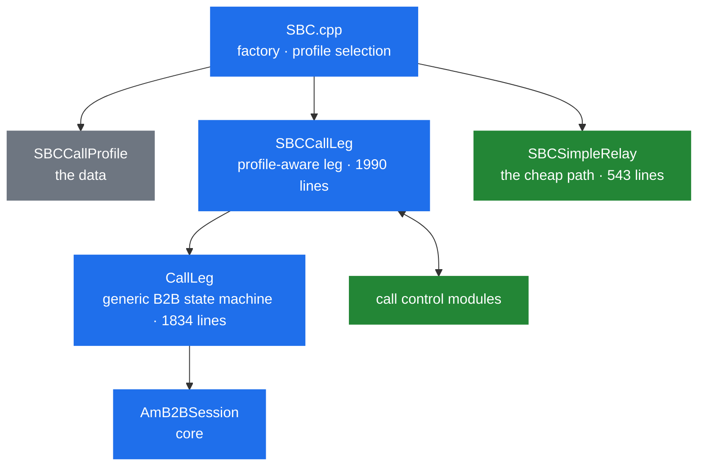

# 6.3 The SBC application: architecture

> [!IMPORTANT]
> `apps/sbc` is roughly 14 000 lines — the largest application in the tree, and larger than
> several parts of the core. It is not a program that does SBC things; it is a **framework for
> building SBCs**, configured by data rather than code. Read it that way and the size makes
> sense.

## The layers



`SBCCallProfile` is [6.4](23b-sbc-profiles.md); the call control modules are
[6.5](23c-sbc-call-control.md); `AmB2BSession` is [6.1](21-b2b-session.md).

The split between `CallLeg` and `SBCCallLeg` is the important one. `CallLeg` is a **generic**
B2B call-leg state machine that knows nothing about profiles, headers or SBC policy — it could
serve any B2BUA application. `SBCCallLeg` adds everything profile-driven on top. If you are
writing your own B2BUA and the core `AmB2BSession` is too raw, `CallLeg` is the class you want.

## Call status is not dialog status

```cpp
    /** B2B call status.
     *
     * This status need not to be related directly to SIP dialog status in
     * appropriate call legs - for example the B2B call status can be
     * "Connected" though the legs have received BYE replies. */
    enum CallStatus {
      Disconnected, //< there is no other call leg we are connected to
      NoReply,      //< there is at least one call leg we are connected to but without any response
      Ringing,      //< this leg or one of legs we are connected to rings
      Connected,    //< there is exactly one call leg we are connected to, in this case AmB2BSession::other_id holds the other leg id
      Disconnecting //< we were connected and now going to be disconnected (waiting for reINVITE reply for example)
    };
```

That header comment is doing real work. This is now the **third** state machine over the same
call — the transaction states ([3.4](10-transaction-layer.md)), the dialog states
([3.5](11-dialog-layer.md)), and now the B2B call status — and they are deliberately independent.

Read the comments on the individual values closely:

- `NoReply` says "at least one call leg" — **plural**.
- `Connected` says "exactly one", and only then is `other_id` meaningful.

Which brings us to the thing that surprises everyone.

## The SBC forks in parallel

```cpp
    /** List of legs which can be connected to this leg, it is valid for A leg until first
     * 2xx response which moves the A leg to Connected state and terminates all
     * other B legs.
     *
     * Please note that the A/B role may change during the call leg life. For
     * example when a B leg is parked and then 'rings back on timer' it becomes
     * A leg, i.e. it creates new B leg(s) for itself. */
    std::vector<OtherLegInfo> other_legs;
```

**An A leg can have many B legs at once.** They are called in parallel; the first `2xx` wins,
moves the A leg to `Connected`, and every other B leg is terminated.

That is a genuine parallel fork, implemented in the application rather than in a routing module.
It is worth knowing before concluding that SEMS cannot distribute a call across candidates — it
can, per call, from an SBC leg. What it lacks is a *peer list with health state* to draw those
candidates from ([13.5](51-peer-dispatching.md)).

The second half of the comment is stranger and worth reading twice: **roles are not fixed**. A B
leg that gets parked and later rings back becomes an A leg and creates B legs of its own. So
`a_leg` ([6.1](21-b2b-session.md)) describes a current role, not an identity, and any code that
assumes otherwise breaks on transfer and parking.

```cpp
    struct OtherLegInfo {
      /** local tag of the B leg */
      string id;

      /** once the B leg gets connected to the A leg A leg starts to use its
       * corresponding media_session created when the B leg is added to the list
       * of B legs */
      AmB2BMedia *media_session;

      void releaseMediaSession() {
	if (media_session) {
	  media_session->releaseReference();
	  media_session = NULL;
	}
      }
    };
```

Each candidate carries **its own** `AmB2BMedia` ([6.2](22-b2b-media.md)), created when the
candidate is added. Forking to three destinations allocates three media objects and three port
pairs; the two losers are released when the winner answers. Parallel forking is therefore not
free — it multiplies media resources for the duration of the ringing.

## Why every status change carries a reason

```cpp
    struct StatusChangeCause
    {
      enum Reason {
        SipReply,
        SipRequest,
        Canceled,
        NoAck,
        NoPrack,
        RtpTimeout,
        SessionTimeout,
        InternalError,
        Other
      } reason;

      union {
        const AmSipReply *reply;
        const AmSipRequest *request;
        const char *desc;
      } param;
      ...
    };

    void updateCallStatus(CallStatus new_status, const StatusChangeCause &cause = StatusChangeCause());
```

Nine reasons, with a union carrying the triggering object. Every transition is annotated with
*why*, and the reason is passed to `onCallStatusChange()` and out to call control modules
([6.5](23c-sbc-call-control.md)).

This is what makes useful CDRs possible. "The call ended" is not an event worth recording; "the
call ended because the RTP timed out" versus "because the far end sent BYE" versus "because no
ACK arrived" are three different operational problems, and the enum keeps them apart all the way
to the log.

## Hold as a three-state machine

```cpp
    bool on_hold; // remote is on hold
    AmSdp non_hold_sdp;
    enum { HoldRequested, ResumeRequested, PreserveHoldStatus } hold;
```

`on_hold` is the current state; the enum is the *pending intent*. `PreserveHoldStatus` is the
interesting third value: a re-INVITE happening for some unrelated reason must not accidentally
resume a held call, so the intent explicitly says "whatever we are, stay that way".

`non_hold_sdp` is the media description to restore on resume. Keeping it here rather than in
`AmB2BMedia` is deliberate ([6.2](22-b2b-media.md)) — it is a fact about the call's history, not
about the current media configuration.

Six of the call-control hooks exist just for this — `holdRequested`, `holdAccepted`,
`holdRejected`, and the same three for resume — because hold is a negotiation that can fail, and
a module enforcing policy needs to know which.

## The hooks

```cpp
    virtual void onCallStatusChange(const StatusChangeCause &cause) { }
    virtual void onCallConnected(const AmSipReply& reply) { }
    virtual void onBLegRefused(const AmSipReply& reply) { }
    virtual void onCallFailed(CallFailureReason reason, const AmSipReply *reply) { }
    virtual void onTransFinished();
    virtual void onRtpTimeout();
    virtual void onSessionTimeout();
    virtual void onNoPrack(const AmSipRequest &req, const AmSipReply &rpl);
    virtual bool getSdpOffer(AmSdp& offer) { return false; }
    virtual bool getSdpAnswer(const AmSdp& offer, AmSdp& answer) { return false; }
```

`onBLegRefused()` is distinct from `onCallFailed()` for the forking reason above: **one B leg
refusing is not the call failing**, as long as candidates remain.

```cpp
    enum CallFailureReason {
      CallRefused, //< non-ok reply received and no more B-legs exit
      CallCanceled //< call canceled
    };
```

The comment spells it out — `CallRefused` requires "no more B-legs exit".

`getSdpOffer()` and `getSdpAnswer()` return `false` by default, meaning "I have no opinion, use
the relayed SDP". A subclass that returns `true` takes over media negotiation for that leg,
which is how a leg can be answered locally — with an announcement, say — rather than being
bridged.

## Adding a callee

```cpp
    void addCallee(CallLeg *callee, const AmSipRequest &relayed_invite);
    void addCallee(const string &session_tag, const AmSipRequest &relayed_invite);
    void addCallee(const string &session_tag, const string &hdrs);
    void addCallee(CallLeg *callee, const string &hdrs);
```

Four overloads across two axes: by object or by session tag, and with a relayed INVITE or with
just headers.

Adding **by session tag** is the one to notice — it connects to a leg that *already exists*
somewhere else in the process. That is the mechanism behind transfer, parking and pickup: an
existing parked leg is attached to a new A leg without either being recreated.

Each `addCallee()` appends to `other_legs` and creates that candidate's `AmB2BMedia`. Calling it
three times before any answers is exactly how parallel forking is expressed.

## `SBCSimpleRelay`

543 lines that exist because the full machinery is overkill for the common case. When a call
needs no profile evaluation, no media, no call control — just SIP forwarded between two dialogs
— `SBCSimpleRelay` handles it without constructing `SBCCallLeg`, `SBCCallProfile` or
`AmB2BMedia`.

It has its own reduced hook set in `ExtendedCCInterface` (`initUAC`, `initUAS`, `onSipRequest`,
`onSipReply`, `onB2BRequest`, `onB2BReply` — [6.5](23c-sbc-call-control.md)), so a module can
still observe relayed traffic without the full leg.

## Events between legs

`sbc_events.h` and `CallLegEvents.h` define the vocabulary on top of the core's five B2B events
([6.1](21-b2b-session.md)) — `ConnectLegEvent` is the one visible in `addCallee()`:

```cpp
    void addCallee(CallLeg *callee, const AmSipRequest &relayed_invite)
      { addNewCallee(callee, new ConnectLegEvent(relayed_invite)); }
```

The A leg does not call into the B leg. It constructs an event and posts it, and the B leg's own
thread acts on it. Even here, inside one application, the legs talk only through the event
system ([2.2](03-event-system.md)).

## Reading order

`SBC.cpp` for the entry point, then `CallLeg.h` for the state machine, then `SBCCallLeg.h` for
what the profile adds. `SBCCallProfile.h` is [6.4](23b-sbc-profiles.md);
`SBCCallControlAPI.h` and `ExtendedCCInterface.h` are [6.5](23c-sbc-call-control.md).

Skip `RegisterCache.cpp` on a first pass — it is a self-contained subsystem, covered in
[6.5](23c-sbc-call-control.md) with the `registrar` module.
