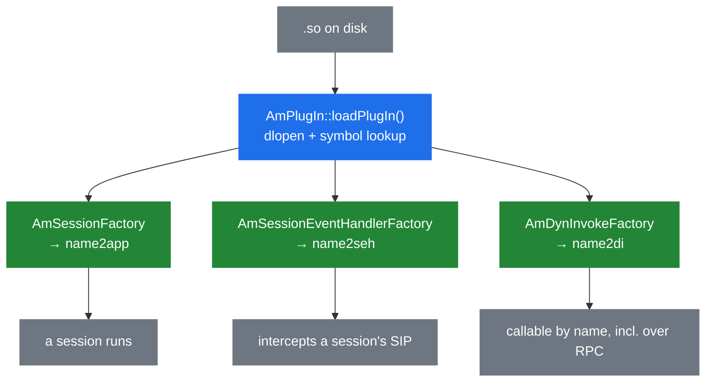

# 7.1 Plug-in architecture

> [!NOTE]
> Almost nothing in SEMS is in the SEMS binary. Applications, codecs, RPC transports, logging
> back-ends and the DSM engine are all shared objects loaded at startup by `AmPlugIn`. The core
> is a framework; everything you actually deploy is a plug-in.

## Five registries

`AmPlugIn` is the singleton that knows what is loaded, and its private members are a good map of
what a plug-in can be:

```cpp
class AmPlugIn : public AmPayloadProvider
{
  std::map<int,amci_codec_t*>       codecs;
  std::map<int,amci_payload_t*>     payloads;
  std::map<string,amci_inoutfmt_t*> file_formats;

  std::map<string,AmSessionFactory*>             name2app;
  std::map<string,AmSessionEventHandlerFactory*> name2seh;
  std::map<string,AmPluginFactory*>              name2base;
  std::map<string,AmDynInvokeFactory*>           name2di;
  std::map<string,AmLoggingFacility*>            name2logfac;

  std::map<string,AmPluginFactory*>              module_objects;
};
```

Two families. The `amci_*` maps are the C codec interface ([5.4](19-codecs-and-plugins.md)),
keyed by integer payload type. The `name2*` maps are the C++ plug-in system, keyed by name.

| Registry | Holds | Chapter |
|---|---|---|
| `name2app` | Applications — things that make sessions | [4.2](13-session-container-and-factories.md) |
| `name2seh` | Session event handlers — interceptors | [4.4](15-session-event-handlers.md) |
| `name2di` | DI objects — callable modules | [8.1](28-rpc-architecture.md) |
| `name2logfac` | Logging facilities | — |
| `name2base` | Plain plug-ins with none of the above roles | — |

`module_objects` is separate and keeps the factory objects themselves alive, independently of
which role registry points at them. One `.so` can register in several — `uac_auth` is both a
session event handler and a DI interface, so it appears twice.

## Loading

```cpp
  void init();
  int load(const string& directory, const string& plugins);

  int loadPlugIn(const string& file, const string& plugin_name, vector<AmPluginFactory*>& plugins);
  int loadAudioPlugIn(amci_exports_t* exports);
  int loadAppPlugIn(AmPluginFactory* cb);
  int loadSehPlugIn(AmPluginFactory* cb);
  int loadBasePlugIn(AmPluginFactory* cb);
  int loadDiPlugIn(AmPluginFactory* cb);
  int loadLogFacPlugIn(AmPluginFactory* f);
```

`load()` takes a directory and an optional explicit list. With a list, only those are loaded, in
that order; without one, the directory is scanned. `loadPlugIn()` `dlopen`s the file and looks
for the exported symbols the `EXPORT_*` macros produce
([4.2](13-session-container-and-factories.md)), then dispatches to the right `load*PlugIn()`
based on which symbol it found.

Order matters when it is specified. A plug-in whose `onLoad()` needs another module already
registered — `dsm` reaching for `mod_mysql`, say — must come after it.

> [!IMPORTANT]
> `onLoad()` returning non-zero fails the plug-in, and a failed plug-in fails the whole process
> start ([2.4](05-lifecycle.md)). This is deliberate and correct: a media server missing the
> module that answers calls is not a media server, and failing loudly at boot beats discovering
> it on the first INVITE. It also means a typo in one module's configuration prevents startup
> entirely.

Loading happens **after** the SIP stack binds its sockets ([2.4](05-lifecycle.md)), which is why
a restart shows a brief window of requests rejected for having no application.

## Registration

```cpp
  bool registerFactory4App(const string& app_name, AmSessionFactory* f);

  static bool registerApplication(const string& app_name, AmSessionFactory* f);
  static bool registerSIPEventHandler(const string& seh_name, ...);
  static bool registerDIInterface(const string& di_name, AmDynInvokeFactory* f);
  static bool registerLoggingFacility(const string& lf_name, AmLoggingFacility* f);
```

The `static` variants exist so a module can register from inside its own `onLoad()` without
holding a pointer to the plug-in manager. A module that provides several applications — the SBC
registers more than one name — calls `registerApplication()` once per name.

Lookup is the mirror:

```cpp
  AmSessionFactory* getFactory4App(const string& app_name);
  AmSessionEventHandlerFactory* getFactory4Seh(const string& name);
  AmDynInvokeFactory* getFactory4Di(const string& name);
  AmLoggingFacility* getFactory4LogFaclty(const string& name);

  AmSessionFactory* findSessionFactory(const AmSipRequest& req, string& app_name);
```

`findSessionFactory()` is the odd one out: it takes the request itself and an out-parameter for
the name. It is used when the application selector produced nothing
([4.2](13-session-container-and-factories.md)) and the factories get to decide among themselves
whether any of them wants the call.

## `AmArg`, the boundary type

Plug-ins are separately compiled shared objects, so anything crossing between them needs a type
both sides agree on without sharing headers. That type is `AmArg`:

```cpp
  enum {
    Undef=0,
    Int,
    LongLong,
    Bool,
    Double,
    CStr,
    AObject, // pointer to an object not owned by AmArg
    ...
    Blob,
    Array,
    Struct
  };

  typedef std::vector<AmArg>              ValueArray;
  typedef std::map<std::string, AmArg>    ValueStruct;
```

A dynamically typed variant: scalars, strings, binary blobs, arrays and string-keyed structs —
JSON's type system, more or less, which is not a coincidence given it is what
`jsonrpc` marshals ([8.1](28-rpc-architecture.md)).

Two entries deserve attention.

**`AObject` is a pointer to an object `AmArg` does not own.** It is how a live C++ object is
passed through an `AmArg`-typed interface, and it is entirely unchecked: the receiver must know
what it is being handed and must not outlive it. Fast, and a use-after-free waiting to happen if
the lifetime is not obvious.

**`Blob` owns its data:**

```cpp
struct ArgBlob {
  ...
  ~ArgBlob() { if (data) free(data); }
};
```

`malloc`/`free` rather than `new`/`delete`, because a blob may have come from the C side.

The cost of `AmArg` is that mistakes are runtime errors. Indexing a struct as an array, or
reading a `CStr` as an `Int`, compiles fine and throws — or worse, asserts — when the call
arrives. The legacy call control interface ([6.5](23c-sbc-call-control.md)) with its positional
integer constants is the sharpest example of what that costs in practice.

## The three ways a plug-in participates



- **An application** owns calls. One INVITE, one session, your code.
- **A session event handler** sees other applications' calls without owning any
  ([4.4](15-session-event-handlers.md)).
- **A DI object** owns nothing and is called by name. This is the one that reaches outside the
  process: register a DI interface and it is callable over XML-RPC and JSON-RPC without writing
  any transport code ([8.1](28-rpc-architecture.md)).

A module frequently does more than one. `uac_auth` is a session event handler that does the
work and a DI interface so credentials can be managed at runtime.

## Codecs are different

```cpp
  int addCodec(amci_codec_t* c);
  int loadAudioPlugIn(amci_exports_t* exports);
```

`AmPlugIn` inherits `AmPayloadProvider`, which is the interface the SDP layer asks "what
payloads do we support?" ([4.3](14-offer-answer.md)). Codec plug-ins do not register a factory;
they hand over a table of function pointers, and `AmPlugIn` becomes the answer to payload
questions.

This is where `exclude_payloads` is applied ([5.4](19-codecs-and-plugins.md)): a payload on the
blacklist is not added, so it never reaches an SDP offer.

## Configuration

Each plug-in may have its own file under `plugin_config_path`:

```
plugin_config_path=/usr/local/etc/sems/etc/
```

`announcement.conf` for the `announcement` module, and so on. The convention is name-based, and
the file is read during `onLoad()` — which is why a bad value there stops startup rather than
producing a warning.

## Writing one

1. Subclass the factory for the role you want — `AmSessionFactory`,
   `AmSessionEventHandlerFactory`, `AmDynInvokeFactory`.
2. Implement `onLoad()`: read configuration, register, return 0. Return non-zero for anything
   you cannot recover from — failing at boot is the intended behaviour.
3. Export it with the matching `EXPORT_*` macro.
4. Build a `.so` into the plug-in directory.
5. If load order matters, name it explicitly in the `load_plugins` list.

> [!WARNING]
> A plug-in is code in the SEMS process ([2.1](02-thread-model.md)). It shares the heap, the
> threads and the fate of every call on the box. A segfault in your module is an outage, not a
> failed call. Chapter [7.4](27-app-tradeoffs.md) is entirely about when that risk is worth
> taking and when a script is the better answer.
