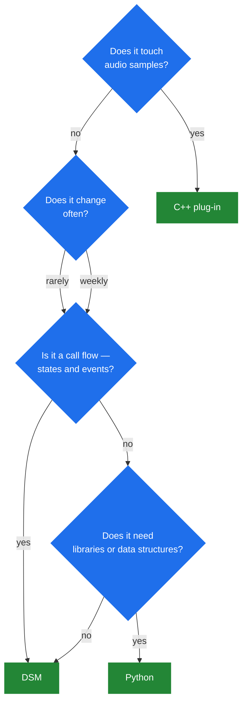

# 7.4 Tradeoffs: C++ vs DSM vs Python

> [!IMPORTANT]
> One fact drives this entire chapter: SEMS is **one process**
> ([2.1](02-thread-model.md)). A segfault in your application code is not a failed call — it is
> every call on the box, at once. Choosing a language here is mostly choosing how much of that
> risk you are taking on.

## The three options

| | C++ plug-in | DSM script | Python (`ivr` / `py_sems`) |
|---|---|---|---|
| Runs as | Native code in-process | Interpreted FSM in-process | CPython in-process |
| Change cycle | Edit → build → restart | Edit → reload | Edit → reload |
| A bug can | **Kill the process** | Raise a `DSMException` | Raise a Python exception |
| Static checking | Compiler | Load-time diagram checks | None until executed |
| Scales on cores | Yes | Yes | **No — GIL** |
| Expressiveness | Total | Deliberately narrow | High |
| Media-path access | Yes | No | No |
| Who can maintain it | C++ developers | Ops, with a day's learning | Python developers |

## Blast radius

This is the axis that matters most and gets discussed least.

**C++** shares the address space with the SIP stack, the media processor and every session. A
null dereference in your `onInvite()` takes down a box carrying a thousand calls. There is no
sandbox, no supervisor that restarts just your module.

**DSM** cannot do that. A script does not dereference pointers; a bad state name fails at load
([7.2](25-dsm.md)), and a runtime problem raises a `DSMException` the diagram can catch. The
worst outcome is one call ending badly.

**Python** sits in between and closer to DSM. An uncaught exception propagates out of the script
into `AmSession::processEventsCatchExceptions()` ([4.1](12-amsession.md)), which ends that
session and returns `false`. One call dies; the server does not.

> [!TIP]
> That containment is real and it is the strongest argument against writing application logic in
> C++. Reserve C++ for what genuinely needs it — media-path work, codecs, performance-critical
> paths — and put decision logic somewhere that cannot take the process with it.

## Latency and throughput

**C++** is the only option on the media path. `AmAudio::read()` runs inside the 10 ms media tick
([5.3](18-audio-pipeline.md)), shared with every session in the callgroup. Neither DSM nor
Python can be there, and that is not an oversight — an interpreter in the tick would be a
disaster.

**DSM** executes a compiled state machine: a map lookup, a condition check, a small list of
actions. For "on key 3, play prompt 7" this is not measurably different from C++ at any call
rate that a media server will see.

**Python** pays interpreter overhead per event and, more importantly, contends on the GIL
([7.3](26-ivr-and-python.md)). Fine for a script that does a few dozen operations per call, and
the wrong tool the moment it does real work.

The load actually matters less than people assume: a call flow runs on the order of tens of
events over minutes. The media plane runs 50 packets per second per direction and is entirely
C++ regardless of what your application is written in.

## Iteration speed

**C++**: edit, build, restart. And restarting SEMS means draining calls with a **10 second**
ceiling on graceful shutdown ([2.4](05-lifecycle.md)) — on a box with long calls, deploying a
one-line change is an operational event.

**DSM and Python**: reload. No restart, no dropped calls. For logic that changes weekly — and
call routing policy always does — this dominates everything else in the table.

That gap is the whole reason `cc_dsm` exists ([6.5](23c-sbc-call-control.md)): it lets SBC call
control be a script, so a policy change is a file edit rather than a maintenance window.

## Correctness

**C++** gets a compiler. Types are checked, refactors are mechanical, and the failure mode of a
mistake is usually a build error.

**DSM** gets something narrower but genuinely useful — the load-time diagram checks
([7.2](25-dsm.md)):

| Check | Catches |
|---|---|
| `checkInitialState` | No initial state, or several |
| `checkDestinationStates` | A transition to a state that does not exist |
| `checkHangupHandled` | A state with no path out on hangup |

The third is the one to appreciate. "A state that does not handle hangup" is the most common
call-flow bug there is, it does not crash, and it leaks a session until `dead_rtp_time` five
minutes later ([5.2](17-rtp-stream.md)). DSM refuses to load it.

**Python** gets none of this. A typo in a rarely-taken branch is discovered by the call that
takes it.

## Expressiveness, honestly

**C++** can do anything, including things that should be somewhere else.

**DSM** is deliberately narrow: states, transitions, conditions, actions, plus functions, `for`
over an array or range, and exceptions ([7.2](25-dsm.md)). Call flows fit it well. Algorithms do
not — and a DSM script fighting the language is worse than the C++ it was avoiding.

**Python** is a real language with a real library ecosystem. When the task is "parse this JSON,
call that API, decide", Python is the honest answer.

A useful signal: if the flow diagram would fit on a whiteboard, DSM is right. If it needs data
structures, Python is. If it needs to touch audio samples, C++ is.

## Choosing

**Reach for C++ when:** the code is on the media path; you are adding a codec
([5.4](19-codecs-and-plugins.md)); you need a session event handler seeing every message
([4.4](15-session-event-handlers.md)); or the work is genuinely CPU-bound.

**Reach for DSM when:** it is a call flow; ops must change it without a build; the logic is
states and events; or it is SBC call control that changes often.

**Reach for Python when:** you need libraries or non-trivial data handling; you are prototyping;
or the team is Python-shaped and the flow is not hot.

## The pattern that avoids the choice

The best answer is often none of the three: put the logic **outside the process**.

A DI interface is callable over XML-RPC and JSON-RPC for free
([8.1](28-rpc-architecture.md)), and the SBC ships a `rest` call control module
([6.5](23c-sbc-call-control.md)) precisely so that policy can live in a service you deploy
separately, in whatever language you like.

The advantages are the ones nothing in-process can offer: your code cannot crash SEMS, cannot
hold the GIL, cannot block a session thread indefinitely, and can be deployed, scaled and rolled
back on its own schedule. The cost is a network round trip in the call setup path, and the
discipline of timeouts and a sensible failure default.

> [!WARNING]
> A blocking call to an external service is dangerous wherever it lives — a session thread
> ([2.1](02-thread-model.md)), a media tick ([5.1](16-media-processor.md)) or an SBC call control
> hook ([6.5](23c-sbc-call-control.md)). Whichever language you pick, the rule does not change:
> short timeouts, a defined behaviour on failure, and never a synchronous call from anything the
> media plane drives.

## In one line each

- **C++** — for things that must be fast or must touch media. Accept that a bug is an outage.
- **DSM** — the default for call flows. Reloadable, checked at load, cannot kill the process.
- **Python** — when you need a real language. Watch the GIL, catch your exceptions.
- **An external service** — when the logic is not really about telephony at all.
