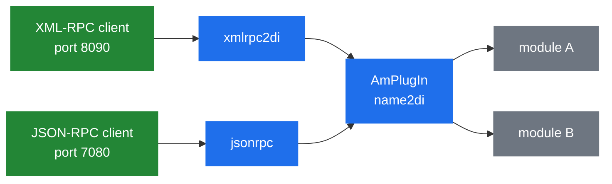

# 8.1 RPC architecture

> [!IMPORTANT]
> SEMS has exactly **one** internal calling convention between modules — the DI (dynamic
> invocation) interface — and the RPC transports are thin adapters onto it. Register a DI
> interface and it becomes callable over XML-RPC and JSON-RPC without writing a line of
> transport code.

## The whole interface

```cpp
class AmDynInvoke
{
 public:
  /** \brief NotImplemented result for DI API calls */
  struct NotImplemented {
    string what;
    NotImplemented(const string& w)
      : what(w) {}
  };

  AmDynInvoke();
  virtual ~AmDynInvoke();
  virtual void invoke(const string& method, const AmArg& args, AmArg& ret);
};

class AmDynInvokeFactory: public AmPluginFactory
{
  virtual AmDynInvoke* getInstance()=0;
};
```

One method. A method name as a string, arguments as an `AmArg`, a result as an `AmArg`
([7.1](24-plugin-architecture.md)).

That is a deliberately minimal contract, and it buys the property everything else in this
chapter depends on: **any DI object is callable by name from anywhere**, including from outside
the process, without either side knowing anything about the other's headers.

`NotImplemented` is thrown — not returned — for an unknown method. So a DI implementation is
typically a chain of string comparisons ending in a throw:

```cpp
void MyModule::invoke(const string& method, const AmArg& args, AmArg& ret)
{
  if (method == "doSomething") { ... }
  else if (method == "doSomethingElse") { ... }
  else if (method == "_list") { ... }
  else throw AmDynInvoke::NotImplemented(method);
}
```

`_list` is the convention for introspection — a module that implements it can tell a caller what
methods it has, which is what makes an RPC console usable against a server you did not write.

> [!TIP]
> The cost of a stringly-typed interface is that everything fails at runtime. A misspelled
> method name, a missing argument, an `AmArg` indexed as the wrong type — none of it is caught
> until the call happens. This is the same weakness that makes the legacy SBC call control
> interface awkward ([6.5](23c-sbc-call-control.md)), and it is the price of a boundary that C++
> modules, Python scripts, DSM scripts and external clients can all cross.

## Getting a DI object

```cpp
  AmDynInvokeFactory* getFactory4Di(const string& di_name);
```

The factory is looked up by name in `AmPlugIn` ([7.1](24-plugin-architecture.md)), then
`getInstance()` gives the object. A module wanting to call another module does exactly that, and
so does every RPC transport.

Note that `getInstance()` is the factory's decision: a module can return one shared object for
all callers, or a fresh one per call. Most return a singleton.

## Two transports



Both are ordinary application plug-ins. Neither is in the core; if you do not load them, SEMS has
no control interface at all.

### `xmlrpc2di`

The name says what it is: XML-RPC translated to DI. Configuration is short:

```
xmlrpc_port=8090
...
# direct_export=di_dial;registrar_client
direct_export=sbc
```

`direct_export` is worth understanding. Without it, an RPC call names the DI module and the
method — two levels. With it, the listed modules' methods are exported at the **top level**, so
a client calls `sbc.postControlCmd` rather than navigating the indirection. It is convenience,
and it also means those methods are the ones most likely to be reachable by anyone who finds the
port.

The plug-in ships a vendored `xmlrpc++` with a local patch (`xmlrpcpp07_sems.patch`) and a
`MultithreadXmlRpcServer` on top, because the upstream library is single-threaded.

### `jsonrpc`

Documented precisely in `doc/Readme.jsonrpc.txt`:

> This plugin implements JSON-RPC protocol version 2.0
> (http://www.jsonrpc.org/specification) operating over TCP/Netstrings.
> Each request and response is of form `<size>:<request or response>` where
> `<size>` tells the number of bytes in `<request or response>`.
>
> Configuration file jsonrpc.conf can contain parameters jsonrpc_port
> (default 7080) and server_threads (default 5).

Two things follow from that.

**It is netstring-framed TCP, not HTTP.** `curl` will not talk to it. A client must prefix each
message with its byte count and a colon. That is simpler and faster than HTTP framing, and it is
the reason most JSON-RPC tooling does not work out of the box.

**`server_threads` defaults to 5.** RPC handling has its own small thread pool
(`RpcServerThread`, `RpcServerLoop`), so an RPC call does not run on a session thread. Five
concurrent RPC calls is plenty for management traffic and a real limit if you build something
that polls hard.

The file list tells the rest of the story:

| File | Role |
|---|---|
| `RpcServerLoop.cpp` | Accept loop |
| `RpcServerThread.cpp` | The worker pool |
| `RpcPeer.cpp` | One connection, and netstring framing |
| `JsonRPCServer.cpp` | Request → DI call → response |
| `JsonRPCEvents.h` | Events for the asynchronous direction |

`JsonRPCEvents.h` matters more than it looks. The JSON-RPC plug-in is **bidirectional**: SEMS can
issue requests to a connected peer, and responses come back as events into a session's queue
([2.2](03-event-system.md)). That is what `JsonRpcRequest` and `JsonRpcResponse` in the DSM event
list are for ([7.2](25-dsm.md)) — a call flow can call out to an external service and be woken
when the answer arrives, without blocking its thread.

That asynchronous path is the sanctioned way to consult an external system mid-call, and it is
strictly better than a blocking HTTP request from a script ([7.4](27-app-tradeoffs.md)).

## `AmArg` on the wire

JSON-RPC is the natural fit because `AmArg`'s type set — `Int`, `Double`, `Bool`, `CStr`,
`Array`, `Struct` ([7.1](24-plugin-architecture.md)) — is essentially JSON's, and
`core/jsonArg.cpp` does the conversion in both directions.

Two entries do not map: `AObject` (a raw pointer) and `Blob` (binary). Neither can cross a wire,
which is a useful reminder that the DI interface has an in-process superset and an RPC subset.
A method taking an `AObject` is callable from another module and not from a client.

## Security

> [!WARNING]
> Neither transport authenticates. Both bind a TCP port — 8090 and 7080 by default — and any
> client that reaches it can invoke any registered DI method: read call state, place calls
> through `di_dial`, change SBC profiles, terminate sessions.
>
> There is no password, no token and no TLS. The only control is network reach. Bind these to
> loopback or a management interface and firewall them; never expose them alongside the SIP
> interface ([10.1](37-security-surface.md)).

## What it is used for

- **Operations** — statistics, active call lists, health ([8.2](29-monitoring-and-stats.md)).
- **Control** — placing calls (`di_dial` wraps `AmUAC::dialout()`,
  [4.2](13-session-container-and-factories.md)), terminating them, reloading SBC profiles
  ([6.4](23b-sbc-profiles.md)).
- **Call control** — the legacy SBC interface is DI ([6.5](23c-sbc-call-control.md)), which is
  how a call control module can live outside SEMS entirely.
- **Module-to-module** — no RPC involved, just `getFactory4Di()` and `invoke()`.
- **Metrics** — the Rust `sems-prometheus-exporter` polls the XML-RPC endpoint and serves
  `/metrics`, which is the whole of SEMS' Prometheus story today
  ([13.3](49-metrics-and-observability.md)).

## Exposing your own

```cpp
class MyFactory : public AmDynInvokeFactory
{
  AmDynInvoke* getInstance() { return instance(); }
  int onLoad() {
    AmPlugIn::registerDIInterface("my_module", this);
    return 0;
  }
};

EXPORT_PLUGIN_CLASS_FACTORY(MyFactory, "my_module");
```

Implement `invoke()`, register the name, and you are reachable from other modules, from DSM, from
Python and over both RPC transports. Implement `_list` while you are there — future you, holding
an RPC console at 3am, will appreciate it.
