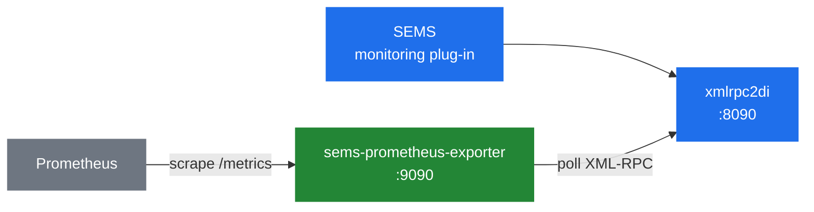

# 8.2 Monitoring and stats

> [!NOTE]
> Monitoring in SEMS is not a metrics system. It is a **per-call log** that applications write
> into and operators read out of over RPC. Everything else — counters, aggregates, Prometheus —
> is built on top of that, and mostly outside the process.

## The `monitoring` application

`apps/monitoring` is an ordinary plug-in exposing a DI interface
([8.1](28-rpc-architecture.md)). Its whole API is visible in the header:

```cpp
class Monitor
{
  LogBucket logs[NUM_LOG_BUCKETS];
  LogBucket& getLogBucket(const string& call_id);
  ...
  void log(const AmArg& args, AmArg& ret);
  void logAdd(const AmArg& args, AmArg& ret);
  void inc(const AmArg& args, AmArg& ret);
  void dec(const AmArg& args, AmArg& ret);
  void addCount(const AmArg& args, AmArg& ret);
  void addSample(const AmArg& args, AmArg& ret);

  void markFinished(const AmArg& args, AmArg& ret);
  void setExpiration(const AmArg& args, AmArg& ret);
  void clear(const AmArg& args, AmArg& ret);
  void clearFinished(const AmArg& args, AmArg& ret);
  void erase(const AmArg& args, AmArg& ret);

  void get(const AmArg& args, AmArg& ret);
  void getSingle(const AmArg& args, AmArg& ret);
};
```

Three groups: **write** (`log`, `logAdd`, `inc`, `dec`, `addCount`, `addSample`), **lifecycle**
(`markFinished`, `setExpiration`, `clear`, `clearFinished`, `erase`) and **read** (`get`,
`getSingle`).

The storage is a sharded hash keyed by Call-ID — the same pattern as the event dispatcher
([2.2](03-event-system.md)) and the transaction table ([3.4](10-transaction-layer.md)):

```cpp
struct LogInfo {
  AmArg info;
  ...
};

struct LogBucket {
  std::map<string, LogInfo> log;
};

LogBucket logs[NUM_LOG_BUCKETS];
LogBucket& getLogBucket(const string& call_id);
```

Each call gets an `AmArg` — an arbitrary structure the application fills in. There is no schema.
An application logs whatever it considers interesting, and a client reads it back.

## Lifecycle, and why it needs a garbage collector

```cpp
class MonitorGarbageCollector;

void markFinished(const AmArg& args, AmArg& ret);
void setExpiration(const AmArg& args, AmArg& ret);
void clearFinished();
```

A finished call's record does not vanish — that would defeat the purpose, since you usually want
to inspect a call *after* it ended. It is marked finished and expires later.

Hence a dedicated garbage collector thread, and hence the thing to watch:

> [!WARNING]
> The monitoring log is unbounded in the same way any cache is. If nothing marks calls finished,
> or expirations are long and call volume is high, the log grows in ordinary heap
> ([2.3](04-memory-and-ownership.md)) until the process is in trouble. `setExpiration` and
> `clearFinished` are not optional housekeeping on a busy server.

`truncate_samples()` does the equivalent for sample series:

```cpp
  void truncate_samples(list<SampleInfo::time_cnt>& v, struct timeval now);
```

`addSample()` records a value with a timestamp; truncation drops the ones outside the window. So
the sample types are a **sliding window**, not a lifetime total — a rate, not a counter.

## `AmStats.h`

The core's own statistics are two small classes, and they are refreshingly plain:

```cpp
class MeanValue
{
 protected:
  double cum_val;
  size_t n_val;
 public:
  void push(double val){
    cum_val += val;
    n_val++;
  }
  double mean(){
    if(!n_val) return 0.0;
    return cum_val / float(n_val);
  }
};

class StddevValue
{
 protected:
  double cum_val;
  double sq_cum_val;
  size_t n_val;
  ...
};
```

A running mean, and a running standard deviation via the sum of squares. Constant memory,
constant time, no history.

That is the right shape for the media plane — you cannot keep a sample list per stream at fifty
packets a second — but note what it cannot do. **There are no percentiles.** A mean jitter of
20 ms tells you very little; the p95 is what you actually care about, and neither of these
classes can produce it. Anything percentile-shaped has to be computed outside, from
`addSample()` series or from RTCP.

> [!NOTE]
> `mean()` divides by `float(n_val)` while accumulating in `double`. For the sample counts these
> classes see it is immaterial, but it is the kind of detail worth knowing before you build a
> billing calculation on top of one.

## `AmCallWatcher`

A separate mechanism for tracking call state, and it is event-driven rather than polled:

```cpp
class CallStatusUpdateEvent : public AmEvent { ... };

class CallStatus
{
  virtual void update(CallStatusUpdateEvent* e) = 0;
  virtual CallStatus* copy() = 0;
  virtual void dump() { }
};

class AmCallWatcher
{
  void run();
  void on_stop();
  void process(AmEvent*);
  void dump();
};

class AmCallWatcherGarbageCollector { ... };
```

`AmCallWatcher` is an `AmThread` and an `AmEventHandler` ([2.2](03-event-system.md)). Sessions
post `CallStatusUpdateEvent`s; the watcher applies them to its own `CallStatus` objects on its
own thread.

Two design points are worth extracting.

**Updates are asynchronous.** A session posting a status update does not block and does not take
a lock on the watcher's data. State tracking never slows down call handling — which matters,
because the alternative (a global call table with a mutex) is exactly the bottleneck this design
avoids.

**`copy()` exists so readers never see a torn state.** A query gets a snapshot, not a pointer
into a structure another thread is mutating.

And again a garbage collector, for the same reason as in monitoring: finished calls linger so
they can be inspected, then must be reaped.

## Prometheus, today

There is no in-process metrics exporter. What ships is a **sidecar**, in Rust:

```
apps/monitoring/tools/
  sems-prometheus-exporter/
  sems-get-callproperties/
  sems-list-active-calls/
  sems-list-calls/
  sems-list-finished-calls/
  sems-monitoring-lib/
  sems_*.py
```

`sems-prometheus-exporter` polls the XML-RPC endpoint and serves `/metrics`:

```rust
const DEFAULT_LISTEN: &str = "0.0.0.0:9090";

fn main() {
    let (sems_url, rest) = sems_monitoring_lib::parse_url_arg(&args);
    let listen_addr = parse_listen_addr(&rest);
    ...
}
```

So the real deployment shape is:



The trade-offs are honest ones. **For it:** no changes to SEMS, no metrics library linked into a
process where a crash is an outage ([2.1](02-thread-model.md)), and the exporter can be updated
independently. **Against it:** a poll interval between reality and your dashboard, a second
process to deploy and monitor, and a metric set limited to what `monitoring` happens to expose.

The other tools — `sems-list-active-calls`, `sems-list-finished-calls`,
`sems-get-callproperties` — are the same library used as CLI, and are the fastest way to see
what a live server is doing. Python equivalents ship alongside.

> [!NOTE]
> `yeti-switch/sems` took the other path and ships a native `prometheus` module
> ([12.3](45-fork-yeti-switch.md)). That divergence is a good illustration of the standing
> question in [13.1](47-gaps-overview.md): does a capability belong in the process, or beside it?

## What is worth watching

From what this book has covered, the numbers that actually predict trouble:

| Signal | Where it comes from | Why |
|---|---|---|
| Active sessions | `monitoring`, `AmCallWatcher` | Against `session_limit` ([2.5](06-sizing-and-tuning.md)) |
| Calls per second | `check_and_add_cps()` | Against `cps_limit` |
| Thread count | `ps -L` | One thread per call in the default build ([2.1](02-thread-model.md)) |
| Media tick overrun | not exported today | The earliest sign of media trouble ([5.1](16-media-processor.md)) |
| RTP ports in use | not exported today | Against the configured range |
| Transactions by state | `dumps_transactions()` | Growth in `TS_COMPLETED` means a peer stopped answering ([3.4](10-transaction-layer.md)) |
| Sessions awaiting reaping | not exported today | The `sleep(5)` queue ([2.3](04-memory-and-ownership.md)) |

Four of those seven are not exported by anything today. That gap, and what closing it would look
like, is [13.3](49-metrics-and-observability.md).
