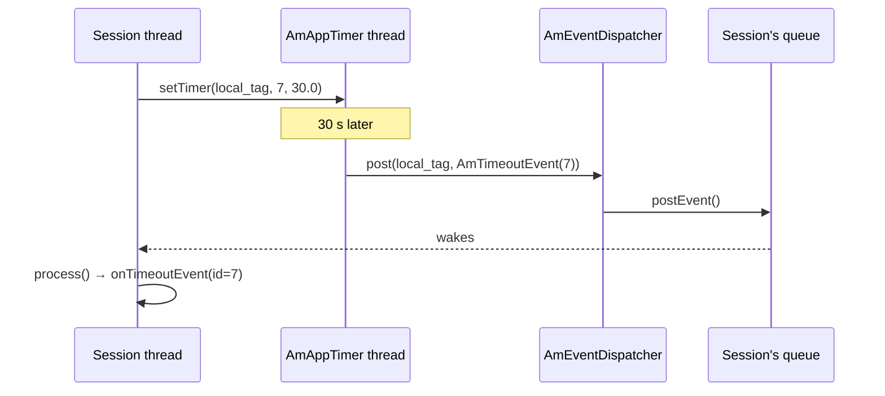
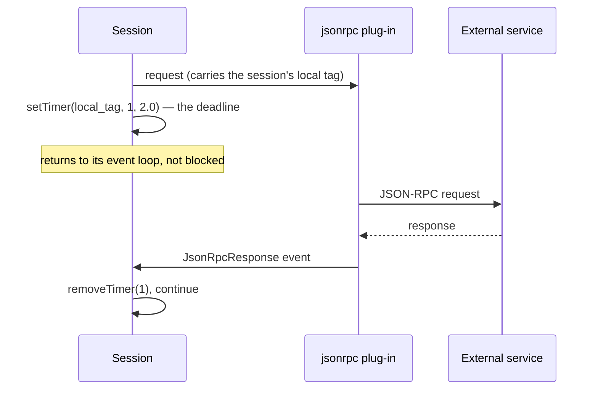

# 8.3 Application timers and events

> [!NOTE]
> This chapter closes the loop opened in [2.2](03-event-system.md). Everything asynchronous in
> SEMS — a timer firing, an RPC response arriving, one module poking another — ends the same
> way: an event lands in a session's queue and is processed on that session's own thread.

## Two kinds of timer

There are already timers in this book — the wheel timer driving RFC 3261
([3.4](10-transaction-layer.md)) and the 10 ms media tick ([5.1](16-media-processor.md)).
`AmAppTimer` is the third, and it is the one applications use.

```cpp
class DirectAppTimer
{
  virtual ~DirectAppTimer() {}
  virtual void fire()=0;
};

class _AmAppTimer
{
  app_timer* create_timer(const string& q_id, int id, unsigned int expires);
  ...
public:
  void setTimer(const string& eventqueue_name, int timer_id, double timeout);
  void removeTimer(const string& eventqueue_name, int timer_id);
  void removeTimers(const string& eventqueue_name);

  void setTimer(DirectAppTimer* t, double timeout);
  void removeTimer(DirectAppTimer* t);
  void setTimer_unsafe(DirectAppTimer* t, double timeout);
  void removeTimer_unsafe(DirectAppTimer* t);
};
```

Two APIs, and the difference matters.

**Queue timers** — `setTimer(eventqueue_name, timer_id, timeout)`. The timer is addressed by
**event queue name**, which is the session's local tag ([3.5](11-dialog-layer.md)). On expiry an
`AmTimeoutEvent` is posted into that queue and handled on the session's own thread. This is what
`AmSession::setTimer()` wraps ([4.1](12-amsession.md)), and it is what you almost always want.

**Direct timers** — `setTimer(DirectAppTimer*, timeout)`. `fire()` is called **on the timer
thread**. No queue, no session, no handoff.

> [!WARNING]
> `DirectAppTimer::fire()` runs on the timer thread. Blocking there delays every other timer in
> the process — including, indirectly, application timers other calls are waiting on. Use it for
> infrastructure that has no session to post to, keep it to a few microseconds, and never do I/O
> in it.

The `_unsafe` variants skip internal locking for callers that already hold the lock. As the name
suggests, they are not for application code.

Addressing a timer **by name rather than by pointer** is the important design choice. A session
can end while a timer is pending; the timer then resolves a name that no longer exists, the post
fails, and nothing dereferences a freed object ([2.2](03-event-system.md)). Pointer-based timers
would need the session to reliably cancel every timer before dying — which is exactly the kind of
invariant that fails on the error path.

## The path a timer takes



The session never blocks. It asks for a timer and returns to its event loop; thirty seconds later
an event arrives like any other. There is no sleeping, no polling, and no separate thread per
timer.

`AmTimeoutEvent` is an `AmPluginEvent` named `timer_timeout` carrying the timer id
([2.2](03-event-system.md)), which is why the id is an `int` you choose: it is how you tell your
own timers apart in one handler.

```cpp
  static bool timersSupported();
```

The check exists because `AmAppTimer` lives in a plug-in — no plug-in, no timers
([7.1](24-plugin-architecture.md)). Calling `setTimer()` without it fails quietly, so a module
that depends on timers should check at load and refuse to start rather than misbehave at call
time.

## `AmPeriodicThread`

For work that is periodic rather than one-shot and belongs to no session:

```cpp
class AmPeriodicThread { ... };
```

A thread that wakes on an interval and does something — cache expiry, an upstream refresh, a
health probe. Modules use it for their own housekeeping; it is not addressed by name and posts
nothing unless you make it.

DSM has an equivalent at the script level: `SystemDSM` runs a diagram with no call attached,
driven by `Startup`, `Reload` and `System` events ([7.2](25-dsm.md)). Periodic background work in
a script rather than C++, with the containment that implies ([7.4](27-app-tradeoffs.md)).

## Posting into a session from outside

The one API worth memorising, because it is how everything external reaches a call:

```cpp
  bool postEvent(const string& local_tag, AmEvent* event);
```

on `AmSessionContainer`, delegating to the dispatcher
([4.2](13-session-container-and-factories.md)).

Three properties, all of which follow from [2.2](03-event-system.md):

- **It returns `bool`.** `false` means the session is gone. Ignoring that return is how modules
  silently leak events.
- **Ownership transfers.** The queue deletes the event after `process()`. Do not keep the
  pointer, do not post it twice, and delete it yourself if the post failed.
- **You do not know when it runs.** Only that it will be on the session's thread, in order,
  after whatever is already queued.

`AmPluginEvent` is the general-purpose vehicle — a name and an `AmArg`
([2.2](03-event-system.md)) — so a module can send structured data to a session without either
knowing the other's headers.

## The asynchronous RPC round trip

Putting this chapter together with [8.1](28-rpc-architecture.md) gives the pattern that matters
most in practice: **calling out to an external service without blocking a call.**



The session issues a request, arms a timer as its deadline, and returns to processing events.
Either the response arrives as an event or the timer fires first. In both cases the session's
thread is free the whole time.

Compare that with a synchronous HTTP call from a Python script or a DSM `mod_curl` action
([7.2](25-dsm.md), [7.3](26-ivr-and-python.md)), which holds the session thread — and in Python,
the GIL — for the duration.

> [!TIP]
> **Always arm a timer alongside an asynchronous request.** A service that never responds
> otherwise leaves the session waiting for an event that will not come, and it stays alive until
> `dead_rtp_time` five minutes later ([5.2](17-rtp-stream.md)). The timer is the timeout; nothing
> else provides one.

DSM exposes both sides of this directly — `JsonRpcRequest`, `JsonRpcResponse` and
`XmlrpcResponse` are event types a script can react to ([7.2](25-dsm.md)) — so the whole pattern
is available in a reloadable script with no C++ at all.
