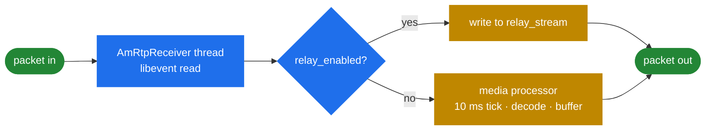

# 9.4 RTP mux and relay

> [!IMPORTANT]
> Relay is not a feature bolted onto the media path — it is a **shortcut around it**. A relayed
> packet is read and written by the RTP receiver thread and never reaches the media processor,
> the audio chain, or a jitter buffer ([5.2](17-rtp-stream.md)). That is why an SBC can carry
> ten thousand calls on hardware that would struggle with a thousand conference channels.

## The relay path

```cpp
  /** pointer to relay stream.
      ... or by the AmRtpReceiver thread while relaying!  */
  AmRtpStream*    relay_stream;
```

That comment is the whole story. With `relay_enabled`, a packet's journey is:



Compare the two branches:

| | Relay | Full media |
|---|---|---|
| Threads involved | One | Receiver + media processor |
| Per packet | Read, maybe rewrite header, write | Decode, resample, buffer, mix, resample, encode |
| Latency added | Sub-millisecond | At least one 10 ms tick, plus playout depth |
| Jitter buffer | None — jitter passes through | Absorbed ([5.5](20-dtmf-and-jitter.md)) |
| DTMF visibility | RFC 2833 only, and only if not filtered | All three sources |
| CPU | Roughly a memcpy | Dominated by the codec |

Relay's lower latency is a genuine advantage, not just a cost saving: passing packets through
adds far less delay than terminating and re-originating the stream.

The trade is that **you cannot do anything with the audio**. No announcement, no recording via
the audio chain, no inband DTMF, no transcoding. The moment an application needs any of those,
`requiresProcessing()` flips and the full path is used ([6.2](22-b2b-media.md)).

## What relay still controls

Relaying is not blind forwarding. The flags from [5.2](17-rtp-stream.md) all apply:

```cpp
  bool relay_raw;
  bool relay_transparent_seqno;
  bool relay_transparent_ssrc;
  bool relay_filter_dtmf;
  PayloadMask relay_payloads;
```

- **`relay_payloads`** — a 128-bit mask deciding, per payload type, whether a packet crosses. So
  an SBC can relay audio while dropping video, or block a codec it refuses to carry, without
  decoding anything ([6.1](21-b2b-session.md)).
- **`relay_filter_dtmf`** — strip RFC 2833 from the relayed stream, typically because the SBC
  handles DTMF itself.
- **The transparency flags** — preserve or rewrite sequence numbers and SSRC. Preserving makes
  the relay invisible, which some endpoints need; rewriting makes the legs independent, which
  you want if either leg can be re-established separately.
- **`relay_raw`** — forward the datagram byte for byte, headers included.

## RTP multiplexing

`AmRtpMuxStream` is a separate mechanism solving a different problem: **too many packets**.

```cpp
#define MAX_RTP_PACKET_LEN 512 // way too long - restricted by max mux frame length

typedef struct { ... } rtp_mux_hdr_t;
typedef struct { ... } rtp_mux_hdr_setup_t;
typedef struct { ... } rtp_mux_hdr_compressed_t;

struct MuxStreamState {
  unsigned int last_mux_packet_id;
  unsigned int ts_increment;
  unsigned int rtp_hdr_len;
  unsigned int setup_frame_ctr;
  unsigned int last_setup_frame_ts;
  ...
};

class AmRtpMuxStream
{
  void recvPacket(int fd, unsigned char* pkt, size_t len);
  ...
};

struct MuxStreamQueue
{
  int l_sd;
  struct sockaddr_storage r_saddr;
  struct sockaddr_storage l_saddr;
  unsigned int mux_packet_id;
  int sendQueue(bool force = false);
  int init(const string& _remote_ip, unsigned short _remote_port);
  void close();
};
```

The problem it addresses: a thousand calls at 50 packets per second per direction is 100 000
datagrams a second, each ~172 bytes of which 12 are an RTP header and 42 are IP+UDP overhead.
The **overhead exceeds the payload**, and the syscall count alone becomes the bottleneck.

Muxing packs many small RTP packets from many streams into one larger datagram between two
SEMS-aware endpoints. Three header types show how far it goes:

- **`rtp_mux_hdr_t`** — the ordinary framing.
- **`rtp_mux_hdr_setup_t`** — sent periodically (`setup_frame_ctr`, `last_setup_frame_ts`) to
  establish per-stream parameters.
- **`rtp_mux_hdr_compressed_t`** — the steady state, where the RTP header is largely omitted
  because the receiver already knows it from the setup frame.

`ts_increment` and `rtp_hdr_len` in `MuxStreamState` are what makes that reconstruction possible:
if timestamps advance by a known constant and the header layout is fixed, most of the header is
predictable and need not be sent.

`MuxStreamQueue::sendQueue(bool force)` is the batching decision — accumulate until the frame is
full, or flush on `force` when latency matters more than efficiency.

> [!WARNING]
> Muxing is **not standard RTP**. Both ends must speak this specific framing, so it works between
> SEMS instances (or something implementing the same format) and nowhere else. It is a private
> optimisation for an internal leg, not something to point at a carrier.

`AmRtpReceiver::startRtpMuxReceiver()` is started separately in `main()`
([2.4](05-lifecycle.md)), after the normal RTP receiver — mux traffic arrives on its own socket
and needs its own reader.

## Choosing

**Relay** whenever the application does not need the audio. It is the default in `sbc`
([6.4](23b-sbc-profiles.md)) and the reason SBC capacity is measured in tens of thousands.

**Full media** when something must produce, consume or mix audio — announcements, recording,
conferences ([9.2](32-conference-and-mixing.md)), transcoding.

**Mux** only between endpoints you control, when packet rate rather than bandwidth or CPU is the
constraint. It is a narrow optimisation, and the first thing to disable when debugging anything
media-related on that leg.
