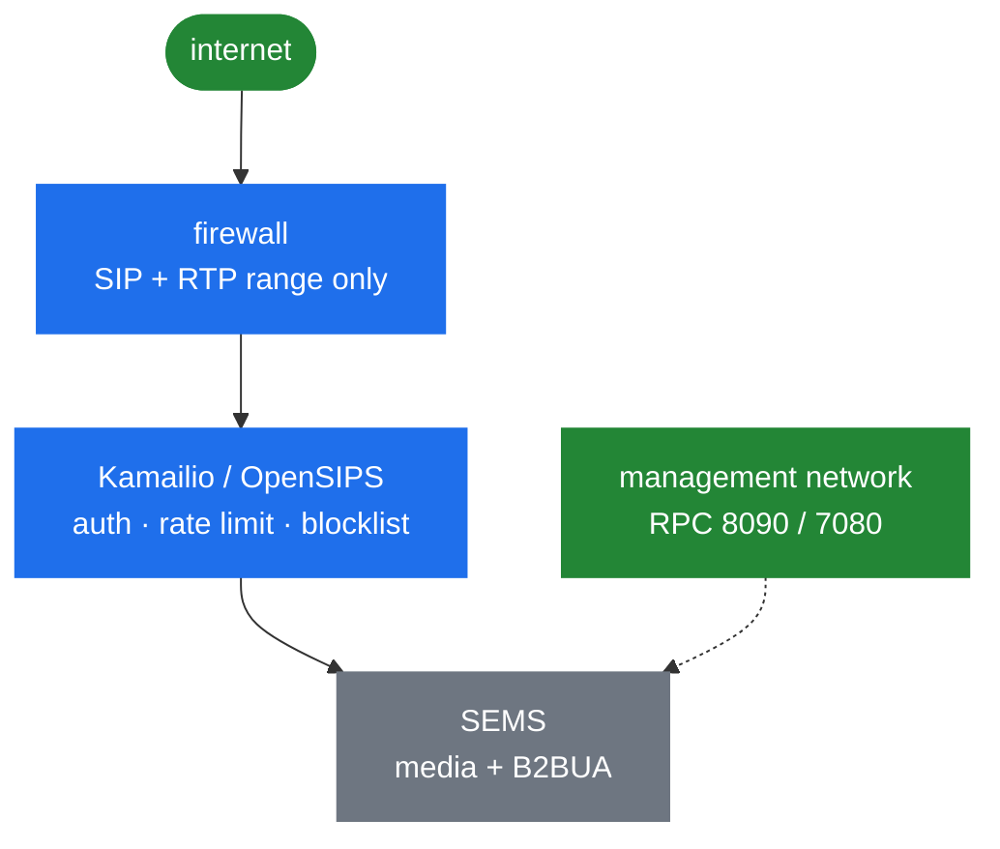

# 10.1 The security surface

> [!IMPORTANT]
> SEMS is a **single process with no privilege separation** ([2.1](02-thread-model.md)). There
> is no sandbox between the SIP parser and your call control module, no worker that can be lost
> and restarted. Anything reachable from the network is reachable by everything else in the
> process. That is the frame for this whole part.

## What listens

| Surface | Default | Reachable by | Authenticated |
|---|---|---|---|
| SIP | 5060, and 5080 in the sample config | Anyone routed to it | Only if you configure it |
| RTP | `rtp_low_port`–`rtp_high_port`, sample 10000–60000 | Anyone who guesses a port | **No** |
| XML-RPC | 8090 | Anyone routed to it | **No** ([8.1](28-rpc-architecture.md)) |
| JSON-RPC | 7080 | Anyone routed to it | **No** |
| `monitoring` | UDP, per `doc/README.stats` | Anyone routed to it | **No** |

Three of those five have no authentication at all and no mechanism to add any. Their only
protection is network reach — a statement worth reading twice before deploying.

## The RPC ports are the biggest exposure

They deserve their own section because the consequences are worse than people expect. An
unauthenticated client that reaches 8090 or 7080 can invoke **any registered DI method**
([8.1](28-rpc-architecture.md)):

- read call state and metadata for every call in progress
  ([8.2](29-monitoring-and-stats.md)),
- place calls via `di_dial`, which wraps `AmUAC::dialout()`
  ([4.2](13-session-container-and-factories.md)) — that is toll fraud with no credentials
  needed,
- add or remove SIP registrations through `registrar_client`
  ([9.1](31-registrar-client.md)) — hijacking a number, or taking a trunk offline,
- change SBC behaviour, since the sample configuration exports `sbc` directly:

```
direct_export=sbc
```

> [!WARNING]
> There is no password, no token, no TLS, and no per-method access control. Bind these to
> loopback or a dedicated management interface, firewall them, and treat reachability to them as
> equivalent to shell access. If a remote system must call in, put a reverse proxy in front that
> does authentication.

## The application selector is attacker-controlled

This one is easy to miss because it looks like configuration rather than input
([4.2](13-session-container-and-factories.md)):

```
# application = $(apphdr)
```

With `$(apphdr)`, **the caller chooses which application runs** by setting `P-App-Name`. With
`$(ruri.user)` or `$(ruri.param)`, they choose it through the request URI.

Only `App_SPECIFIED` — a literal application name — and `$(mapping)`, where the pattern is
yours, are not caller-controlled.

On an interface reachable only from your own proxy this is fine and is the intended integration
([11.1](40-with-kamailio.md)). On anything else it is remote selection of the code path.

## Header substitution in SBC profiles

The same shape, one level down ([6.4](23b-sbc-profiles.md)). `ParamReplacer` can read anything
from the request:

```
RURI=sip:$rU@$H(P-Destination)
```

A profile routing on `$H(...)` lets the caller pick the destination. `$si` — the actual source
address — is at least honest; a header is whatever the peer typed.

The `ctl` call control module ([6.5](23c-sbc-call-control.md)) exists precisely to let headers
steer policy, which is a feature between trusted systems and a vulnerability otherwise.

## Plug-ins load from disk

`AmPlugIn` `dlopen`s everything in the plug-in directory
([7.1](24-plugin-architecture.md)). Anyone who can write a `.so` there executes code in the SEMS
process at the next restart. So the plug-in directory, the configuration directory and
`plugin_config_path` are all part of the trust boundary, and their permissions matter as much as
any credential.

## Where credentials sit

| What | Where | Form |
|---|---|---|
| Registration passwords | `reg_agent` config, or a database | `SIPRegistrationInfo::pwd`, plain string ([9.1](31-registrar-client.md)) |
| `uac_auth` credentials | Configuration or set via DI | Plain ([4.4](15-session-event-handlers.md)) |
| ZRTP cache and entropy | `cache_path`, `entropy_path` | Files, persistent ([9.6](36-zrtp-and-srtp.md)) |
| Database credentials | Module configuration | Plain |

Nothing is encrypted at rest and nothing is expected to be. File permissions are the whole
control ([10.3](39-security-hardening.md)).

## What an unauthenticated attacker can attempt

Assuming only reachability to the SIP port:

**Exhaust sessions.** Every INVITE that passes admission creates a session, and in the default
build that is an OS thread ([2.1](02-thread-model.md)). This is why `session_limit` and
`cps_limit` are the first hardening step and not an optimisation
([2.5](06-sizing-and-tuning.md)).

**Occupy resources for 32 seconds at a time.** A call to an unresponsive destination holds a
transaction until timer B ([3.4](10-transaction-layer.md)), and with it a session and a thread.

**Hold sessions for five minutes.** A call established and then abandoned without a `BYE` lives
until `dead_rtp_time`, default 300 seconds ([5.2](17-rtp-stream.md)).

**Reach the parser.** `sip_parser` is C over raw pointers, reachable by a single unauthenticated
datagram, and everything downstream trusts its output ([3.3](09-parser.md)). It is the
highest-value target in the tree.

**Desynchronise a TCP stream.** Framing depends on `Content-Length`
([3.3](09-parser.md)); a peer that lies about it puts the stream out of step.

**Redirect audio.** Symmetric RTP in `passive` mode learns the remote address from whatever
arrives ([5.2](17-rtp-stream.md)) — the RTP-bleed family, and [10.2](38-security-media.md).

## What is not in the picture

Being explicit about absences, because assuming they exist is how people get hurt:

- **No SRTP or DTLS-SRTP.** Encrypted media can be relayed, never terminated
  ([9.6](36-zrtp-and-srtp.md)).
- **No RPC authentication**, and no hook to add it.
- **No rate limiting per source.** `cps_limit` is global, not per-peer. Per-source limiting
  belongs in the proxy ([11.1](40-with-kamailio.md)).
- **No IP allowlist for SIP.** That is a firewall's job.
- **No audit log.** `SBCEventLog` and `monitoring` record calls, not administrative actions
  ([8.2](29-monitoring-and-stats.md)).
- **No privilege separation.** One process, one blast radius.

## The shape of a defensible deployment



The pattern that follows from everything above: **do not put SEMS on the internet.** Put a proxy
in front. The proxy authenticates, rate limits, blocklists and routes — all things it does
cheaply and SEMS does not do at all ([1.1](01-introduction.md)) — and hands SEMS only calls that
have already been vetted.

That is not a workaround for a weakness. It is the architecture the project describes for itself:
SEMS is intended to *complement* a proxy, and the security division of labour is part of what
that means.
