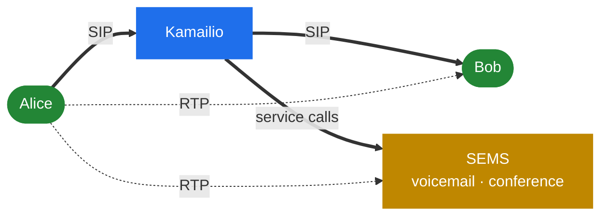
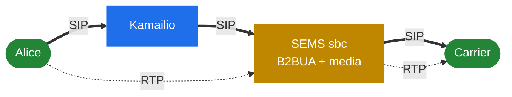

# 11.1 SEMS with Kamailio

> [!NOTE]
> This is the companion chapter to the [Kamailio Handbook](https://denyspozniak.github.io/kamailio-handbook/).
> [1.1](01-introduction.md) answered *which* tool to use; this one answers *how they are wired
> once the answer is both* — which, in any network of interesting size, it is.

## The division of labour

| | Kamailio | SEMS |
|---|---|---|
| Owns | Registration, routing, authentication, the high-CPS path | The calls that need audio |
| Sees | Every request, cheaply | Only what the proxy hands it |
| Costs | Fractions of a millisecond per message | A session, a thread, a port pair |
| Fails as | One worker | The whole process ([2.1](02-thread-model.md)) |

The proxy is the front door and the filter. It authenticates, rate limits, blocklists and routes
— none of which SEMS does at all — and passes on only the small subset of calls that need a media
server ([10.1](37-security-surface.md)).

## The handoff

The in-tree `doc/Howtostart_simpleproxy.txt` shows it directly, and it is worth reading as the
canonical pattern rather than an example:

```text
route[SERVICES] {
     if ($rU=~"^200.*") {
             remove_hf("P-App-Name");
             append_hf("P-App-Name: echo\r\n");
             $ru = "sip:" + $rU + "@" + "127.0.0.1:5070";
             route(RELAY);
             exit;
     }
     if ($rU=~"^300.*") {
             remove_hf("P-App-Name");
             append_hf("P-App-Name: conference\r\n");
             $ru = "sip:" + $rU + "@" + "127.0.0.1:5070";
             route(RELAY);
             exit;
     }
}
```

Three things happen in those five lines:

1. **The proxy decides which application runs** and states it in `P-App-Name`.
2. **The request URI is rewritten** to the SEMS instance.
3. **`remove_hf` before `append_hf`** — the incoming header is discarded before ours is added.

That third point is the security-critical one. Without the removal, a caller who sets
`P-App-Name` themselves chooses the application ([4.2](13-session-container-and-factories.md)).
The example gets it right, and any configuration derived from it must keep that ordering.

On the SEMS side, one line:

```
application=$(apphdr)
```

Other selectors exist — `$(ruri.user)`, `$(ruri.param)`, `$(mapping)` — and the trade is the
same: the more the proxy states explicitly, the less SEMS has to infer.

> [!WARNING]
> `P-App-Name` is trusted input from an untrusted source unless the SEMS SIP port is reachable
> **only** from your proxies. Bind it to an internal address and firewall it
> ([10.3](39-security-hardening.md)). The two-component design assumes a trusted link between
> the components.

## Topology hiding: `topoh`, `topos`, and just terminating

Three mechanisms for one problem — stop the far end learning your internal addressing — at three
very different costs. This comparison is the reason [1.1](01-introduction.md) sends you here.

### Kamailio `topoh`

Encodes the dialog-identifying headers in place. `Via`, `Record-Route`, `Contact` and the rest
are masked with a reversible encoding; the proxy decodes them again on the way back.

- **Stateless.** Everything needed to reverse it is in the message.
- **Cheap.** The proxy's forwarding path is untouched.
- **Nothing is stored**, so nothing is lost on restart and nothing needs replicating.
- Messages grow, and the encoded values are visibly odd to anyone looking.

### Kamailio `topos`

Goes further: strips the headers entirely and keeps the originals in a database or hash table,
replacing them with short opaque keys.

- **Stateful.** Storage is required, and it must survive for the life of the dialog.
- **Cleaner on the wire** — the far end sees almost nothing.
- **Restart and clustering become questions**: lose the store, lose the ability to route
  in-dialog requests.

### SEMS: terminate

A B2BUA does not hide topology — it never exposes it. The B leg is a **new dialog** with its own
Call-ID, its own tags, its own CSeq space and its own route set
([6.1](21-b2b-session.md)). There is nothing of the A leg present to leak.

- **No module, no configuration, no storage.** It is a property of terminating.
- **Complete.** Not an encoding to be reversed — genuinely separate dialogs.
- **Expensive.** You paid for a full session, a thread and, if media flows through, a port pair.

### Side by side

| | `topoh` | `topos` | B2BUA |
|---|---|---|---|
| State | None | Database or hash table | The session itself |
| Cost per call | Negligible | Small, plus storage | A session and a thread |
| Reversible by you | Yes | Yes, via the store | No — the legs are independent |
| Survives restart | Yes | Only if the store does | No, the call ends |
| Also gets you | — | — | Media control, per-leg timers and headers |
| Fails when | Peer mangles headers | Store is unavailable | You are out of capacity |

> [!TIP]
> **If topology hiding is all you need, do it in the proxy.** `topoh` is close to free and
> `topos` is cheap; terminating every call in a B2BUA to hide headers is paying for a media
> server to do a proxy's job.
>
> **If you were going to terminate anyway** — for media, transcoding, per-leg session timers,
> codec policy — then hiding comes free with it, and adding `topoh` in front is redundant.

The SBC profile's `hiding` fields ([6.4](23b-sbc-profiles.md)) are a third, narrower thing:
masking *URIs and identities* inside a dialog the B2BUA already separated. Useful when you must
relay a Contact or a From but not what it says.

Note also `transparent_dlg_id` ([6.4](23b-sbc-profiles.md)), which copies dialog identifiers to
the B leg and therefore **switches the hiding off** — for peers that correlate legs by Call-ID.
A deliberate trade of privacy for interoperability.

## Two topologies

### SEMS as an application server

The proxy routes most calls between endpoints and sends only service calls — voicemail,
conferences, announcements — to SEMS.



Normal calls never touch SEMS, so it is sized for the service fraction only. This is the shape
`Howtostart_simpleproxy.txt` describes.

### SEMS as a B2BUA in the path

Every call goes through SEMS, which terminates and re-originates.



Now SEMS is sized for total traffic, and topology hiding, media control and codec policy come
with it ([6.3](23-sbc.md)). Relay keeps the cost per call low
([9.4](34-rtp-mux-and-relay.md)) — but every call is a session and a thread.

## Where the proxy's features complement SEMS' gaps

Reading the two handbooks together, several of SEMS' absences are Kamailio features:

| SEMS lacks | Kamailio provides | Reference |
|---|---|---|
| Peer groups with health checks | `dispatcher` — sets, algorithms, OPTIONS probing | [13.5](51-peer-dispatching.md) |
| Per-source rate limiting | `pike`, `htable` | [10.1](37-security-surface.md) |
| Inbound blocklists | `permissions`, dynamic blocklists | [10.3](39-security-hardening.md) |
| Registrar and user location | `registrar`, `usrloc` | [9.1](31-registrar-client.md) |
| Cheap topology hiding | `topoh`, `topos` | above |
| Shipping SIP to Homer | `siptrace` with HEP | [13.2](48-hep-and-capture.md) |

That last row is the sharpest illustration of the split: Kamailio taps decrypted SIP inside the
proxy and ships it over HEP; SEMS writes pcap files locally and has no HEP transport at all.

None of these are things SEMS should grow. They are proxy responsibilities, and the two-component
design is what makes it reasonable that SEMS does not have them.

## A checklist for the pair

- [ ] SEMS' SIP port reachable only from the proxies
- [ ] The proxy does `remove_hf` before `append_hf` on `P-App-Name`
- [ ] Rate limiting and blocklisting in the proxy, not SEMS
- [ ] Authentication in the proxy, unless SEMS needs it per leg
  ([6.4](23b-sbc-profiles.md))
- [ ] Topology hiding decided once, in one place
- [ ] `options_session_limit` set so the proxy sees a loaded SEMS, not a dead one
  ([2.5](06-sizing-and-tuning.md))
- [ ] The proxy's dispatcher or failover handles SEMS instances
  ([11.2](41-topologies-and-ha.md))
