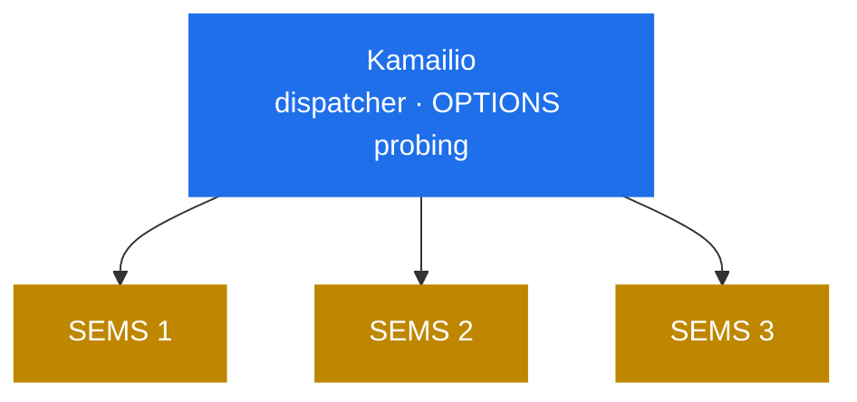

# 11.2 Topologies and HA

> [!IMPORTANT]
> Two SEMS instances share **nothing**. No shared memory, no replicated state, no cluster
> protocol ([2.3](04-memory-and-ownership.md)). Every high-availability design here follows from
> that single fact, and pretending otherwise is how people build clusters that do not fail over.

## Scale by instance, not by worker

Kamailio scales by forking more workers into the same shared-memory pool. SEMS has no such pool,
so the unit of scaling is the **process**, which in practice means the box or the container.

The ceilings, in the order you usually hit them ([2.5](06-sizing-and-tuning.md)):

| Ceiling | Set by |
|---|---|
| Threads | One per call by default ([2.1](02-thread-model.md)); `pids.max`, `threads-max` |
| Media tick headroom | `media_processor_threads`, default **1** ([5.1](16-media-processor.md)) |
| RTP ports | The configured range |
| File descriptors | Sockets plus files plus module connections |
| Transcoding CPU | Codec choice, a factor of four ([5.4](19-codecs-and-plugins.md)) |

Two of those are per-instance and cannot be scaled around inside one process. In particular a
**callgroup cannot span threads** ([5.1](16-media-processor.md)), so a single large conference
is bounded by one core regardless of instance size ([9.2](32-conference-and-mixing.md)).

## What "state" means here

Nothing survives an instance, and it is worth being precise about what is lost:

| State | Where it lives | On instance loss |
|---|---|---|
| Sessions | The session object and its thread | Gone |
| Dialogs | `AmSipDialog` in the session | Gone |
| Transactions | `trans_table` ([3.4](10-transaction-layer.md)) | Gone |
| Media streams | `AmRtpStream`, bound ports | Gone |
| Conference rooms | `AmConferenceStatus` ([9.2](32-conference-and-mixing.md)) | Gone |
| Registration cache | `RegisterCache` ([6.5](23c-sbc-call-control.md)) | Gone, rebuilds |
| Monitoring log | `monitoring` ([8.2](29-monitoring-and-stats.md)) | Gone |
| Recordings on disk | Filesystem | Survives, possibly truncated |

> [!WARNING]
> **There is no call preservation.** An instance that dies drops every call on it, and no other
> instance can pick them up — the dialog state, the media state and the RTP ports all lived in
> that process. High availability in SEMS means *new* calls survive, not existing ones.

That is not unusual for a media server, but it is different from a proxy, where a stateless
worker can be replaced mid-transaction.

## Distributing calls

The proxy in front does it ([11.1](40-with-kamailio.md)). SEMS has no peer list, no health
probing and no way to hand a call to a sibling ([13.5](51-peer-dispatching.md)) — so the
distribution logic lives entirely in Kamailio's `dispatcher` or its equivalent.

Two SEMS-side settings make this work properly:

**`options_session_limit`, set below `session_limit`** ([2.5](06-sizing-and-tuning.md)). A full
instance keeps answering keepalive `OPTIONS` and can report itself loaded, rather than going
silent and being marked dead — which would remove it abruptly, dropping its calls.

**`cps_limit` and `session_limit`, set deliberately.** A `503` is a call the proxy can route
elsewhere; an accepted call on a saturated instance is bad audio for everyone already on it.

## What forces affinity

Not all calls can go anywhere.

**A conference must be on one instance.** Participants must reach the same
`AmConferenceStatus` ([9.2](32-conference-and-mixing.md)), and there is no bridging between
instances. Route by conference id — Kamailio can hash on the R-URI user — or accept that a room
is capped by one box.

**Both legs of a B2BUA are on one instance** by construction. `other_id` is a local tag resolved
through the local event dispatcher ([6.1](21-b2b-session.md)); there is no cross-instance
addressing.

**Registration caching is per instance.** `RegisterCache` ([6.5](23c-sbc-call-control.md)) is
in-process, so a subscriber's registration is known to one instance only. Either the proxy
consistently routes that subscriber to the same instance, or every instance registers upstream
independently.

## Draining

The only supported way to take an instance out gracefully:

1. **Stop new calls upstream** — remove it from the proxy's dispatcher set.
2. **Wait for it to empty.** SEMS has no "stop accepting, keep serving" mode; the upstream must
   provide it.
3. **Then signal it.** `max_shutdown_time` bounds the wait at **10 seconds** by default
   ([2.4](05-lifecycle.md)), after which remaining calls are dropped.

> [!WARNING]
> Ten seconds is nothing for a media server carrying long calls. If you signal an instance
> without draining first, you drop calls — the graceful shutdown broadcast asks sessions to end,
> and the deadline ends the rest ([2.4](05-lifecycle.md)). Raise the ceiling if your calls are
> long, but the real fix is draining upstream.

## Sizing an instance

Smaller instances fail smaller. The trade-off:

**Larger instances** amortise fixed overhead and keep more calls' legs together, but a failure
takes more calls with it, and a single process's ceilings (media threads, conference size) apply
regardless.

**Smaller instances** lose less on failure, drain faster, and let a conference-heavy workload sit
alongside a relay-heavy one without competing. More instances to operate, and more registrations
if each registers upstream.

Given that failure is total per process, the argument leans towards **more, smaller instances**
than instinct suggests — particularly with the default single media processor thread
([5.1](16-media-processor.md)), which makes a large box no better than a small one for media
unless configured otherwise.

## Practical shapes

**Service tier.** Kamailio routes normal calls between endpoints and only service calls to a
small SEMS pool ([11.1](40-with-kamailio.md)). Sized for the service fraction; a lost instance
loses voicemails in progress, not the network.

**SBC tier.** Every call traverses SEMS. Sized for total traffic; relay keeps per-call cost low
([9.4](34-rtp-mux-and-relay.md)); a lost instance drops the calls it held. Distribution and
failover both in the proxy.

**Conference tier.** Affinity by room, sized by the largest room rather than total participants,
and worth separating from other workloads because its cost profile is completely different.

## An HA checklist

- [ ] Distribution in the proxy's dispatcher, with OPTIONS probing
- [ ] `options_session_limit` below `session_limit` so a full instance answers probes
- [ ] `cps_limit` and `session_limit` set on every instance
- [ ] Conference-id affinity if you run conferences
- [ ] A drain procedure that removes from the dispatcher first
- [ ] `max_shutdown_time` matched to your call lengths
- [ ] Instance sizing chosen against blast radius, not just capacity
- [ ] Recordings and voicemail on shared or replicated storage, since instances share nothing
  ([9.3](33-msg-storage-and-voicemail.md))
- [ ] Monitoring per instance — the log is in-process
  ([8.2](29-monitoring-and-stats.md))
