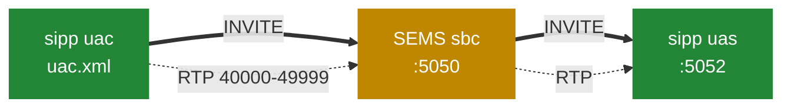

# 11.3 A reproducible lab

> [!NOTE]
> Everything here uses what is already in the target tree — the Docker build files, the `sipp`
> scenarios in `doc/sipp/` and the sample configurations. No invented tooling, and every command
> is one you can paste.

## Build it

The tree ships Dockerfiles for Debian 11–13, Ubuntu 22.04 and 24.04, and RHEL 7–10. The Debian
13 one is a good reference because it also tells you the dependency list:

```dockerfile
FROM debian:13

RUN apt-get update && apt-get install -y \
        git \
        debhelper devscripts \
        g++ make cmake \
        python3-dev python3-pip \
        openssl libssl-dev \
        libspandsp-dev flite1-dev libspeex-dev libgsm1-dev libopus-dev \
        libsamplerate-dev libmp3lame-dev libcodec2-dev libbcg729-dev \
        libev-dev libevent-dev libxml2-dev libcurl4-openssl-dev \
        libhiredis-dev libmysqlcppconn-dev \
        cargo rustc \
    && rm -rf /var/lib/apt/lists/*
```

That list is a map of the book. `libspandsp` is the alternative inband DTMF detector
([5.5](20-dtmf-and-jitter.md)); `flite1` is the text-to-speech ([7.3](26-ivr-and-python.md));
`libsamplerate` is the high-quality resampler ([5.3](18-audio-pipeline.md)); `libevent` drives
the RTP receiver ([5.2](17-rtp-stream.md)); `libspeex`, `libgsm1`, `libopus`, `libcodec2`,
`libbcg729` are codecs ([5.4](19-codecs-and-plugins.md)); `libhiredis` and `libmysqlcppconn` are
for DSM modules ([7.2](25-dsm.md)); and `cargo`/`rustc` build the Rust monitoring tools
([8.2](29-monitoring-and-stats.md)).

Note what is **not** there: no `libzrtp`. ZRTP is off by default and needs a forked SDK
([9.6](36-zrtp-and-srtp.md)).

```bash
docker build -f Dockerfile-debian13 -t sems-build .
```

The build runs the unit tests as part of the image:

```dockerfile
RUN mkdir -p build && cd build && cmake .. && make sems_tests && ./core/sems_tests
```

So a successful image means the tests passed. Locally:

```bash
mkdir -p build && cd build
cmake ..
make -j"$(nproc)"
make sems_tests && ./core/sems_tests
```

Useful options, all covered earlier:

```bash
cmake .. -DSEMS_USE_ZRTP=yes        # ZRTP, needs the SDK
cmake .. -DSEMS_USE_TTS=yes         # flite, and the spoken SAS
```

ZRTP is [9.6](36-zrtp-and-srtp.md); the spoken SAS needs both flags together.

> [!TIP]
> `SESSION_THREADPOOL` is commented out in `CMakeLists.txt` ([2.1](02-thread-model.md)). If you
> want to experiment with the pooled session model, this is the one thing you must change in the
> build rather than the configuration.

## The lab that ships with SEMS

`doc/sipp/` is a complete working setup, and its `README` is short enough to quote:

```
SEMS sipp Basic Test Configuration

sems.conf:

- listening at 127.0.0.1:5050 for sip requests from uac
- using 127.0.0.1:40000-49999 for media (if rtprelay enabled)
- adjust plugin_config_path and plugin path to your sems setup

# sems -f sems.conf

uas:

- listening at 127.0.0.1:5052 for sip requests from sems

$ sipp -sf uas.xml -i 127.0.0.1 -p 5052

uac:

- makes one call to uac via sems transparent sbc

$ sipp -sf uac.xml -m 1 127.0.0.1:5050
```

Three processes on loopback: a `sipp` caller, SEMS running the SBC, and a `sipp` callee.



The directory also contains `sbc.conf`, `monitoring.conf`, `stats.conf`, `zrtp.conf` and a
profile:

```
# Transparent SBC profile

header_filter=blacklist
header_list=P-App-Name,P-App-Param

message_filter=transparent

enable_session_timer=yes
```

Small, and every line is [Part 6](23b-sbc-profiles.md): a header blacklist stripping the two
`P-App-*` headers so they do not leak to the B leg, transparent message filtering, and session
timers on.

### Run it

Three terminals:

```bash
# 1 — the callee
sipp -sf doc/sipp/uas.xml -i 127.0.0.1 -p 5052

# 2 — SEMS
sems -f doc/sipp/sems.conf

# 3 — one call
sipp -sf doc/sipp/uac.xml -m 1 127.0.0.1:5050
```

`-m 1` places a single call. Drop it for continuous load, or add `-r 10 -l 100` for ten calls per
second with a hundred concurrent.

## What to look at while it runs

**The startup line** ([2.4](05-lifecycle.md)):

```
SEMS <version> (<arch>/<os>) started
```

logged after plug-ins load and immediately before `sip_ctrl.run()`. If it is missing, the last
stage that logged tells you where it stopped.

**The threads** ([2.1](02-thread-model.md)):

```bash
ps -L -p "$(pgrep -x sems)" -o tid,pcpu,comm | head -20
watch -n1 'ps -L -p "$(pgrep -x sems)" | wc -l'
```

Under load the count rises with concurrent calls — one thread per session in the default build.

**The session loop** ([4.1](12-amsession.md)):

```bash
grep '^\^\^ S \[' /var/log/sems.log | tail -20
```

`vv S [` and `^^ S [` bracket every pass through a session's event loop, carrying the Call-ID,
local tag, dialog status, pending UAC transactions and usage count. Grep one local tag for the
complete life of one call.

**The transaction table** ([3.4](10-transaction-layer.md)) is dumped at shutdown:

```
** Transaction table dump: **
```

Anything listed was in flight when the server stopped.

**RTP ports:**

```bash
ss -unlp | grep sems | wc -l
```

Against your configured range ([10.2](38-security-media.md)).

**Capture a call** ([9.5](35-siprec-and-recording.md)) — set a `pcap_logger` and open the result
in Wireshark; SIP and media land in one file.

## Experiments worth running

Each one demonstrates something from earlier in the book, and each takes minutes.

**Media threads.** Run a conference with a dozen participants, watch one core saturate, then set
`media_processor_threads=4` and watch it *not* help — because a conference is one callgroup and
therefore one thread ([5.1](16-media-processor.md), [9.2](32-conference-and-mixing.md)).

**Relay versus processing.** Run the transparent SBC profile at load and measure CPU. Add
anything with an input — an announcement — and measure again. That is `requiresProcessing()`
flipping ([6.2](22-b2b-media.md)).

**Codec cost.** Force G.711 with `exclude_payloads`, measure capacity; force iLBC, measure again.
The README's ratio is roughly four to one ([5.4](19-codecs-and-plugins.md)).

**Timer B.** Point the SBC at an address that silently drops packets and watch sessions occupy
threads for 32 seconds each ([3.4](10-transaction-layer.md)).

**The reaper delay.** Run a burst of short calls and watch memory lag active calls by the
`sleep(5)` grace ([2.3](04-memory-and-ownership.md)).

**`session_processor_threads` does nothing.** Set it to 200, restart, count threads. Unchanged,
because `SESSION_THREADPOOL` is not compiled in ([2.1](02-thread-model.md)).

## Packaging

The tree carries packaging for Debian (buster through trixie), Ubuntu, RPM and Gentoo:

```
pkg/deb/{bullseye,bookworm,trixie,...}
pkg/rpm/{sems.spec,sems.init,sems.sysconfig}
pkg/gentoo/
```

The Debian image builds a real package:

```dockerfile
RUN ln -s pkg/deb/trixie ./debian
```

with a version guard worth knowing about:

```dockerfile
    if ! dpkg --compare-versions "$v" ge "$changelog"; then \
        echo "refusing to build $v: older than debian/changelog $changelog" >&2; \
        exit 1; \
    fi; \
```

Building a version older than the changelog fails the build rather than producing a package apt
will refuse to upgrade to. Details are [14.2](53-whats-new.md).

## Adding a proxy

Once the `sipp` lab works, the next step is the real integration
([11.1](40-with-kamailio.md)): put Kamailio in front, move SEMS off loopback, and add the
`route[SERVICES]` block that tags calls with `P-App-Name`. That is the shape everything in
production actually uses, and the `sipp` scenarios keep working as the load generator against it.
