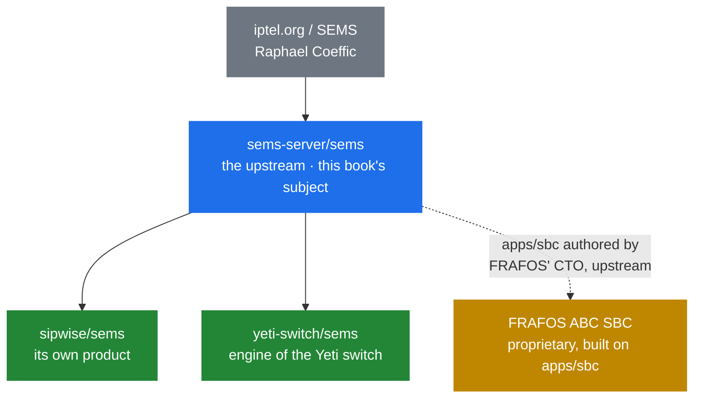

# 12.1 The family, at a glance

> [!NOTE]
> Everything up to here has described `sems-server/sems`. This part is about the other branches
> — what each one is, why it exists, and what actually differs. It is not a second deep dive:
> the internals in Parts 2–11 are largely shared, and where they are not, that is the point of
> the chapter that covers it.

## The lineage

Note the dashed line. FRAFOS is not a fork in the same sense as the other two, and
[12.4](46-frafos-and-the-sbc.md) is about why that distinction matters.

## Side by side

| | `sems-server/sems` | `sipwise/sems` | `yeti-switch/sems` | FRAFOS |
|---|---|---|---|---|
| Relationship | The upstream | Diverged fork | Diverged fork | Contributor, then commercial product |
| Licence | **Dual**: GPLv2+ or proprietary from FRAFOS | **Plain GPL** — deliberately | Open source | Proprietary product |
| Config compatible with upstream | — | Diverged | **Explicitly not** | n/a |
| Driven by | Community | The Sipwise NGCP platform | The Yeti class-4 switch | FRAFOS' SBC business |
| Documentation | In-tree `doc/`, doxygen | `sems.readthedocs.io` | `yeti-switch.org/docs/sems/` | Product documentation |
| Packaging | Debian, Ubuntu, RHEL, Gentoo in-tree | Debian, via Sipwise | Own Debian repository | Product |
| Notable additions | — | Redis/MySQL, own docs | `yeti`, `prometheus`, `jsonrpc` modules | The `apps/sbc` framework, upstream |
| Covered in | Parts 1–11 | [12.2](44-fork-sipwise.md) | [12.3](45-fork-yeti-switch.md) | [12.4](46-frafos-and-the-sbc.md) |

## The licence question, which is the interesting one

The upstream is **dual-licensed**, and its own `README.md` says so plainly:

> SEMS is free (speech+beer) software. It is licensed under dual license terms, the GPL (v2+)
> and proprietary license. […] For a license to use SEMS under non-GPL terms, please contact
> FRAFOS GmbH at info@frafos.com .

Two things follow.

**FRAFOS holds the commercial licence.** That is unusual for a project of this shape, and it is
explained by [12.4](46-frafos-and-the-sbc.md).

**Contributions must fit that arrangement.** Dual licensing requires the project to be able to
relicense what it accepts, which is why `README.md` points contributors at the policy in
`doc/COPYING` before anything else.

And that is exactly what Sipwise moved away from. Their README says they are a

> fully GPL license compatible implementation

which reads as a technical remark and is a licensing one: plain GPL, no dual-licensing
obligation, no relicensing question for contributors. [12.2](44-fork-sipwise.md) unpacks it.

## What the forks tell you about the upstream

Read together, the three branches are a commentary on the same set of gaps.

**Everyone needed better observability.** Yeti wrote a native `prometheus` module; upstream
answered with a Rust sidecar polling XML-RPC ([8.2](29-monitoring-and-stats.md)). Same problem,
opposite architecture — and it is the sharpest instance of the question in
[13.1](47-gaps-overview.md): in the process, or beside it?

**Everyone needed a control API beyond XML-RPC.** Yeti ships its own `jsonrpc`; upstream has one
too ([8.1](28-rpc-architecture.md)). Convergent evolution, because a stringly-typed
XML-RPC-to-DI bridge is not what anyone wants to automate against.

**Nobody added SRTP.** Across the whole family, media encryption remains ZRTP or nothing
([9.6](36-zrtp-and-srtp.md)). When three independent teams all skip the same feature, it is
usually because their deployments put a different component in the media path.

**Configuration is where forks diverge first.** Yeti says outright that its format is
incompatible with mainline. Configuration is the surface users touch, so it is the first thing a
fork reshapes and the hardest thing to reconcile afterwards.

## Which one should you run

**Run `sems-server/sems`** if you are building your own thing, want the widest packaging, or want
the code this book describes. It is the reference, and it is the base every other branch is
measured against.

**Run `sipwise/sems`** if you are running Sipwise NGCP, or want a plain-GPL codebase with no
dual-licensing considerations. Outside NGCP you are a smaller audience than the platform it
serves.

**Run `yeti-switch/sems`** if you are deploying Yeti. Not otherwise: it is a component of a
larger system and its configuration will not accept mainline files.

**Talk to FRAFOS** if you need a supported commercial SBC, or a non-GPL licence for SEMS itself.

> [!WARNING]
> **Do not mix.** Configuration files, module builds and expectations do not transfer between
> branches, most explicitly for Yeti ([12.3](45-fork-yeti-switch.md)). Choosing a branch is
> choosing an ecosystem, not just a source tarball.

## Reading the rest of this part

Each chapter answers four questions in the same order: what it is, why it was forked, what
actually differs, and who should care.

Where a branch's divergence changes how upstream code should be read, that is noted in the
relevant chapter rather than here — the inline `> [!NOTE]` callouts elsewhere in this book exist
for exactly that.
