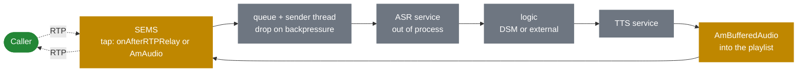

# 13.4 Media forking for STT and TTS

> [!IMPORTANT]
> The tap points **already exist**. What is missing is a streaming sink: nothing in the tree
> speaks websocket or gRPC, and no ASR vendor appears anywhere in `core` or `apps`. This chapter
> is about where you would attach one and — more usefully — what the media plane's design will
> not let you do.

## What exists

**TTS, file-based.** `flite_text_to_speech()` in `apps/ivr` and `apps/conference`
([7.3](26-ivr-and-python.md)) synthesises to a file, which is then played through the ordinary
audio chain ([5.3](18-audio-pipeline.md)). Synthesis completes, then playback starts. Fine for
"your PIN is 1234"; not what anyone means in 2026 by a voice agent.

**Media forking, via SIPREC.** `cc_siprec` forks a copy of the media to a recorder
([9.5](35-siprec-and-recording.md)), and `apps/siprec_srs` is a recording server. A standard
protocol, working today, forking audio out of a live call.

**Two tap points.**

| Tap | Sees | Runs on | Chapter |
|---|---|---|---|
| `AmAudio::read()` / `write()` | **Decoded** linear audio | A media processor thread, inside the 10 ms tick | [5.3](18-audio-pipeline.md) |
| `onAfterRTPRelay()` | **Encoded** RTP packets | The RTP receiver thread | [6.5](23c-sbc-call-control.md) |

Those two are genuinely different, and the choice between them decides most of the design.

## The constraints, which are the point of this chapter

**Neither tap may block.** `AmAudio::read()` runs inside a 10 ms budget shared with every session
in the callgroup ([5.1](16-media-processor.md)). `onAfterRTPRelay()` runs on the thread forwarding
every relayed packet on the box ([5.2](17-rtp-stream.md)). A synchronous network write in either
one degrades audio for unrelated calls.

The sanctioned pattern is `async_file_writer` ([2.4](05-lifecycle.md)): queue and return, let
another thread send, and **drop rather than block** when the queue fills.

> [!WARNING]
> A blocking send to an ASR endpoint is not a slow feature — it is a media outage. If the
> recogniser is slow, unreachable or backpressuring, the queue must drop audio and the call must
> continue. Recognition is best-effort; the call is not.

**A crash is an outage.** Linking a vendor SDK — gRPC, a websocket library, an audio codec you
did not audit — into a single-process server ([2.1](02-thread-model.md)) means their bug is your
downtime. This is the strongest argument for keeping the recogniser out of process and sending it
bytes.

**Encrypted legs are invisible.** SEMS relays SRTP without decrypting it
([9.6](36-zrtp-and-srtp.md)). A leg negotiating `RTP/SAVP` cannot be recognised, transcribed or
recorded as audio. This is a hard limit, not a configuration issue.

**Relay mode has no decoded audio.** With `relay_enabled` the packets never reach the audio chain
([9.4](34-rtp-mux-and-relay.md)). `AmAudio` tapping requires the full media path, which is a real
cost increase for an SBC ([6.2](22-b2b-media.md)).

## Two designs

### Fork encoded packets

Attach at `onAfterRTPRelay()`, copy the packet, queue it, and let another thread ship it.

- **Works in relay mode** — no decode, no full media path, no capacity change.
- **Cheap**: a copy and an enqueue.
- The receiving end gets RTP and must depacketise, decode and handle loss itself.
- Needs codec information out of band, from the negotiated SDP
  ([4.3](14-offer-answer.md)).

This is what `cc_siprec` does, and SIPREC already standardises the metadata. **If you want audio
out of a live call today, this is the path**, and the recogniser sits behind a SIPREC recording
server.

### Tap decoded audio

Insert an `AmAudio` into the chain that passes samples through and copies them to a queue.

- **Linear PCM**, already resampled to a common rate ([5.3](18-audio-pipeline.md)) — exactly what
  a recogniser wants.
- **Composes**: it is just another element in the chain.
- **Forces the full media path.** `requiresProcessing()` flips
  ([6.2](22-b2b-media.md)) and the call costs what a conference participant costs.
- Loss concealment has already happened ([5.5](20-dtmf-and-jitter.md)), so the recogniser sees
  synthesised audio for lost packets — usually an improvement.

Choose this when the call is already on the full media path — an IVR, a conference — because the
cost is already paid.

## Streaming synthesis

The other direction is harder, and the difficulty is structural rather than incidental.

Today's `flite` path writes a file and plays it ([7.3](26-ivr-and-python.md)). Streaming
synthesis means audio arriving over the network while playback is in progress, which needs an
`AmAudio` whose `read()` drains a network-fed buffer.

The pieces exist. `AmBufferedAudio` already decouples a producer from the tick
([5.3](18-audio-pipeline.md)), and `AmPlaylistSeparator` already posts an event when playback
reaches a marker ([2.2](03-event-system.md)), which is how a script learns a prompt finished.

The hard part is **underrun**. If the synthesiser falls behind, `read()` has audio to produce and
nothing to produce it from. The options are silence, a comfort tone, or repeating — and all three
are audible. A file has no underrun; a stream always can. Any design must decide this explicitly.

## What a full pipeline looks like

Note what is inside SEMS and what is not. **Everything intelligent is out of process**, reached
asynchronously ([8.3](30-app-timers-and-events.md)) — which is the same conclusion
[7.4](27-app-tradeoffs.md) reaches for application logic generally, for the same reasons.

The logic step is the natural place for DSM ([7.2](25-dsm.md)): it already has `JsonRpcRequest`
and `JsonRpcResponse` event types, so a call flow can consult an external service and be woken by
the answer without blocking. Arm a timer alongside it
([8.3](30-app-timers-and-events.md)) — a service that never answers otherwise leaves the session
waiting until `dead_rtp_time`.

## Latency, honestly

Round-trip latency for a conversational agent is the sum of: media tick (10 ms), the tap queue,
network to the recogniser, recognition, the logic step, synthesis, network back, buffering, and
the playout path. Only the first is SEMS'.

That is worth stating because it locates the problem. SEMS contributes a few tens of
milliseconds; everything perceptible happens outside it. Optimising SEMS' side of this is not
where the win is.

## Where to start

1. **Use SIPREC.** It works today, it is standard, and it keeps calls in relay mode
   ([9.5](35-siprec-and-recording.md)). Point a recorder at your recogniser.
2. **If SIPREC is too heavy**, write a call control module on `onAfterRTPRelay()` that copies to a
   queue. Small, contained, and no core changes ([6.5](23c-sbc-call-control.md)).
3. **Only tap `AmAudio` if the call is already on the full media path.**
4. **Keep the recogniser out of process.** No vendor SDK inside a server where a crash is an
   outage.
5. **Drop, never block.** Both taps run on threads that must not stall.
