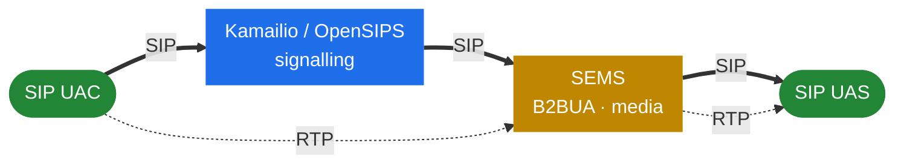

<h1 align="center">SEMS Handbook — English</h1>

  <em>How SEMS is built on the inside.</em>

  
  
  

---

> [!IMPORTANT]
> This handbook is **deliberately not a re-telling of the official docs**. It assumes you already know what SEMS is at a surface level and instead drills into the thread model, the event system, the session core, the media pipeline, the home-grown SIP stack and the B2BUA machinery. There is no application-by-application configuration reference here.

> [!NOTE]
> The subject of this handbook is **[sems-server/sems](https://github.com/sems-server/sems)** — the canonical upstream. The other branches of the SEMS family are covered in [Part 12](#12-the-sems-family), and elsewhere only where a divergence changes how the upstream code should be read.

**Sources used:**

- [github.com/sems-server/sems](https://github.com/sems-server/sems) — the target; the actual C++ implementation and the final source of truth.
- In-tree `doc/Readme.*.txt` and `doc/doxygen_proj` — application behaviour and configuration semantics.
- [sems.readthedocs.io](https://sems.readthedocs.io/) — narrative documentation.
- For **Part 12 (the family)** only:
    - [github.com/sipwise/sems](https://github.com/sipwise/sems) — the Sipwise branch.
    - [github.com/yeti-switch/sems](https://github.com/yeti-switch/sems) and [yeti-switch.org/docs/sems](https://yeti-switch.org/docs/sems/) — the Yeti branch.

## Where SEMS sits

A proxy routes signalling and steps out of the media path. SEMS does the opposite: it terminates
signalling as a B2BUA **and** carries the media. That is the split this handbook is organised around.

> [!TIP]
> The companion volume, the [Kamailio Handbook](https://denyspozniak.github.io/kamailio-handbook/), covers the signalling side — a multi-process, fork-per-worker proxy driven by a configuration DSL. SEMS is its mirror image: multi-threaded, event-driven, thread-per-session. [Part 11.1](40-with-kamailio.md) is where the two books meet.

## Contents

### 1. Preface

- [1.1 Introduction](01-introduction.md)
- [1.2 SIP and media — a primer](01b-sip-media-primer.md)

### 2. The Runtime

- [2.1 Thread model](02-thread-model.md)
- [2.2 The event system](03-event-system.md)
- [2.3 Memory and ownership](04-memory-and-ownership.md)
- [2.4 Process lifecycle](05-lifecycle.md)
- [2.5 Sizing and tuning](06-sizing-and-tuning.md)

### 3. The SIP Layer

- [3.1 The SIP stack](07-sip-stack-overview.md)
- [3.2 Transport](08-transport.md)
- [3.3 The parser](09-parser.md)
- [3.4 The transaction layer](10-transaction-layer.md)
- [3.5 The dialog layer](11-dialog-layer.md)

### 4. Session Core

- [4.1 AmSession](12-amsession.md)
- [4.2 Session container and factories](13-session-container-and-factories.md)
- [4.3 Offer/answer](14-offer-answer.md)
- [4.4 Session event handlers](15-session-event-handlers.md)

### 5. The Media Plane

- [5.1 The media processor](16-media-processor.md)
- [5.2 The RTP stream](17-rtp-stream.md)
- [5.3 The audio pipeline](18-audio-pipeline.md)
- [5.4 Codecs and plug-ins](19-codecs-and-plugins.md)
- [5.5 DTMF and jitter](20-dtmf-and-jitter.md)

### 6. B2BUA

- [6.1 AmB2BSession](21-b2b-session.md)
- [6.2 B2B media](22-b2b-media.md)
- [6.3 The SBC application: architecture](23-sbc.md)
- [6.4 SBC call profiles and rewriting](23b-sbc-profiles.md)
- [6.5 SBC call control modules](23c-sbc-call-control.md)

### 7. The Application Framework

- [7.1 Plug-in architecture](24-plugin-architecture.md)
- [7.2 DSM](25-dsm.md)
- [7.3 IVR and Python](26-ivr-and-python.md)
- [7.4 Tradeoffs: C++ vs DSM vs Python](27-app-tradeoffs.md)

### 8. Control Plane

- [8.1 RPC architecture](28-rpc-architecture.md)
- [8.2 Monitoring and stats](29-monitoring-and-stats.md)
- [8.3 Application timers and events](30-app-timers-and-events.md)

### 9. Cool architectural tricks

- [9.1 The registrar client](31-registrar-client.md)
- [9.2 Conferencing and mixing](32-conference-and-mixing.md)
- [9.3 Message storage and voicemail](33-msg-storage-and-voicemail.md)
- [9.4 RTP mux and relay](34-rtp-mux-and-relay.md)
- [9.5 SIPREC and recording](35-siprec-and-recording.md)
- [9.6 ZRTP and SRTP](36-zrtp-and-srtp.md)

### 10. Security & Hardening

- [10.1 The security surface](37-security-surface.md)
- [10.2 Media-plane security](38-security-media.md)
- [10.3 Hardening](39-security-hardening.md)

### 11. SEMS in production

- [11.1 SEMS with Kamailio](40-with-kamailio.md)
- [11.2 Topologies and HA](41-topologies-and-ha.md)
- [11.3 A reproducible lab](42-lab.md)

### 12. The SEMS family

- [12.1 The family, at a glance](43-family-overview.md)
- [12.2 sipwise/sems](44-fork-sipwise.md)
- [12.3 yeti-switch/sems](45-fork-yeti-switch.md)
- [12.4 FRAFOS and the SBC](46-frafos-and-the-sbc.md)

### 13. Reference

- [13.1 Term map](47-term-map.md)
- [13.2 What's new in 2.x](48-whats-new.md)
