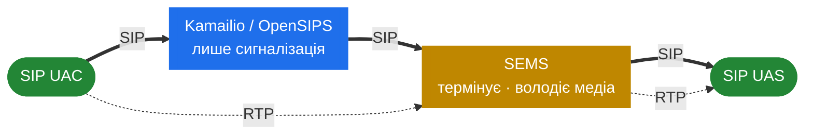

# 1.1 Вступ

> [!IMPORTANT]
> SEMS — це **не** проксі. Проксі пересилає запит і сходить зі шляху. SEMS дзвінок
> *термінує*: він відповідає як user agent, володіє діалогом і зазвичай ще й пропускає через
> себе аудіо. Майже кожне хибне припущення, з яким приходять у SEMS, зводиться до очікування
> проксі-поведінки від того, що за суттю є ендпоінтом.

## Що таке SEMS

Проєкт описує себе прямо, у власному `README.md`:

> SEMS is a free, high performance, extensible media server for SIP (RFC3261) based VoIP
> services. It is intended to **complement** proxy/registrar servers in VoIP networks for all
> applications where **server-side processing of audio** is required […] Another use case is
> for interconnecting SIP networks, where a back-to-back user agent (B2BUA) is required.

Отже, дві ролі. SEMS — це **медіа-сервер**: він породжує, споживає, записує й мікшує аудіо. І
це **B2BUA**: він сидить між двома ногами дзвінка, якими володіє незалежно. Усе в цьому
хендбуці — або одна з цих двох ролей, або механіка, що робить їх можливими.

Слово *complement* тут важливе. SEMS проєктувався, щоб жити поруч із проксі, а не замінювати
його. У ньому немає реєстратора, немає бази місцезнаходження користувачів, немає скільки-небудь
серйозної логіки маршрутизації. Дайте йому дзвінок — і він зробить із аудіо щось цікаве;
попросіть вирішити, **куди** цей дзвінок має піти — і ви взяли не той інструмент.

## Поділ на площини



Проксі торкається сигналізації й лишається поза медіа-шляхом. SEMS — на **обох** шляхах: він
відповідає на SIP-діалог, і RTP тече крізь нього. Ця інверсія — організуюча ідея книги: частини
3–4 про сигнальну половину, частини 5–6 про медійну.

## Коли потрібен Kamailio, а коли SEMS

Це перше питання, яке ставлять усі, тож спершу коротка відповідь.

> [!TIP]
> **Правило:** якщо дзвінок можна змаршрутизувати переписуванням заголовків і пересиланням —
> вам потрібен **проксі**. Якщо щось має *відповісти* — породити аудіо, записати його,
> змікшувати, або зшити дві ноги, які не повинні бачити одна одну — вам потрібен
> **медіа-сервер**.

| Треба… | Kamailio | SEMS | Чому |
|---|:---:|:---:|---|
| Реєструвати користувачів, тримати user location | ✅ | ❌ | У SEMS немає реєстратора; щонайбільше він *клієнт* чужого (`AmSipRegistration`) |
| Маршрутизувати за номером, префіксом, LCR, dispatcher | ✅ | ❌ | Логіка маршрутизації живе в конфізі проксі; у SEMS немає DSL для маршрутизації |
| Автентифікувати абонентів, обмежувати швидкість, блоклисти | ✅ | ❌ | Проксі бачить кожен запит дешево; SEMS платить сесією за дзвінок |
| Тримати 10k+ реєстрацій, високий CPS пересилання | ✅ | ❌ | Stateless або transaction-stateful пересилання значно дешевше за термінування |
| Програти анонс, ringback, промпт | ❌ | ✅ | Треба відповісти й породити аудіо |
| Голосова пошта, запис, IVR-меню | ❌ | ✅ | Треба захоплювати аудіо, грати промпти й збирати DTMF |
| Конференц-міст, мікшування | ❌ | ✅ | Треба N-канальний мікшер на медіа-шляху |
| Транскодувати між кодеками | ❌ | ✅ | Треба декодувати й перекодовувати RTP-навантаження |
| Сховати свою топологію від дальнього боку | ✅ | ✅ | У Kamailio є `topoh` і `topos`; SEMS отримує це задарма, бо термінує — порівняння в [11.1](40-with-kamailio.md) |
| Повноцінний B2BUA: окремі діалоги, таймери, заголовки на ногу | ❌ | ✅ | Два незалежні діалоги — це і **є** те, чим є `AmB2BSession` |
| Обов'язки SBC: NAT, медіа-релей, переписування заголовків, call control | ⚠️ | ✅ | Kamailio потребує зовнішнього релея для медіа; застосунок `sbc` у SEMS робить і те, і те ([6.3](23-sbc.md)–[6.5](23c-sbc-call-control.md)) |
| Релеїти RTP, не чіпаючи кодек | ⚠️ | ✅ | Kamailio делегує це rtpengine; SEMS може зробити в тому ж процесі |

Рядки з ⚠️ читайте як «можливо, але з другим компонентом». Kamailio здатен на роботу навколо
медіа лише керуючи зовнішнім релеєм на кшталт rtpengine — саме медіа крізь Kamailio ніколи не
тече.

Два рядки варті окремого слова просто зараз, бо саме на них найчастіше беруть не той
інструмент.

**Приховування топології.** Kamailio розв'язує це модулем: `topoh` переписує заголовки, що
ідентифікують діалог, просто на місці, щоб дальній бік не прочитав вашу внутрішню адресацію, а
`topos` іде далі — знімає їх зовсім і тримає оригінали у сховищі. Обидва зберігають дешевий
шлях пересилання проксі. SEMS не потребує жодного модуля: B2BUA стартує *новий* діалог у бік
викликаного, тож із боку викликача просто нема чому витікати. Це задарма — але задарма лише
тому, що ви вже заплатили повною сесією. Усі три механізми порівняні в
[11.1](40-with-kamailio.md).

**Обов'язки SBC.** «Бути SBC» — це не одна функція, а набір: переписування заголовків, робота з
NAT, релей медіа, транскодинг, допуск дзвінків, CDR. Kamailio робить сигнальну половину нативно
й делегує медійну половину rtpengine. Застосунок `sbc` у SEMS робить увесь набір в одному
процесі — це найбільший застосунок у дереві, близько 14 000 рядків, і побудований він як
*конфігурований фреймворк*, а не як фіксована програма. Частина 6 розбирає його на три розділи:
[архітектура](23-sbc.md), [профілі дзвінків](23b-sbc-profiles.md) і
[модулі call control](23c-sbc-call-control.md).

### Відповідь зазвичай — «обидва»

У будь-якій продакшн-мережі скільки-небудь цікавого розміру ці двоє стоять разом: проксі
володіє реєстрацією, автентифікацією, маршрутизацією й високим CPS, а ту невелику частку
дзвінків, яким потрібна робота з аудіо, віддає в SEMS. Файл `doc/Howtostart_simpleproxy.txt` у
дереві коду показує саме цю передачу — Kamailio позначає дзвінок іменем застосунку й пересилає:

```text
route[SERVICES] {
     if ($rU=~"^300.*") {
             remove_hf("P-App-Name");
             append_hf("P-App-Name: conference\r\n");
             $ru = "sip:" + $rU + "@" + "127.0.0.1:5070";
             route(RELAY);
             exit;
     }
}
```

Проксі вирішив, *який* застосунок; SEMS вирішує, що робити з аудіо. Саме через цей заголовок
запит потрапляє у фабрику сесій — механізм у [4.2](13-session-container-and-factories.md), а
схеми розгортання в [11.1](40-with-kamailio.md).

> [!NOTE]
> SEMS уміє працювати й узагалі без проксі. `doc/Howtostart_noproxy.txt` описує реєстрацію SEMS
> на публічному SIP-сервісі так само, як це робить будь-який софтфон. Цього досить, щоб
> спробувати сервіс, — але недосить для будь-чого, що потребує даних абонента, бо їх просто
> немає.

## SEMS — це потоки, а не процеси

Якщо ви прийшли з Kamailio, це найбільша перебудова в голові. Kamailio на старті форкає пул
воркер-процесів і ділиться станом через алокатор спільної пам'яті. SEMS не робить ні того, ні
іншого. Це **один процес і багато потоків**, а стан живе у звичайній купі C++.

Послідовність старту в `core/sems.cpp` — це список пулів потоків, що піднімаються:

```cpp
  INFO("Starting application timer scheduler\n");
  AmAppTimer::instance()->start();

  INFO("Starting session container\n");
  AmSessionContainer::instance()->start();

#ifdef SESSION_THREADPOOL
  INFO("Starting session processor threads\n");
  AmSessionProcessor::addThreads(AmConfig::SessionProcessorThreads);
#endif

  INFO("Starting media processor\n");
  AmMediaProcessor::instance()->init();

  INFO("Starting RTP receiver\n");
  AmRtpReceiver::instance()->start();

  INFO("Starting SIP stack (control interface)\n");
  if(sip_ctrl.load()) {
    goto error;
  }

  INFO("Loading plug-ins\n");
  AmPlugIn::instance()->init();
```

Практичні наслідки, кожен розгорнутий далі в книзі:

- **Дебаг — це `gdb thread apply all bt`, а не `ps -ef`.** PID один. Приєднавшись до нього, ви
  отримуєте все ([2.1](02-thread-model.md)).
- **Немає поділу на `shm` і `pkg`** — і взагалі немає міжпроцесного стану. Масштабування йде
  додаванням *інстансів*, а не воркерів, і два інстанси не ділять нічого
  ([2.3](04-memory-and-ownership.md), [11.2](41-topologies-and-ha.md)).
- **Падіння кладе весь сервер.** Kamailio може втратити один воркер і продовжити обслуговувати;
  SEMS — ні. Це піднімає ставки щодо якості плагінів ([7.4](27-app-tradeoffs.md)).
- **Робота роздається як події в черги окремих сесій**, а не воркером, який бере наступний
  пакет ([2.2](03-event-system.md)).

## На що SEMS здатен

README наводить власні бенчмарки проєкту: приблизно 1200 конференц-каналів G.711 на
чотириядерному Xeon 2 ГГц (700 на GSM, 280 на iLBC), до 5000 каналів на машині з двома
чотириядерними 2.9 ГГц, і B2BUA, що витримує близько 19 000 транзакцій на секунду на тому ж
залізі. Сприймайте це як орієнтир порядку величини, а не як обіцянку: цифри старі, і домінує в
них вибір кодека — що, власне, і є суттю. Сайзинг — [2.5](06-sizing-and-tuning.md).

## Чим цей хендбук не є

Тут немає покрокової інсталяції, немає довідника з конфігурації окремих застосунків, немає
таблиць опцій. Файли `doc/Readme.*.txt` у дереві коду й вивід doxygen уже роблять цю роботу, і
роблять краще, бо їдуть разом із кодом. Ця книга відповідає на питання, яких ті файли не
торкаються: *чому воно збудоване саме так і що станеться під навантаженням або під атакою.*

## Як її читати

Частини 2–6 — це хребет, і їх варто читати послідовно: рантайм пояснює SIP-рівень, той пояснює
ядро сесій, а воно — медіа-площину й B2BUA. Частини 7–10 значною мірою самостійні, їх можна
читати за потребою. Частина 11 — розгортання, частина 12 — інші гілки родини SEMS, частина 13 —
довідкові матеріали, зокрема [мапа термінів Kamailio↔SEMS](47-term-map.md), яку варто прогорнути
рано, якщо ви прийшли з боку проксі.

> [!NOTE]
> Предмет опису всюди — [sems-server/sems](https://github.com/sems-server/sems) на `VERSION`
> 2.1.0. Ліцензування подвійне: GPL v2+ або пропрієтарна ліцензія від FRAFOS GmbH, як зазначено
> в `README.md` проєкту. Ця схема — не історична випадковість; вона пояснена в
> [12.4](46-frafos-and-the-sbc.md).
