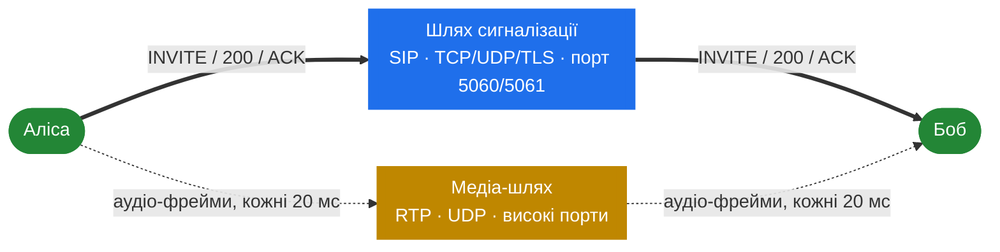
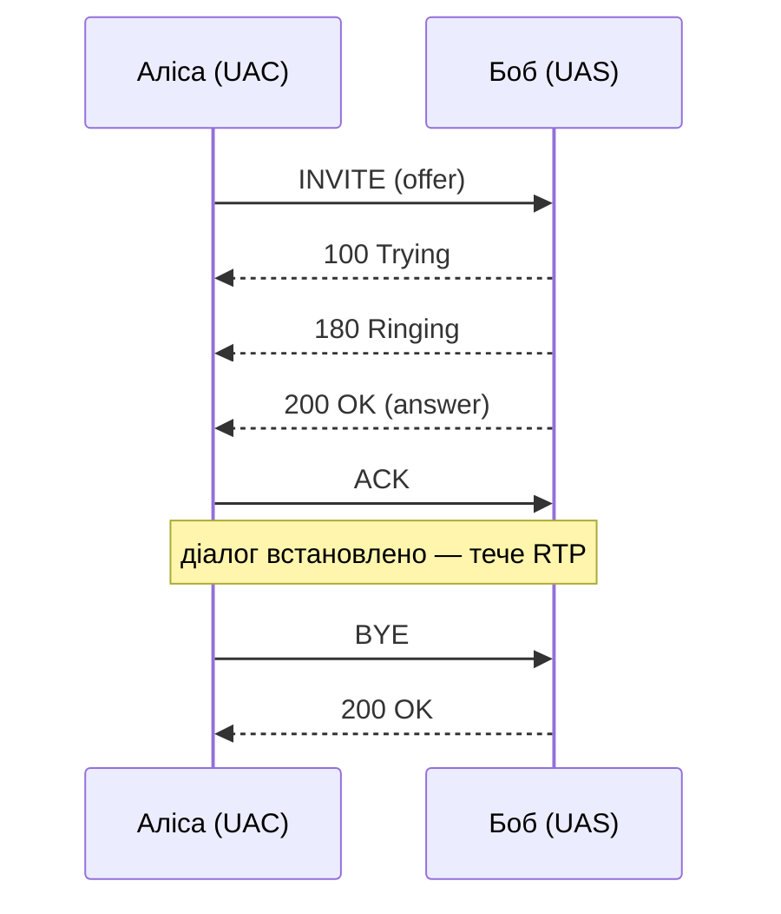

# 1.2 SIP і медіа — вступний мінімум

> [!NOTE]
> Цей розділ існує, щоб решта книги могла спиратися на спільний словник. Якщо ви вже знаєте
> різницю між транзакцією і діалогом і можете пояснити, чому offer здатен приїхати в ACK, —
> пропускайте: тут немає нічого специфічного для SEMS.

## Два протоколи, два шляхи

SIP-дзвінок — це дві слабко зв'язані розмови, що йдуть одночасно.

**Сигналізація** — це SIP: текстові повідомлення, які встановлюють, змінюють і розривають
дзвінок. Вона відповідає на питання *хто кому дзвонить і на яких умовах*.

**Медіа** — це RTP: безперервний потік невеликих пакетів із закодованим аудіо. Він відповідає
на питання *як це звучить*.

Вони йдуть незалежно. Можуть іти різними маршрутами, через різні мережі й ламатися незалежно —
дзвінок, який «піднятий» з погляду SIP, але мовчить, є найпоширенішою продакшн-скаргою в VoIP,
і існує вона саме тому, що ці два шляхи розділені.



## Запити, відповіді, транзакції, діалоги

**Запит** — це метод плюс заголовки плюс необов'язкове тіло: `INVITE`, `ACK`, `BYE`, `CANCEL`,
`REGISTER`, `OPTIONS`, `INFO`, `UPDATE`, `PRACK`, `REFER`, `SUBSCRIBE`, `NOTIFY`. **Відповідь** —
тризначний код в одному з шести класів:

| Клас | Значення | Приклади |
|---|---|---|
| 1xx | Provisional — ще працюю | `100 Trying`, `180 Ringing`, `183 Session Progress` |
| 2xx | Успіх | `200 OK` |
| 3xx | Редирект | `302 Moved Temporarily` |
| 4xx | Помилка клієнта | `404 Not Found`, `407 Proxy Authentication Required`, `486 Busy Here` |
| 5xx | Помилка сервера | `500 Server Internal Error`, `503 Service Unavailable` |
| 6xx | Глобальна відмова | `603 Decline` |

**Транзакція** — це один запит плюс усі його відповіді. Вона короткоживуча (секунди) і саме на
ній працюють ретрансмісії й таймаути. SEMS реалізує транзакції в `core/sip/trans_layer.cpp` і
зберігає їх у `core/sip/trans_table.cpp`; таймери крутить wheel timer
([3.4](10-transaction-layer.md)).

**Діалог** — це довший зв'язок між двома user agent'ами, створений успішним `INVITE` і знищений
`BYE`. Ідентифікується трійкою **Call-ID + From tag + To tag** і несе стан, що має пережити
транзакції: лічильники CSeq, route set, remote target. SEMS реалізує його в
`core/AmSipDialog.cpp` ([3.5](11-dialog-layer.md)).



Вище один діалог, а всередині нього — транзакції: INVITE-транзакція (яка закінчується на ACK) і
BYE-транзакція. `ACK` на 2xx особливий: він є окремою транзакцією, а не частиною
INVITE-транзакції. Ця дивина породжує реальні баги, і саме тому код обробляє її окремо.

> [!TIP]
> Для тих, хто з Kamailio: проксі може бути *stateless* і забувати все між повідомленнями.
> Медіа-сервер так не може — він мусить бути ендпоінтом, тож завжди тримає стан діалогу. Саме
> тому «SEMS дорожчий на дзвінок» — це структурна властивість, а не деталь реалізації.

## SDP і модель offer/answer

Медіа-шлях треба узгодити поверх шляху сигналізації, і мовою опису для цього є SDP (RFC 4566).
Типове тіло:

```text
v=0
o=sems 1234 1234 IN IP4 192.0.2.10
s=session
c=IN IP4 192.0.2.10
t=0 0
m=audio 34567 RTP/AVP 8 0 101
a=rtpmap:8 PCMA/8000
a=rtpmap:0 PCMU/8000
a=rtpmap:101 telephone-event/8000
a=sendrecv
```

Читається так: *шли мені аудіо на `192.0.2.10:34567`; я розумію G.711 A-law, G.711 µ-law і тони
RFC 2833, саме в такому порядку переваги; і я маю намір і слати, і приймати.*

Саме узгодження — це **offer/answer** (RFC 3264), і це машина станів, а не одноразовий обмін:

- Один бік шле **offer** зі списком того, що підтримує.
- Другий відповідає **answer** — прийнятною підмножиною плюс власною адресою і портом.
- Будь-який бік може згодом почати новий offer/answer, щоб змінити дзвінок: поставити на
  утримання (`a=sendonly`), додати кодек, змінити медіа-адресу, зробити re-INVITE після
  переведення.

Спотикаються зазвичай на двох легальних місцях для першого offer:

| Схема | Offer у | Answer у |
|---|---|---|
| Звичайна | `INVITE` | `200 OK` |
| Late offer | `200 OK` | `ACK` |

Обидві валідні, обидві трапляються в дикій природі, і B2BUA має витримати будь-яку з них на
будь-якій нозі — включно з випадком, коли дві ноги розходяться в тому, за якою схемою вони
працюють. SEMS зводить це в одне місце, `core/AmOfferAnswer.cpp` ([4.3](14-offer-answer.md)).

> [!WARNING]
> Кодек, присутній у SDP, означає лише «я вмію це декодувати». Він нічого не каже про те, чи
> справді дальній бік це надішле і чи пропустить проміжна коробка. Узгодження звужує
> можливості; воно не гарантує аудіо.

## RTP, RTCP і тик у 20 мс

RTP (RFC 3550) несе медіа. У кожного пакета невеликий заголовок — payload type, sequence number,
timestamp, SSRC — а за ним один фрейм закодованого аудіо. Для типового G.711 на 8 кГц пакет
кожні **20 мс** несе 160 семплів, тобто 160 байтів навантаження.

Три наслідки, що формують усю медіа-площину:

- **П'ятдесят пакетів на секунду, на напрямок, на дзвінок.** Тисяча дзвінків — це 100 000
  пакетів на секунду через один процес. Саме тому медіа-шлях побудований навколо фіксованого
  тика, а не роботи «на пакет» ([5.1](16-media-processor.md)).
- **UDP втрачає й переставляє пакети.** Sequence number дозволяє приймачу це виявити, timestamp
  — правильно розмістити аудіо в часі. Згладжування цього — робота джитер-буфера
  ([5.5](20-dtmf-and-jitter.md)).
- **Порти виділяються на потік, із налаштованого діапазону.** Як цей діапазон рахувати й
  захищати — [5.2](17-rtp-stream.md) і [10.2](38-security-media.md).

**RTCP** їде поруч на сусідньому порті й несе звіти про якість — втрати, джитер, оцінку
round-trip. Це єдиний внутрішньосмуговий сигнал про те, як аудіо справді почувається.

**DTMF** — цифри, які натиснув абонент — може приїхати трьома різними шляхами: подіями RFC 2833
у самому RTP-потоці (звичайний випадок, payload type 101 вище), inband-тонами, змішаними в
аудіо, або SIP-запитами `INFO` по шляху сигналізації. Медіа-сервер мусить уміти всі три, бо не
може обрати за дальній бік ([5.5](20-dtmf-and-jitter.md)).

## Проксі, B2BUA, медіа-сервер

Три ролі, які легко сплутати; різняться тим, якою часткою дзвінка кожна володіє:

| Роль | Діалогів | На медіа-шляху | Приклад |
|---|---|---|---|
| **Проксі** | нуль — пересилає чужі | ні | Kamailio, OpenSIPS |
| **B2BUA** | два — по одному на ногу, незалежні | опційно | SEMS `sbc`, SEMS `ann_b2b` |
| **Медіа-сервер** | один на кожну ногу, яку відповів | так, завжди | SEMS `conference`, `voicemail` |

Проксі може переписувати заголовки, але діалог належить ендпоінтам. **B2BUA** відповідає
викликачу як user agent і окремо дзвонить викликаному як user agent; два діалоги незалежні, тож
до кожного можна застосувати свої таймери, свої кодеки й свої заголовки, і жоден бік нічого не
дізнається про інший. **Медіа-сервер** відповідає і сам породжує або споживає аудіо.

SEMS — це друге й третє, і ніколи не перше. Частини 4–6 по суті є розповіддю про те, як він це
реалізує.

## Терміни, вживані в книзі

| Термін | Що означає тут |
|---|---|
| **UAC / UAS** | Клієнтська (шле запити) і серверна (відповідає на запити) ролі. B2BUA є обома одночасно |
| **Нога (leg)** | Один діалог із пари B2BUA. «A leg» дивиться на викликача, «B leg» — на викликаного |
| **Offer / answer** | Обмін SDP, що встановлює медіа-шлях (RFC 3264) |
| **Early media** | Аудіо, що тече до відповіді на дзвінок, разом із `183 Session Progress` |
| **Сесія** | Конкретно в SEMS: об'єкт `AmSession` плюс його потік і черга подій ([4.1](12-amsession.md)) |
| **Relay** | Пересилання RTP без декодування. Дешево, і є типовим у `sbc` ([9.4](34-rtp-mux-and-relay.md)) |
| **Транскодинг** | Декодування й перекодування аудіо, щоб зшити два кодеки. Дорого ([5.4](19-codecs-and-plugins.md)) |

Повніший список, включно з перекладами Kamailio↔SEMS, — у [13.1](47-term-map.md).
