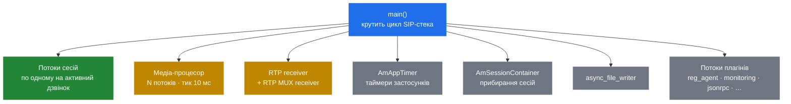

# 2.1 Модель потоків

> [!IMPORTANT]
> SEMS — це **один процес із багатьма потоками**. Кожне «SEMS робить X» насправді означає
> «якийсь конкретний потік усередині єдиного процесу SEMS робить X». Якщо ви прийшли з
> Kamailio, переверніть усе, що знаєте: тут один PID, немає `fork()` воркерів і немає алокатора
> спільної пам'яті — бо ділити пам'ять просто **між чим**.

## Що видно, коли воно працює

`ps -ef | grep sems` показує **один** процес. На рівні ОС це вся картина, і саме тому звичка з
Kamailio рахувати процеси тут не каже нічого. Щоб побачити, що справді працює, потрібен список
потоків:

```bash
ps -L -p "$(pgrep -x sems)" -o tid,pcpu,comm
# або з дебагера:
gdb -p "$(pgrep -x sems)" -batch -ex 'thread apply all bt'
```

Усередині здорового сервера приблизно таке:



| Потік | Стартує в | Що робить |
|---|---|---|
| `main()` | — | Після старту він *стає* SIP-стеком: `sip_ctrl.run()` не повертається до зупинки |
| Потоки сесій | `AmSession::start()` | Типово по одному на активний дзвінок. Виконує логіку застосунку |
| Медіа-процесор | `AmMediaProcessor::init()` | Фіксований тик 10 мс; тягне й штовхає аудіо для кожної медіа-сесії |
| RTP receiver | `AmRtpReceiver::start()` | Читає RTP-сокети й віддає пакети потоку-власнику |
| `AmAppTimer` | `AmAppTimer::start()` | Кидає таймери застосунків у черги сесій |
| `AmSessionContainer` | `AmSessionContainer::start()` | Прибирає завершені сесії, див. [2.3](04-memory-and-ownership.md) |
| `async_file_writer` | у `main()` | Запис на диск поза потоком сесії, щоб та ніколи не блокувалась на I/O |
| Потоки плагінів | `AmPlugIn::load()` | Усе, що завантажені модулі стартують самі |

## Типово — потік на сесію

Це дивує, тож будьмо точні. `AmSession` успадковується від `AmThread`, і `AmSession::run()` —
звичайне тіло потоку:

```cpp
void AmSession::run() {
  ...
  if (!startup())
    return;

  while (...) {
    if (!processingCycle())
      break;
  }
  ...
}
```

Пулова альтернатива *існує* — `AmSessionProcessor`, що мультиплексує багато сесій на фіксований
набір `AmSessionProcessorThread`. Але вона не компілюється. У `CMakeLists.txt`:

```cmake
# ADD_DEFINITIONS(-DSESSION_THREADPOOL)
```

> [!WARNING]
> Усе, що під `#ifdef SESSION_THREADPOOL` — включно з усім `AmSessionProcessor.h` і опцією
> `session_processor_threads` — **неактивне у стоковій збірці**. Читати цей код і вважати, що він
> виконується, — поширена й дорога помилка. Якщо вам потрібна пулова модель, ви перезбираєте
> SEMS, а не переналаштовуєте його.

Отже, у типовій збірці: **один дзвінок — один потік — один стек**. Плюс у тому, що код
застосунку можна писати лінійно — блокуватися, чекати, спати — не морячи голодом інших. Мінус —
справжній потік ОС (і його стек) на кожен дзвінок, і саме це впирає конкурентність задовго до
CPU. Сайзинг — [2.5](06-sizing-and-tuning.md).

### Дві моделі поруч

| | Потік на сесію (типово) | `SESSION_THREADPOOL` (на етапі збірки) |
|---|---|---|
| Потоки | По одному на активний дзвінок | `session_processor_threads`, фіксовано |
| Блокування в коді застосунку | Коштує один потік | Стопорить усі сесії на цьому потоці |
| Пам'ять на дзвінок | Один стек потоку | Спільна |
| Стеля | Кількість потоків / RAM | CPU |
| Дебаг | Один потік на дзвінок, читабельні бектрейси | Переплетено, читати важче |

## Примітиви конкурентності

`core/AmThread.h` — тонка й свідомо маленька обгортка над pthreads. Чотири речі, і по суті
більше нічого:

- **`AmMutex`** — `pthread_mutex_t`, опційно рекурсивний.
- **`AmLock`** — RAII-guard на область видимості. Бере лок у конструкторі, віддає в деструкторі.
  Саме це й варто вживати; голі `lock()`/`unlock()` навколо коду, який може зробити `return` або
  кинути виняток, — це те, як пишуться дедлоки.
- **`AmSharedVar<T>`** — значення плюс власний м'ютекс, із `get()`/`set()`. Також відкриває
  `lock()`, `unlock()`, `unsafe_get()`, `unsafe_set()` для послідовностей
  read-modify-write, які мають бути атомарними цілком.
- **`AmCondition<T>`** — condition variable, одружена зі значенням, із `set()`, `get()` і
  `wait_for()`. `set()` робить broadcast, коли значення істинне. Це і є механізм пробудження,
  вживаний усюди: воркери блокуються у `wait_for()`, а хтось інший перемикає прапорець.

```cpp
void set(const T& newval)
{
  pthread_mutex_lock(&m);
  t = newval;
  if(t)
    pthread_cond_broadcast(&cond);
  pthread_mutex_unlock(&m);
}
```

Зверніть увагу: `broadcast`, а не `signal` — прокидаються всі, хто чекає. Для тієї невеликої
кількості очікувачів, з якою це вживається в SEMS, воно нормально, і позбавляє цілого класу
багів із загубленим пробудженням.

Жодної lock-free машинерії, окрім атоміків у `core/atomic_types.h`, немає — а ті існують
переважно заради підрахунку посилань ([2.3](04-memory-and-ownership.md)).

## Що це змінює на практиці

**Дебаг.** PID один. `gdb -p` приєднується одразу до всього, і `thread apply all bt` — найкорисніша
команда під час інциденту в SEMS. Питання «який воркер узяв цей дзвінок» просто не існує;
еквівалент — «який потік тримає цю сесію», а знайти його дозволяє local tag сесії.

**Радіус ураження.** Segfault у будь-якому потоці кладе процес, а разом із ним усі дзвінки на
машині. Kamailio переживає втрату одного воркера; SEMS — ні. Це різко піднімає планку до якості
плагінів і є головним аргументом у [7.4](27-app-tradeoffs.md) за те, щоб тримати ризиковану
логіку поза C++-модулями.

**Немає спільної пам'яті — і взагалі нічого міжпроцесного.** Немає `shm_malloc`, немає
`pkg_malloc`, немає команди дампу пам'яті, бо є одна звичайна купа. Два інстанси SEMS не ділять
рівно нічого — і це вирішує, як воно масштабується ([11.2](41-topologies-and-ha.md)).

**Локи — ваша проблема.** Сесії здебільшого уникають конкуренції тим, що володіють власним станом
і спілкуються подіями ([2.2](03-event-system.md)), а не через спільні структури. Коли плагін
тягнеться між сесіями, він бере локи — і може задедлочити весь сервер. Система подій існує
значною мірою для того, щоб цього не доводилось робити.
