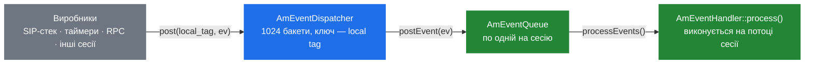
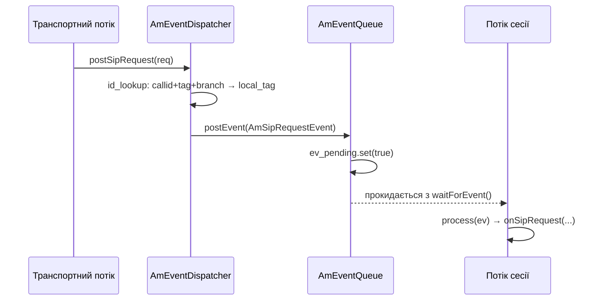

# 2.2 Система подій

> [!IMPORTANT]
> Потоки — це те, як SEMS *працює*; події — це те, як він *спілкується*. Ніщо не потрапляє в
> сесію викликом методу з іншого потоку. Воно приїжджає як `AmEvent`, покладений у чергу цієї
> сесії, і обробляється на її власному потоці. Помилитись тут — полізти напряму у стан чужої
> сесії — найпоширеніший спосіб внести гонку в SEMS.

## Чотири складові



| Складова | Файл | Роль |
|---|---|---|
| `AmEvent` | `AmEvent.h` | Повідомлення. Тег (`event_id`) плюс те, що додає підклас |
| `AmEventQueue` | `AmEventQueue.h` | Поштова скринька: `std::queue`, м'ютекс, condition variable |
| `AmEventDispatcher` | `AmEventDispatcher.h` | Адресна книга: local tag → черга |
| `AmEventHandler` | `AmEvent.h` | Інтерфейс споживача — один метод, `process(AmEvent*)` |

## Сама подія

`AmEvent` свідомо мінімальний:

```cpp
struct AmEvent
{
  int event_id;
  bool processed;
  AmEvent(int event_id);
  virtual ~AmEvent();
  virtual AmEvent* clone();
};
```

`event_id` — звичайне ціле, з кількома зарезервованими діапазонами, оголошеними просто над ним:

```cpp
#define E_PLUGIN           100
#define E_SYSTEM           101
#define E_SIP_SUBSCRIPTION 102
#define E_B2B_APP          103
#define E_IVR              104
```

Прапорець `processed` дозволяє ланцюжку обробників позначити подію спожитою, щоб наступні її
пропустили — та сама ідея, що й у ланцюжку обробників подій сесії
([4.4](15-session-event-handlers.md)). `clone()` існує тому, що `broadcast()` мусить віддати
*окремий* об'єкт кожній черзі; одним об'єктом події не можуть володіти двоє.

Два підкласи важливі одразу:

- **`AmPluginEvent`** — `string name` плюс `AmArg data`. Це узагальнена подія «щось сталося, ось
  торба значень», і саме так модулі говорять із сесіями без спільного заголовка.
  `AmTimeoutEvent` — це `AmPluginEvent` з іменем `timer_timeout`.
- **`AmSystemEvent`** — `ServerShutdown`, `User1`, `User2`. Розсилається кожній сесії; саме так
  коректна зупинка просить дзвінки завершитись ([2.4](05-lifecycle.md)).

## Черга

```cpp
class AmEventQueue
  : public AmEventQueueInterface,
    public atomic_ref_cnt
{
protected:
  AmEventHandler*           handler;
  AmEventNotificationSink*  wakeup_handler;
  std::queue<AmEvent*>      ev_queue;
  AmMutex                   m_queue;
  AmCondition<bool>         ev_pending;
  bool finalized;
public:
  void postEvent(AmEvent*);
  void processEvents();
  void waitForEvent();
  ...
};
```

Три речі варті уваги.

**Вона рахує посилання.** `AmEventQueue` успадковується від `atomic_ref_cnt`, тож виробник може
тримати чергу живою, поки кладе в неї подію, навіть якщо сесія в цей момент вирішила
завершитись ([2.3](04-memory-and-ownership.md)). Без цього «покласти подію в сесію, яка щойно
скінчилась» було б use-after-free, а не безпечним no-op.

**У неї два шляхи пробудження.** `waitForEvent()` блокує *власний* потік на `ev_pending` — це
модель «потік на сесію». Альтернативно можна встановити `AmEventNotificationSink`, і тоді
`postEvent()` викликає `notify(this)`, щоб зовнішній воркер дізнався про роботу — пулова модель.
Той самий клас черги обслуговує обидві.

**`finalize()` незворотний.** Після фіналізації черга закінчена; прибиральник може її забрати.
`is_finalized()` — прапорець, який перевіряє контейнер сесій.

## Диспатчер

`AmEventDispatcher` — сінглтон, що перетворює ідентифікатор на чергу. Це **шардована хеш-мапа**:

```cpp
#define EVENT_DISPATCHER_POWER   10
#define EVENT_DISPATCHER_BUCKETS (1<<EVENT_DISPATCHER_POWER)

EvQueueMap queues[EVENT_DISPATCHER_BUCKETS];
AmMutex    queues_mut[EVENT_DISPATCHER_BUCKETS];
Dictionnary id_lookup[EVENT_DISPATCHER_BUCKETS];
AmMutex     id_lookup_mut[EVENT_DISPATCHER_BUCKETS];
```

1024 бакети, у кожного **власний м'ютекс**. Публікація події в сесію лочить рівно один бакет,
тож 1024 одночасні публікації в різні сесії не конкурують. Це найважливіше рішення щодо
масштабованості в усій системі подій, і саме тому глобальний лок ніколи не з'являється тут у
профілях.

Індексів два, а не один:

- `queues[]` мапить **local tag → черга**. Local tag — це власний тег сесії у `From`/`To`, тож
  будь-хто, хто його має, може класти події напряму.
- `id_lookup[]` мапить **Call-ID + remote tag + via branch → local tag**. Цим шляхом ідуть, коли
  приїхало SIP-повідомлення і єдина доступна ідентичність — те, що дальній бік поклав у
  заголовки.

Звідси й дві перевантажені `post()`:

```cpp
bool post(const string& local_tag, AmEvent* ev);
bool post(const string& callid,
          const string& remote_tag,
          const string& via_branch,
          AmEvent* ev);
```

Обидві повертають `bool`. **`false` означає «такої сесії немає»** — диспатчер не кидає винятків
і не відкладає на потім. Модуль, який ігнорує це значення, тихо губить події; варто прогрепати
власний код на цей патерн.

`broadcast(AmEvent*)` обходить усі бакети й робить `clone()` події для кожної черги.
`addEventQueue()` і `delEventQueue()` — це як сесія реєструється й знімається;
`delEventQueue()` повертає чергу, щоб той, хто викликав, вирішив, що з нею робити.

## Як SIP-запит стає подією

`postSipRequest(const AmSipRequest&)` — міст із [частини 3](07-sip-stack-overview.md) у світ
сесій:



Транспортний потік ніколи не виконує логіку застосунку. Він парсить, ідентифікує, кладе подію й
повертається читати сокет. Усе після публікації відбувається на потоці сесії. Саме ця межа
робить можливим писати всередині застосунку звичайний блокуючий код
([7.4](27-app-tradeoffs.md)).

Якщо пошук не вдався — жоден діалог не збігся — значить, це не внутрішньодіалогове повідомлення,
і воно йде в `AmSessionContainer`, щоб створити *нову* сесію
([4.2](13-session-container-and-factories.md)).

## Шлях пулових воркерів

Коли черги не належать власному потоку, ними керує `AmEventQueueProcessor`:

```cpp
class EventQueueWorker
: public AmThread,
  public AmEventNotificationSink
{
  AmSharedVar<bool> stop_requested;
  AmCondition<bool> runcond;
  std::deque<AmEventQueue*> process_queues;
  AmMutex process_queues_mut;
  ...
  void notify(AmEventQueue* sender);
};
```

Воркер спить на `runcond`. `notify()` додає чергу в `process_queues` і будить його.
`AmEventQueueProcessor::getWorker()` роздає воркерів **по колу** через збережений ітератор —
жодного врахування навантаження, тож одна важка черга може опинитись поруч із дев'ятьма
порожніми на тому самому воркері. Варто знати, перш ніж робити висновок, що воркер «завис».

> [!NOTE]
> Цю машинерію використовують компоненти, які не є сесіями, а самі сесії — лише у збірці з
> `SESSION_THREADPOOL`, яка не є типовою ([2.1](02-thread-model.md)).

## Правила, що з цього випливають

- **Ніколи не чіпайте поля чужої сесії.** Покладіть подію. Її обробить власний потік сесії, і
  лок вам взагалі не знадобиться.
- **Перевіряйте результат `post()`.** `false` означає, що сесії вже немає. Вирішіть, що це для
  вас значить; не ігноруйте.
- **Володіння передається разом із публікацією.** Черга видаляє подію після повернення з
  `process()`. Не тримайте вказівник і не публікуйте той самий об'єкт двічі.
- **`process()` виконується на потоці споживача й блокує його.** Повільна робота в обробнику
  затримує всі інші події цієї сесії — а в пуловій збірці ще й усіх сесій, що ділять воркер.
