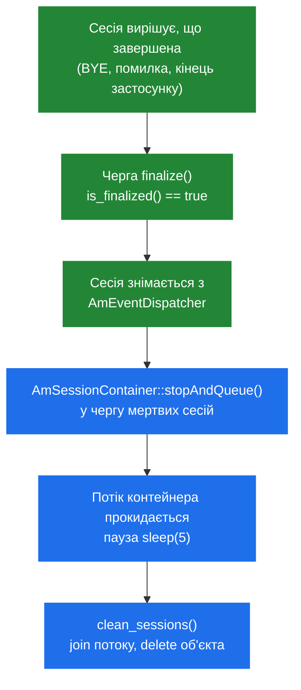

# 2.3 Пам'ять і володіння

> [!IMPORTANT]
> В SEMS немає алокатора спільної пам'яті. Немає `shm_malloc`, немає `pkg_malloc`, немає RPC
> для дампу пам'яті, немає паніки «out of shm». Є один процес і одна звичайна купа C++. Усе в
> цьому розділі випливає звідси.

## Що є в Kamailio і чого немає в SEMS

Kamailio ділить пам'ять надвоє, бо сам поділений на процеси: `pkg` приватна для воркера, `shm` —
пул, який бачать усі, і покласти об'єкт у правильний із них є постійною турботою при
проєктуванні. Розмір цих пулів — задача тюнінгу, вичерпання будь-якого з них — відомий режим
відмови, і для обох є RPC-команди інспекції.

Нічого з цього тут немає, і причина структурна, а не смакова: з одним процесом ділити пам'ять
просто **між чим**. Потоки й так бачать один адресний простір. `new` достатньо.

Питання `shm` vs `pkg` замінюється іншим: **хто володіє цим об'єктом і хто його видаляє?**

## Підрахунок посилань

Основний механізм — у `core/atomic_types.h`:

```cpp
class atomic_ref_cnt
{
  atomic_int ref_cnt;

protected:
  atomic_ref_cnt() {}

  void _inc_ref() { ref_cnt.inc(); }
  bool _dec_ref() { return ref_cnt.dec_and_test(); }

  virtual ~atomic_ref_cnt() {}
  virtual void on_destroy() {}

  friend void inc_ref(atomic_ref_cnt* rc);
  friend void dec_ref(atomic_ref_cnt* rc);
};
```

Успадкуйтесь від нього — і `inc_ref(p)` / `dec_ref(p)` керують часом життя; останній `dec_ref`
викликає `on_destroy()` і видаляє. Лічильник атомарний, тож викликати можна з будь-якого потоку.

Головний споживач — `AmEventQueue`, який сам є `atomic_ref_cnt`. Саме це робить систему подій
безпечною проти очевидної гонки: виробник дістав чергу сесії з диспатчера, і перш ніж устиг
покласти подію, сесія завершилась. Утримане посилання тримає чергу живою; подія падає в чергу,
яку ніхто не вичерпає, а об'єкт звільняється, коли зникне останнє посилання
([2.2](03-event-system.md)).

> [!TIP]
> `on_destroy()` — віртуальний хук, що виконується *перед* видаленням, поки об'єкт ще повністю
> сформований. Використовуйте його для зняття з реєстрації: деструктор — уже запізно, щоб
> безпечно кликати код, який може знову взяти на вас посилання.

## Сінглтони

Більшість довгоживучих сервісів — сінглтони, і всі вони ділять один шаблон у
`core/singleton.h`:

```cpp
template<class T>
class singleton
  : public T
{
public:
  static singleton<T>* instance()
  {
    _inst_m.lock();
    if(NULL == _instance) {
      _instance = new singleton<T>();
    }
    _inst_m.unlock();
    return _instance;
  }
  static void dispose()
  {
    _inst_m.lock();
    if(_instance != NULL){
      _instance->T::dispose();
      delete _instance;
      _instance = NULL;
    }
    _inst_m.unlock();
  }
  ...
};
```

Дві деталі. Лок береться на **кожному** виклику `instance()`, а не лише на першому — це не
double-checked locking, тож `Foo::instance()` у гарячому циклі є справжнім захопленням м'ютекса.
Виносьте його в локальну змінну. І `dispose()` кличе власний `dispose()` обгорнутого типу перед
видаленням — саме так виражається порядок зупинки ([2.4](05-lifecycle.md)).

`AmEventDispatcher`, `AmSessionContainer`, `AmMediaProcessor`, `AmRtpReceiver`, `AmAppTimer` і
`AmPlugIn` доступні саме так.

## Хто видаляє сесію

Сесія є водночас потоком і об'єктом, тож просто зробити `delete this` вона не може.
Послідовність свідомо непряма:



`AmSessionContainer` крутить власний потік, єдина робота якого — збирати мертвих:

```cpp
void AmSessionContainer::run()
{
  while(!_container_closed.get()){

    _run_cond.wait_for();

    if(_container_closed.get())
      break;

    // Give the Sessions some time to stop by themselves
    sleep(5);

    bool more = clean_sessions();

    DBG("Session cleaner finished\n");
    if(!more  && (!_container_closed.get()))
      _run_cond.set(false);
  }
  DBG("Session cleaner terminating\n");
}
```

Цей буквальний `sleep(5)` варто засвоїти. **Завершена сесія не звільняється одразу** — вона
лежить у черзі мертвих щонайменше п'ять секунд, поки її потік догортається, а посилання в
польоті вичерпуються. За високої плинності дзвінків на машині завжди є популяція
завершених-але-ще-не-звільнених сесій, і вона пропорційна вашій швидкості дзвінків. Якщо ви
дивитесь на RSS і дивуєтесь, чому воно не йде за активними дзвінками, — ось чому.

## Практичні наслідки

**Пам'ять росте з конкурентністю, і це звичайна купа.** Немає пулу, який треба заздалегідь
розмірити, і немає пулу, який можна вичерпати. Інструменти звичайні: `valgrind`, ASan, `massif`,
`pmap`. Це справжня перевага порівняно з дебагом власного алокатора.

**Витік — це витік на весь час життя процесу.** `pkg` у Kamailio приватний для воркера й фактично
обмежений його життям; плагін SEMS, що тече, тече до рестарту. На довгоживучих машинах дрібні
витоки стають помітними.

**Фрагментація реальна.** Тисячі коротких сесій, кожна з власними аудіо-буферами, за тижні
фрагментують купу glibc. Якщо RSS росте, а активні дзвінки — ні, підозрюйте фрагментацію раніше
за витік і перевірте, чи вичерпується черга мертвих сесій.

**Стеки потоків — теж пам'ять.** У типовій збірці «потік на сесію» кожен дзвінок несе стек
потоку. Часто це і є домінантна вартість на дзвінок і справжня стеля конкурентності
([2.1](02-thread-model.md), [2.5](06-sizing-and-tuning.md)).

**Ніщо не переживає процес.** Немає спільного сегмента — немає стану, який можна відновити, і
нічого інспектувати посмертно, окрім core-файла. Два інстанси SEMS не ділять рівно нічого, і
саме тому кластеризація тут є питанням розгортання, а не конфігурації
([11.2](41-topologies-and-ha.md)).
