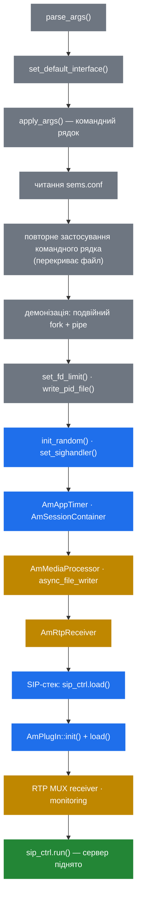

# 2.4 Життєвий цикл процесу

> [!NOTE]
> Увесь старт і вся зупинка живуть в одній читабельній функції: `main()` у `core/sems.cpp`.
> Якщо вам судилось прочитати лише один файл ядра — читайте цей: порядок операцій у ньому
> пояснює кілька поведінок, що ззовні виглядають довільними.

## Старт, по порядку



### Конфігурація застосовується двічі

Командний рядок парситься, застосовується, а потім застосовується **ще раз** після читання
конфігураційного файлу:

```
/* apply command-line options */
/* load and apply configuration file */
/* re-apply command-line options to override configuration file */
```

Саме це подвійне застосування робить так, що `-D` і подібні перемагають `sems.conf` незалежно
від порядку. Воно ж означає, що опція, оброблена лише в першому проході, тихо програє файлу —
справжня пастка при додаванні нових опцій.

### Демонізація

Якщо не зібрано з `DISABLE_DAEMON_MODE`, SEMS робить хрестоматійний подвійний fork: fork, щоб
перестати бути лідером групи, `setsid()`, щоб віддати керуючий термінал, ще один fork, щоб не
можна було його повернути, а далі підміна stdin/stdout/stderr на `/dev/null` (stderr — лише якщо
`log_stderr=0`).

Цікава деталь — **pipe**. Перший батько створює його й чекає; онук пише туди свій PID уже після
того, як старт справді вдався:

```cpp
  if(fd[1]) {
    if (write(fd[1], &main_pid, sizeof(int))<0) {
       DBG("error writing main_pid to parent\n");
    }
    close(fd[1]); fd[1] = 0;
  }
```

Саме тому нульовий код виходу `sems` для init-скрипта означає «воно справді піднялось», а не
просто «зробило fork». Запис відбувається *після* завантаження плагінів — плагін, що не
завантажився, валить увесь старт, і супервізор про це дізнається.

### Порядок важливий, двічі

**SIP-стек стартує раніше за плагіни.** `sip_ctrl.load()` виконується приблизно на рядку 656, а
`AmPlugIn::load()` — після нього. Тобто існує коротке вікно, коли сокети вже є, а жодного
застосунку ще не зареєстровано. Запити, що приїхали в цей момент, не знаходять фабрики й
відхиляються — це видно як жменька дивних 5xx у перші миті після рестарту.

**Медіа-інфраструктура стартує раніше за SIP-стек.** `AmMediaProcessor` і `AmRtpReceiver` уже
працюють, коли може приїхати перший INVITE, тож сесії ніколи не доводиться чекати на підняття
медіа-потоків.

## Сигнали

Обробка сигналів свідомо винесена з обробника. `signal_handler()` запам'ятовує, що сталося, і
повертається; сама робота відкладається на головний потік:

```cpp
  // Register signal processing callback so signals are handled
  // safely from the main thread rather than from signal context.
  sip_ctrl.on_idle_cb = process_pending_signals;
```

`process_pending_signals()` викликається з циклу простою SIP-стека. Виграш у тому, що обробка
сигналу може брати локи, писати в лог і чіпати контейнер сесій — жодне з цього не є легальним у
справжньому сигнальному контексті. Ціна — сигнали обробляються лише тоді, коли стек іде в
простій; на повністю насиченій машині `SIGTERM` може бути помічений не миттєво.

`AmSystemEvent` несе `User1` і `User2` — саме так `SIGUSR1`/`SIGUSR2` доходять до застосунків,
яким вони потрібні.

## Зупинка

Коректна зупинка — це розсилка, а не вбивство:

```cpp
void AmSessionContainer::broadcastShutdown() {
  DBG("brodcasting ServerShutdown system event to %u sessions...\n",
      AmSession::getSessionNum());
  AmEventDispatcher::instance()->
    broadcast(new AmSystemEvent(AmSystemEvent::ServerShutdown));
}
```

Кожна сесія отримує власний клон `AmSystemEvent::ServerShutdown` і має завершити те, що робить:
надіслати `BYE`, скинути запис на диск, коректно покласти слухавку. Далі контейнер чекає, поки
черги подій зупиняться.

Є два запасні виходи:

| Механізм | Типово | Дія |
|---|---|---|
| `max_shutdown_time` | **10** секунд (`DEFAULT_MAX_SHUTDOWN_TIME`) | Верхня межа очікування завершення сесій |
| `enableUncleanShutdown()` | вимкнено | Пропустити розсилку взагалі й одразу лягати |

```cpp
void AmSessionContainer::on_stop()
{
  _container_closed.set(true);

  if (enable_unclean_shutdown) {
    INFO("unclean shutdown requested - not broadcasting shutdown\n");
  } else {
    broadcastShutdown();

    DBG("waiting for active event queues to stop...\n");
    ...
```

> [!WARNING]
> Десять секунд — це стеля за замовчуванням, а дзвінкам байдуже до вашого вікна обслуговування.
> Машина з довгими дзвінками або обірве їх на дедлайні, або триматиме рестарт відкритим. Якщо
> потрібен справжній drain, спершу зупиніть *нові* дзвінки вище за течією, на проксі, і дайте
> машині спорожніти, перш ніж слати їй сигнал: власного режиму «не приймати нові, доживати
> старі» в SEMS немає.

Після очікування розбирання йде у зворотному порядку залежностей — контейнер сесій, потім дамп
таблиці транзакцій, потім RTP receiver:

```cpp
  INFO("Disposing session container\n");
  AmSessionContainer::dispose();

  DBG("** Transaction table dump: **\n");
  dumps_transactions();
  DBG("*****************************\n");

  INFO("Disposing RTP receiver\n");
  AmRtpReceiver::dispose();
```

Цей дамп таблиці транзакцій справді корисний: він друкує все, що лишалось у польоті на момент
падіння, і часто це найшвидший спосіб побачити, що саме перервала зупинка
([3.4](10-transaction-layer.md)).

## Що насправді означає «воно стартувало»

`INFO("SEMS " SEMS_VERSION " (" ARCH "/" OS") started")` пишеться **після** завантаження плагінів
і безпосередньо перед `sip_ctrl.run()`. Тобто цей рядок означає:

- конфігурація розібрана й застосована двічі,
- медіа-процесор, RTP receiver і таймери працюють,
- SIP-сокети відкриті,
- кожен налаштований плагін завантажився успішно,
- і процес ось-ось увійде в SIP-цикл.

Якщо рядка немає — звірте лог із порядком на діаграмі вище; остання стадія, яка встигла
залогуватись, і покаже, де саме воно спинилось.
