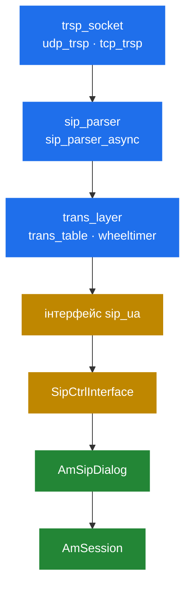
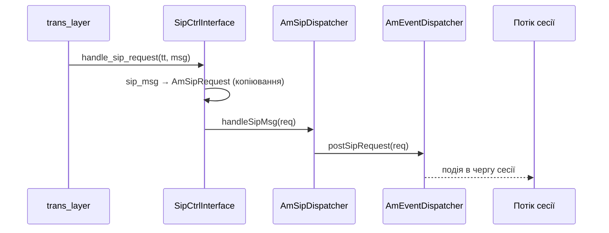

# 3.1 SIP-стек

> [!IMPORTANT]
> SEMS не лінкує сторонній SIP-стек. Він несе власний, у `core/sip/`, написаний на C поверх
> сирих буферів. Ця тека за стилем є іншою кодовою базою порівняно з рештою дерева — `cstring`
> замість `std::string`, саморобні хеш-таблиці, явні машини станів — і читати її варто за її
> власними правилами.

## Навіщо власний стек

На час написання SEMS не існувало SIP-бібліотеки, на яку варто було б покластися і яка була б
водночас достатньо швидкою й прийнятною за ліцензією. Ті самі міркування породили стек Kamailio,
стек OpenSIPS і стек Asterisk. Ніхто не збирався писати чотири SIP-стеки; просто кожному був
потрібен такий, який можна підігнати під власну модель пам'яті й потоків, а універсальна
бібліотека цього не вміє.

Що SEMS виграв, володіючи ним:

- **Парсинг без копіювання.** Заголовки вказують усередину приймального буфера, а не копіюються
  назовні ([3.3](09-parser.md)). API на `std::string` такого дати не може.
- **Колесо таймерів під SIP.** Таймери RFC 3261 грубі й численні; колесо з роздільністю 20 мс
  лягає на них рівно ([3.4](10-transaction-layer.md)).
- **Контроль над потоками.** Стек сам вирішує, який потік парсить, а який виконує код застосунку
  — саме ця межа робить життєздатною модель «потік на сесію» ([2.1](02-thread-model.md)).

Ціна: покриття RFC — це те, що хтось реалізував, а не те, що написано в стандарті. Усе поза
типовим шляхом — незвичні форми заголовків, екзотичні транспорти, новіші RFC — ваша задача.

## Рівні



Усе від `trsp_socket` до `trans_layer` — це світ C у `core/sip/`. Усе від `AmSipDialog` і вище —
світ сесій на C++. `sip_ua` і `SipCtrlInterface` — шов між ними.

| Рівень | Файли | Володіє |
|---|---|---|
| Транспорт | `transport.*`, `udp_trsp.*`, `tcp_trsp.*`, `resolver.*` | Сокети, з'єднання, DNS ([3.2](08-transport.md)) |
| Парсер | `sip_parser.*`, `sip_parser_async.*`, `parse_*.{h,cpp}` | Перетворення байтів на `sip_msg` ([3.3](09-parser.md)) |
| Транзакції | `trans_layer.*`, `trans_table.*`, `sip_trans.*`, `wheeltimer.*`, `sip_timers.*` | Ретрансмісії, зіставлення, таймаути ([3.4](10-transaction-layer.md)) |
| Шов | `sip_ua.h`, `SipCtrlInterface.*` | Передача зіставленого повідомлення в діалог |
| Діалог | `AmSipDialog.*`, `AmBasicSipDialog.*`, `Am100rel.*` | Довгоживучий стан дзвінка ([3.5](11-dialog-layer.md)) |

## Шов: `sip_ua`

Увесь контракт між стеком і всім, що вище, — це три чисто віртуальні методи:

```cpp
class sip_ua
{
public:
    virtual ~sip_ua() {}
    virtual void handle_sip_request(const trans_ticket& tt, sip_msg* msg)=0;
    virtual void handle_sip_reply(const string& dialog_id, sip_msg* msg)=0;
    virtual void handle_reply_timeout(AmSipTimeoutEvent::EvType evt,
        sip_trans *tr, trans_bucket *buk=0)=0;
};
```

Це весь інтерфейс. З нього випливають три спостереження.

**Запити несуть `trans_ticket`, відповіді — `dialog_id`.** Вхідний запит може ще не належати
жодному діалогу, тож стек віддає непрозорий хендл на щойно створену транзакцію; цим квитком ви
пізніше відповідаєте в потрібну транзакцію. Вхідна ж відповідь завжди належить UAC-транзакції,
яку *ми* почали, тож стек уже знає діалог і передає його ідентифікатор простим рядком.

**Таймаути — повноцінний колбек.** Відповідь, яка не прийшла, є подією, а не тишею.
`handle_reply_timeout()` — це те, як «дальній бік перестав відповідати» доходить до застосунку.

**Стек не знає, що таке сесія.** Він знає транзакції й рядковий ідентифікатор. Усе про
`AmSession`, застосунки й медіа живе вище цієї лінії — саме тому стек можна читати й розуміти
цілком окремо.

## `SipCtrlInterface`

`SipCtrlInterface` — єдина реалізація `sip_ua` і міст у світ сесій. У `main()` він з'являється
тричі ([2.4](05-lifecycle.md)):

```cpp
  INFO("Starting SIP stack (control interface)\n");
  if(sip_ctrl.load()) {
    goto error;
  }
```

```cpp
  sip_ctrl.on_idle_cb = process_pending_signals;

  // running the server
  if(sip_ctrl.run() != -1)
    success = true;
```

`load()` біндить сокети й стартує транспортні потоки. `run()` **і є сервером** — він не
повертається до зупинки, тому в `main()` немає власного циклу. А `on_idle_cb` — гачок, який
дозволяє відкладеній обробці сигналів відбуватись на головному потоці, безпечно поза сигнальним
контекстом.

Далі від `handle_sip_request()` шлях такий:



Копіювання з `sip_msg` в `AmSipRequest` — це місце, де закінчується zero-copy. Інакше не можна:
`sip_msg` вказує в приймальний буфер, який транспортний потік ось-ось перевикористає, а сесія
подивиться на запит значно пізніше й на іншому потоці. Парсити дешево, скопіювати один раз на
межі, далі працювати зі звичайними C++-об'єктами — ось і весь задум ([3.3](09-parser.md)).

## Як читати `core/sip/`

Кілька конвенцій, які інакше вас гальмуватимуть:

- **`cstring` — це view, а не рядок.** `{const char* s; unsigned int len;}`, що вказує в чужий
  буфер. Ніколи не переживає цей буфер.
- **`c2stlstr()` / `stl2cstr()`** — макроси переходу в `std::string` і назад. Їхня поява
  позначає копіювання.
- **Хеш-таблиці саморобні й лочаться по бакетах.** `hash_table.h` плюс `ht_bucket<T>`; таблиця
  транзакцій — `1<<10` бакетів, у кожного власний лок — та сама ідея шардування, що й у
  `AmEventDispatcher` ([2.2](03-event-system.md)).
- **Машини станів — це цілочисельні enum'и і `switch`.** `TS_TRYING`, `TS_PROCEEDING`,
  `TS_COMPLETED`… Жодної ієрархії класів; грепніть enum і читайте switch.
