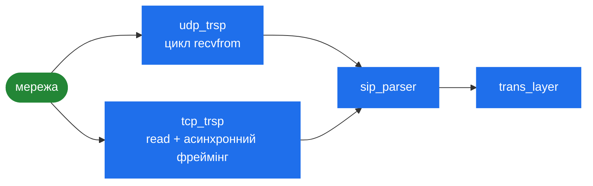

# 3.2 Транспорт

> [!NOTE]
> Задача транспортного рівня вузька: покласти байти на дріт і зняти їх звідти, та з'ясувати,
> куди слати. Усе про те, що ці байти *означають*, належить парсеру ([3.3](09-parser.md)) і
> транзакційному рівню ([3.4](10-transaction-layer.md)).

## `trsp_socket`

Кожен слухач — це `trsp_socket`, і, як і черга подій, він рахує посилання:

```cpp
class trsp_socket
    : public atomic_ref_cnt
{
public:
    enum socket_options {
	force_via_address       = (1 << 0),
	force_outbound_if       = (1 << 1),
	use_raw_sockets         = (1 << 2),
	no_transport_in_contact = (1 << 3)
    };
    ...
protected:
    int sd;                       // socket descriptor
    sockaddr_storage addr;        // bound address
    string           ip;          // bound IP
    unsigned short   port;        // bound port number
    string      public_ip;        // public IP (Via-HF)
    unsigned short   if_num;      // internal interface number
    unsigned int sys_if_idx;      // network interface index
    unsigned int socket_options;
};
```

Підрахунок посилань важливий тому, що транзакція може пережити рішення використати сокет:
ретрансмісія стріляє з потоку таймерів значно пізніше за відправку запиту, і сокет має все ще
існувати.

### Чотири опції сокета

Це ручки мультихомінгу, і кожна існує заради конкретної проблеми розгортання.

| Опція | Що робить | Коли потрібна |
|---|---|---|
| `force_via_address` | Кладе `public_ip` у `Via` замість прив'язаної адреси | За 1:1 NAT — ви біндите приватну адресу, а анонсувати мусите публічну |
| `force_outbound_if` | Прибиває вихід до цього інтерфейсу, а не дає обрати маршрутизації | Мультихомні машини, де ядро інакше візьме не те джерело |
| `use_raw_sockets` | Слати через `raw_sender`/`raw_sock`, а не через прив'язаний сокет | Відправка з адресою джерела, яку ви не біндили — див. нижче |
| `no_transport_in_contact` | Не додавати `;transport=` у `Contact` | Піри, які неправильно обробляють цей параметр |

Зверніть увагу на розділення `ip` (прив'язана) і `public_ip` (анонсована). Плутанина між ними —
класична причина однобічного аудіо й недоставлюваних внутрішньодіалогових запитів за NAT.

### Сирі сокети

`raw_sock.*` і `raw_sender.*` існують, щоб SEMS міг видати UDP-датаграму з адресою джерела, яку
він не `bind()`ив. На машині з багатьма адресами тримати по сокету на адресу й обирати між ними
дорого; сирий сокет дозволяє одному відправнику писати з довільним джерелом.

Ціна — сирі сокети потребують `CAP_NET_RAW`. Це прямо стикається з роботою демона без привілеїв
([10.3](39-security-hardening.md)): або ви даєте цю capability бінарнику, або не користуєтесь
цим шляхом.

## UDP і TCP

**`udp_trsp`** — простий випадок. Датаграма і є повідомленням: прийняти, розпарсити,
роздиспетчерити. Ні проблеми фреймінгу, ні стану з'єднання, ні часткових читань.

**`tcp_trsp`** несе всю складність, бо потік не дає жодної з цих гарантій. Один `read()` може
повернути пів повідомлення, або три повідомлення, або повідомлення, розрізане між двома
читаннями. Наслідки:

- Фреймінг — задача асинхронного парсера: `skip_sip_msg_async()` і його `parser_state`
  ([3.3](09-parser.md)).
- З'єднання довгоживучі, їх треба відстежувати, перевикористовувати для внутрішньодіалогового
  трафіку і врешті вивільняти.

Керують цим два таймаути, обидва визначені в `transport.h`:

```cpp
#define DEFAULT_TCP_CONNECT_TIMEOUT 2000 /* 2 seconds */
#define DEFAULT_TCP_IDLE_TIMEOUT 3600000 /* 1 hour */
```

Вони налаштовуються на інтерфейс (`tcp_connect_timeout`, `tcp_idle_timeout` в `AmConfig`).

> [!TIP]
> **Дві секунди на з'єднання** — агресивно для перевантаженого або далекого шляху: TCP-рукостискання
> до піра за три континенти може легітимно не вкластися, і ви побачите відмови, схожі на
> «пір лежить». **Година простою** — щедро в інший бік: за багатьох пірів простійні з'єднання
> накопичуються проти вашого ліміту fd ([2.5](06-sizing-and-tuning.md)). Обидва дефолти пасують
> дата-центру, і жоден не пасує кожному розгортанню.

## Резолвінг DNS

`core/sip/resolver.*` — повноцінний SIP-резолвер, а не обгортка над `gethostbyname()`, і коду
там більше, ніж очікують. Точки входу:

```cpp
int resolve_name(const char* name, ...);
int resolve_targets(const list<sip_destination>& dest_list, ...);
```

Ієрархія типів каже, що саме він уміє:

| Тип | Запис | Призначення |
|---|---|---|
| `dns_ip_entry` | A / AAAA | Звичайний пошук адреси |
| `dns_srv_entry` | SRV | Пошук сервісу з **пріоритетом і вагою** |
| `dns_naptr_entry` | NAPTR | Вибір транспорту — що з UDP/TCP/TLS пір воліє |
| `dns_entry_map` | — | Кеш |
| `dns_handle` | — | Курсор на одну резолюцію: **пам'ятає, де ви в списку результатів** |

`address_type` розрізняє `IPv4` і `IPv6`, `proto_type` — транспорти.

`dns_handle` тут головний. Резолюція за RFC 3263 дає не *адресу*, а впорядкований список, і
ціль може легітимно перемкнутись на наступний запис. Хендл несе цей курсор — саме це робить
можливим failover-таймер транзакційного рівня:

```cpp
    // Transport address failover timer:
    // - used to cycle throught multiple addresses
    //   in case the R-URI resolves to multiple addresses
    STIMER_M,
```

> [!IMPORTANT]
> Це найближче до групи пірів, що взагалі є в SEMS. Якщо R-URI резолвиться через SRV у кілька
> цілей, таймер M перебирає їх при відмові — пріоритет і вага враховуються, бо вони в самому
> DNS-записі. Чого він не вміє — це *знати*, що пір лежить, до спроби: немає ні пробінгу, ні
> рантайм-стану пірів, ні адміністративного вмикання/вимикання. Ця прогалина і те, що замість
> цього робить `dispatcher` у Kamailio, — [13.5](51-peer-dispatching.md).

Результати резолюції кешуються в `dns_entry_map` із дотриманням TTL. Пір, що змінив адресу,
підхоплюється після спливання TTL — тобто короткий TTL є вашим бюджетом на failover, і скинути
кеш адміністративно ніяк.

## Блоклист

`tr_blacklist.*` тримає напрямки, які нещодавно відмовили, щоб стек перестав довбати мертвого
піра. `STIMER_BL` — його grace-таймер. Це механізм клієнтських транзакцій, і він реактивний:
вчиться на відмовах, а не пробінгує.

Конфігурація і безпековий бік — [10.3](39-security-hardening.md).

## Що куди приїжджає



Обидва транспорти сходяться на тому самому парсері й тому самому транзакційному рівні. Від
`trans_layer` і вище ніщо не знає й не цікавиться, яким транспортом приїхало повідомлення —
застосунок питає діалог, якщо йому треба.
