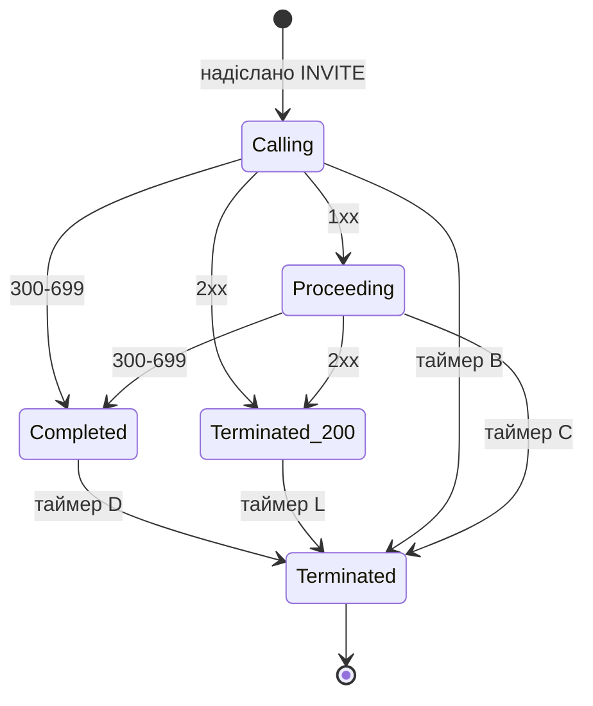

# 3.4 Транзакційний рівень

> [!IMPORTANT]
> Саме тут живе RFC 3261. Ретрансмісії, зіставлення, сім таймерів із літерними іменами і машини
> станів, що роблять ненадійний транспорт схожим на надійний — усе це `core/sip/trans_layer.cpp`,
> `trans_table.cpp`, `sip_trans.cpp` і `wheeltimer.cpp`.

## Таблиця

Транзакції тримаються в шардованій хеш-таблиці — той самий патерн, що й у диспатчера подій
([2.2](03-event-system.md)):

```cpp
#define H_TABLE_POWER   10
#define H_TABLE_ENTRIES (1<<H_TABLE_POWER)

class trans_bucket:
    public ht_bucket<sip_trans>
{
    ...
};

trans_bucket* get_trans_bucket(const cstring& callid, const cstring& cseq_num);
unsigned int hash(const cstring& ci, const cstring& cs);
```

1024 бакети, кожен лочиться незалежно, ключ — **Call-ID плюс номер CSeq**. Два різні дзвінки по
суті ніколи не конкурують; дві транзакції одного дзвінка ділять бакет, що нешкідливо, бо вони й
так зазвичай послідовні.

Зіставити вхідне повідомлення з наявною транзакцією — робота бакета, і матчерів чотири, бо SIP
потребує саме чотирьох:

```cpp
    sip_trans* match_request(sip_msg* msg, unsigned int ttype);
    sip_trans* match_1xx_prack(sip_msg* msg);
    sip_trans* match_reply(sip_msg* msg);
    sip_trans* find_uac_trans(const cstring& dialog_id, unsigned int inv_cseq);
private:
    sip_trans* match_200_ack(sip_trans* t, sip_msg* msg);
```

Те, що `match_200_ack` приватний і окремий, є визнанням коду щодо незручності, описаної в
[1.2](01b-sip-media-primer.md): ACK на 2xx *не* є частиною INVITE-транзакції, тож зіставити його
звичайним шляхом неможливо. `match_1xx_prack` існує тому, що PRACK посилається на RSeq, а не на
звичні координати ([3.5](11-dialog-layer.md)).

Параметри branch генеруються, а не беруться випадково:

```cpp
#define BRANCH_BUF_LEN 8
void compute_branch(char* branch, const cstring& callid, const cstring& cseq);
```

Вісім байтів, похідних від Call-ID і CSeq. Детерміновано, тож ретрансмісія того самого запиту
дає той самий branch — а це рівно те, чого вимагає зіставлення за RFC 3261.
`compute_sl_to_tag()` робить еквівалент для stateless-відповідей, де немає транзакції, яка
запам'ятала б тег.

## Типи і стани

```cpp
enum {
    TT_UAS=1,
    TT_UAC
};

enum {
    TS_TRYING=1,   // UAC:!INV;     UAS:!INV
    TS_CALLING,    // UAC:INV
    TS_PROCEEDING, // UAC:INV,!INV; UAS:INV,!INV
    TS_PROCEEDING_REL, // UAS:INV
    TS_COMPLETED,  // UAC:INV,!INV; UAS:INV,!INV
    TS_CONFIRMED,  //               UAS:INV
    TS_TERMINATED_200,
    TS_TERMINATED, // UAC:INV,!INV; UAS:INV,!INV

    TS_ABANDONED,
    TS_REMOVED
};
```

Коментарі тут є специфікацією: кожен стан анотований тим, яка з чотирьох машин
(UAC/UAS × INVITE/не-INVITE) може в ньому бути. Чотири машини станів, один enum.

Три стани відсутні в RFC 3261:

- **`TS_PROCEEDING_REL`** — UAS-транзакція INVITE, що надіслала надійну provisional-відповідь і
  чекає на її PRACK.
- **`TS_TERMINATED_200`** — UAC-транзакція INVITE, що отримала 2xx і тепер лише поглинає
  ретрансмісії, керована таймером L.
- **`TS_ABANDONED` / `TS_REMOVED`** — бухгалтерія розбирання.



## Таймери

Кожна транзакція одночасно тримає щонайбільше три таймери:

```cpp
/**
 * We support at most 3 timer per transaction,
 * which is okay according to the standard
 */
#define SIP_TRANS_TIMERS 3
```

Повний набір із дефолтами SEMS із `sip_timers.h`:

```cpp
#define T1_TIMER  500 /* 500 ms */
#define DEFAULT_T2_TIMER 4000 /*   4 s  */
#define T4_TIMER 5000 /*   5 s  */
```

| Таймер | Дефолт | Машина | Призначення |
|---|---|---|---|
| A | T1 = 500 мс | UAC INVITE | Ретрансмісія INVITE, з подвоєнням |
| B | 64·T1 = **32 с** | UAC INVITE | Calling → Terminated. Класичне «спроба дзвінка здалась» |
| C | **3 хв** | UAC INVITE | Proceeding → Terminated. Обмежує вічне «дзвонить» |
| D | 64·T1 = 32 с | UAC INVITE | Completed → Terminated; поглинає ретрансмісії відповідей |
| E | T1 = 500 мс | UAC не-INVITE | Ретрансмісія запиту |
| F | 64·T1 = 32 с | UAC не-INVITE | Здатись |
| G | T1 = 500 мс | UAS INVITE | Ретрансмісія фінальної відповіді до ACK |
| H | 64·T1 = 32 с | UAS INVITE | Перестати чекати ACK |
| I | T4 = 5 с | UAS INVITE | Confirmed → Terminated; поглинає ретрансмісії ACK |
| J | 64·T1 = 32 с | UAS не-INVITE | Completed → Terminated |
| L | 64·T1 = 32 с | UAC INVITE | **Немає в RFC 3261** — поглинає ретрансмісії 200 після 2xx |
| M | B/4 = **8 с** | UAC | **Немає в RFC 3261** — failover адрес із DNS |
| BL | — | UAC | Grace блоклиста ([3.2](08-transport.md)) |

Два з них варті уваги в експлуатації.

**Таймер B — 32 секунди.** Саме стільки запит до неживого піра займає транзакцію, а разом із нею
сесію і її потік. На машині, що втрачає маршрут, 32 секунди накопичених мертвих транзакцій — це
і є те, як стається «у нас закінчились потоки» ([2.5](06-sizing-and-tuning.md)).

**Таймер M — це failover.** На 8 секундах він перемикається на наступну адресу, якщо R-URI
резолвнувся в кілька ([3.2](08-transport.md)). У поєднанні з 32 секундами таймера B ви отримуєте
щонайбільше чотири спробувані адреси, перш ніж усе здасться — реальне обмеження, якщо ви
сподівались, що SRV дасть вам великий пул пірів ([13.5](51-peer-dispatching.md)).

## Колесо

Усі ці таймери крутить один потік і одна структура даних:

```cpp
#define BITS_PER_WHEEL 8
#define ELMTS_PER_WHEEL (1 << BITS_PER_WHEEL)

// 20 ms == 20000 us
#define TIMER_RESOLUTION 20000

// do not change
#define WHEELS 4
```

**Ієрархічне колесо таймерів**: чотири колеса по 256 слотів, тик 20 мс. Разом вони покривають
2³² тиків — роки — за сталої вартості.

Сенс колеса в тому, що вставка, видалення й спрацювання таймера — усі O(1). Купа або
відсортований список дали б O(log n) на операцію, а за трьох таймерів на транзакцію і тисяч
транзакцій це різниця між робочим сервером і профілем, у якому домінує бухгалтерія таймерів.
`// do not change` над `WHEELS` не декоративне — арифметика каскаду припускає саме чотири.

```cpp
class timer: public base_timer
{
public:
    base_timer*  prev;
    u_int32_t    expires;
    virtual void fire()=0;
};
```

Таймери — інтрузивний двозв'язний список (`next` у `base_timer`, `prev` у `timer`), тож видалити
один — це оновлення вказівників без пошуку. `trans_timer` додає зворотний вказівник на
транзакцію та ідентифікатор її бакета, щоб `fire()` міг знайти й залочити потрібний бакет.

Вставки й видалення йдуть через чергу запитів (`timer_req`), а не напряму в колесо, що тримає
колесо однопотоковим і майже без локів.

> [!NOTE]
> **Роздільність 20 мс.** Кожен SIP-таймер квантується нею. Це значно дрібніше, ніж потрібно
> будь-якому таймеру RFC 3261 — найкоротший, T1, це 500 мс — і це той самий порядок, що й
> медіа-тик ([2.5](06-sizing-and-tuning.md)), але то збіг, а не зв'язок: годинники незалежні.

## Читання таблиці в рантаймі

`dumps_transactions()` друкує всю таблицю. Її кличуть на зупинці ([2.4](05-lifecycle.md)):

```
DBG("** Transaction table dump: **\n");
dumps_transactions();
```

Усе, що там перелічено, було в польоті на момент зупинки сервера. Застряглі транзакції в
працюючій системі видно так само: зростаюча популяція в `TS_COMPLETED` або `TS_PROCEEDING`
зазвичай означає піра, який перестав відповідати, а стан плюс таймер кажуть, якого саме.
