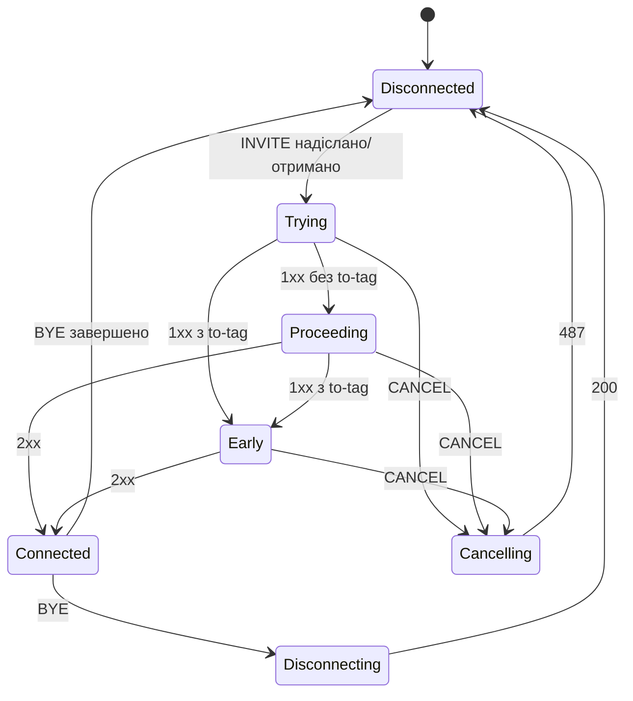

# 3.5 Рівень діалогів

> [!NOTE]
> Діалог — перший об'єкт у стеку, який мислить *дзвінками*, а не повідомленнями. Це ж і межа,
> де закінчується C із `core/sip/` і починається світ сесій на C++ — файли тут `AmSipDialog.*`,
> а не `sip_*.cpp`.

## Два класи, поділені навмисно

`AmBasicSipDialog` тримає все, що потрібно SIP-діалогу. `AmSipDialog` додає поверх семантику
дзвінка, специфічну для INVITE. Поділ існує тому, що в SEMS є діалоги, які не є дзвінками:
підписки ([9.1](31-registrar-client.md)), реєстрації, `SUBSCRIBE`/`NOTIFY` — їм потрібні
ідентичність, нумерація й маршрутизація без жодного поняття «з'єднано».

Стан ідентичності й маршрутизації живе в базовому класі:

```cpp
  string callid;
  string local_tag;
  string ext_local_tag;
  string remote_tag;
  string first_branch;

  string local_uri;      // local uri
  string remote_uri;     // remote uri
  string remote_party;   // To/From
  string local_party;    // To/From
  string remote_ua;      // User-Agent/Server

  string route;

  string next_hop;
  bool next_hop_1st_req;
  bool patch_ruri_next_hop;
  bool next_hop_fixed;

  int outbound_interface;
  ...
  string outbound_proxy;
  bool   force_outbound_proxy;
  bool nat_handling;
  bool r_cseq_i;
```

Кілька з них варто назвати явно.

**`local_tag` — це адреса сесії.** Саме за цим ключем індексується `AmEventDispatcher`
([2.2](03-event-system.md)), тож тег діалогу і адреса поштової скриньки сесії — той самий рядок.
Побачивши local tag у логу, ви можете класти події в цю сесію.

**`route` — це route set**, стек `Record-Route`, вивчений під час встановлення діалогу, який
відтворюється як `Route` у кожному наступному внутрішньодіалоговому запиті. Помилка тут — це те,
чому внутрішньодіалогові `BYE` летять не туди.

**Сімейство `next_hop` — це ручка з чотирьох частин**, і воно дослівно повторюється в профілі
дзвінка SBC ([6.4](23b-sbc-profiles.md)):

| Поле | Дія |
|---|---|
| `next_hop` | Слати сюди незалежно від того, у що резолвиться R-URI |
| `next_hop_1st_req` | Застосувати лише до першого запиту діалогу |
| `patch_ruri_next_hop` | Переписати ще й R-URI, а не тільки напрямок |
| `next_hop_fixed` | Не дозволяти нічому пізніше це змінити |

**`r_cseq_i`** відстежує, чи ініціалізовано віддалений CSeq — захист від прийняття
внутрішньодіалогового запиту з CSeq меншим за вже побачений.

## Стан діалогу

```cpp
  enum Status {
    Disconnected=0,
    Trying,
    Proceeding,
    Cancelling,
    Early,
    Connected,
    Disconnecting,
    __max_Status
  };
```

Сім станів, і зверніть увагу: це **не** стани транзакцій із [3.4](10-transaction-layer.md).
Діалог переживає багато транзакцій; дві машини працюють паралельно й означають різне.
`TS_PROCEEDING` каже «цей запит отримав provisional-відповідь»; `Proceeding` каже «цей дзвінок
встановлюється».



`Early` проти `Proceeding` — це та відмінність, яка важить на практиці: provisional-відповідь із
To-тегом створює **ранній діалог**, який може нести early media і який можна встановити або
скасувати незалежно. `183 Session Progress` із тегом — це інша ситуація, ніж `180 Ringing` без
нього, і enum це фіксує.

`Cancelling` існує тому, що CANCEL справді незручний: ви просите відмовитись від транзакції, яка
могла вже й успішно завершитись, і діалог мусить тримати цю невизначеність, доки її не розв'яже
`487` або `200`.

## Інтерфейс обробника подій

`AmSipDialogEventHandler` — це те, у що діалог кличе при зміні стану. Механізм, яким сесія
дізнається, що її дзвінок зрушив:

```cpp
  virtual void onEarlySessionStart()=0;
```

Коментар до класу точно описує розподіл обов'язків:

> and executes onSessionStart/onEarlySessionStart when required.

Діалог вирішує, *коли* сесія почалась; сесія вирішує, *що це означає*. Прикріплення медіа,
наприклад, висить на `onSessionStart` — саме тому early media вимагає, щоб
`onEarlySessionStart` існував як окремий гачок, а не був згорнутий усередину.

## Надійні provisional-відповіді: `Am100rel`

PRACK (RFC 3262) отримує власний невеликий клас, бо додає діалогу другий простір нумерації:

```cpp
class Am100rel
{
public:
  enum State {
    REL100_DISABLED=0,
    REL100_SUPPORTED,
    REL100_REQUIRE,
    //REL100_PREFERED, //TODO
    REL100_IGNORED,
    REL100_MAX
  };
private:
  State reliable_1xx;
  // UAS
  unsigned rseq;          // RSeq for next request
  bool rseq_confirmed;    // latest RSeq is confirmed
  unsigned rseq_1st;      // value of first RSeq (init value)
  // UAC
  unsigned rseq_last;     // last accepted RSeq
  ...
};
```

Чотири політики:

| Стан | Значення |
|---|---|
| `REL100_DISABLED` | Не пропонувати й не приймати |
| `REL100_SUPPORTED` | Анонсувати `100rel` у `Supported`; вживати, якщо пір попросить |
| `REL100_REQUIRE` | Покласти в `Require` — пір мусить робити PRACK або отримає відмову |
| `REL100_IGNORED` | Вдавати, що не бачимо |

`REL100_PREFERED` закоментований із `//TODO` — чесний підсумок того, наскільки на нього був
попит.

Чотири гачки — `onRequestIn`, `onReplyIn`, `onRequestOut`, `onReplyOut`, плюс `onTimeout` —
означають, що кожне повідомлення, яке проходить через діалог, перевіряється на бухгалтерію
RSeq/RAck. `rseq_confirmed` — важливий прапорець: із `REQUIRE` ви не маєте права слати наступну
надійну provisional, доки попередню не підтвердили PRACK'ом, і це стримує UAS, який хотів би
надіслати кілька.

> [!TIP]
> `REL100_REQUIRE` проти піра, який не вміє PRACK, валить дзвінок повністю, а не деградує.
> `REL100_SUPPORTED` — сумісний варіант за замовчуванням; тягніться по `REQUIRE` лише тоді, коли
> контролюєте обидва кінці, що на практиці означає внутрішній транк.

## `AmSipDispatcher`

Останній стрибок перед світом сесій — дуже маленький клас:

```cpp
class AmSipDispatcher
{
  public:
    void handleSipMsg(AmSipRequest &);
    void handleSipMsg(const string& dialog_id, AmSipReply &);
    static AmSipDispatcher* instance();
};
```

Два методи, дзеркальні до двох колбеків `sip_ua` ([3.1](07-sip-stack-overview.md)). Запити
приїжджають без ідентифікатора діалогу — вони можуть його створювати — тож ідуть у
`AmEventDispatcher::postSipRequest()`, а якщо жоден діалог не збігся, далі в
`AmSessionContainer`, щоб створити сесію ([4.2](13-session-container-and-factories.md)).
Відповіді завжди мають ідентифікатор діалогу, бо транзакцію почали ми, тож вони кладуться прямо
в чергу цієї сесії.

Ця асиметрія — запити можуть створювати, відповіді ніколи — і є всім класом, і це останнє, що
відбувається перед тим, як керування бере [частина 4](12-amsession.md).
