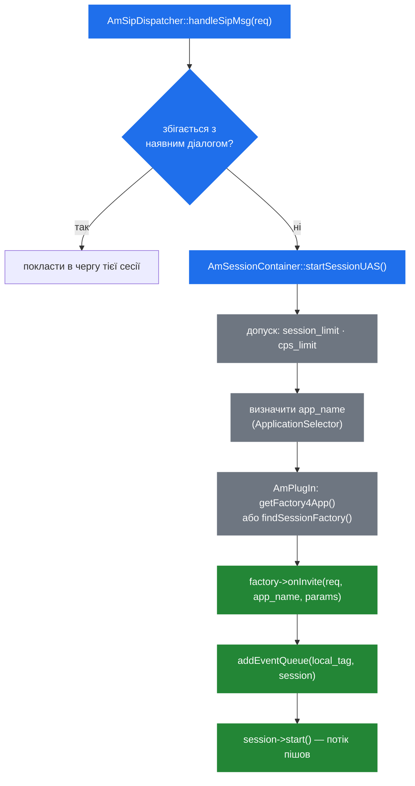

# 4.2 Контейнер сесій і фабрики

> [!NOTE]
> Цей розділ відповідає на одне питання: приїхав INVITE, який не збігся з жодним діалогом — як
> він стає працюючим застосунком? Відповідь: пошук, фабрика і реєстрація в диспатчері подій.

## `AmSessionContainer`

Контейнер — це сінглтон, що володіє самим фактом існування кожної сесії. У нього три задачі, і
пов'язані вони між собою слабко:

1. **Створювати сесії** — `startSessionUAS()`, `startSessionUAC()`, `createSession()`.
2. **Прибирати їх** — потік-прибиральник із `sleep(5)` із [2.3](04-memory-and-ownership.md).
3. **Контролювати допуск** — `check_and_add_cps()`, `setCPSLimit()`, `setCPSSoftLimit()` і ліміт
   сесій із [2.5](06-sizing-and-tuning.md).

Дві точки входу названі за тим, хто ініціював дзвінок:

```cpp
  void startSessionUAS(AmSipRequest& req);
  string startSessionUAC(const AmSipRequest& req,
                         string& app_name, AmArg* session_params);
```

`startSessionUAS()` обробляє вхідний INVITE. `startSessionUAC()` вживається, коли дзвонимо *ми*,
і повертає local tag нової сесії, щоб той, хто викликав, міг до неї звертатись
([2.2](03-event-system.md)).

## Від INVITE до сесії



Реєстрація в диспатчері відбувається **перед** стартом потоку. Інакше не можна: щойно сесія
побігла, вона може отримати відповідь, і диспатчер мусить уже знати, куди її класти.

## Вибір застосунку

Саме це дивує тих, хто прийшов з проксі, де маршрутизація явна. У SEMS застосунок обирається
налаштованою *стратегією*:

```cpp
  enum ApplicationSelector {
    App_RURIUSER,
    App_RURIPARAM,
    App_APPHDR,
    App_MAPPING,
    App_SPECIFIED
  };
```

яку задає один рядок у `sems.conf`:

```
# examples:
# application = conference
# application = $(mapping)
# application = $(ruri.user)
# application = $(ruri.param)
# application = $(apphdr)
application=webconference
```

| Значення | Селектор | Звідки береться ім'я |
|---|---|---|
| літеральне ім'я | `App_SPECIFIED` | Фіксовано. Кожен дзвінок веде той самий застосунок |
| `$(ruri.user)` | `App_RURIUSER` | Користувацька частина R-URI |
| `$(ruri.param)` | `App_RURIPARAM` | Параметр URI, напр. `;app=conference` |
| `$(apphdr)` | `App_APPHDR` | Заголовок **`P-App-Name`** |
| `$(mapping)` | `App_MAPPING` | Налаштований regex-мапінг поверх R-URI |

`$(apphdr)` — саме той, що вживається в прикладі з Kamailio у дереві коду
([1.1](01-introduction.md)):

```text
append_hf("P-App-Name: conference\r\n");
$ru = "sip:" + $rU + "@" + "127.0.0.1:5070";
```

Проксі вирішує, який застосунок, і каже це в заголовку; SEMS підкоряється. Цей поділ —
маршрутизація в проксі, виконання в медіа-сервері — і є всім патерном інтеграції
([11.1](40-with-kamailio.md)).

> [!WARNING]
> З `$(apphdr)` **будь-хто, хто досягає вашого SIP-порту, обирає, який застосунок запуститься**,
> просто виставивши заголовок. Це довірений вхід із недовіреного джерела, якщо порт не досяжний
> лише з вашого проксі. Закрийте сигнальний інтерфейс фаєрволом або використовуйте `$(mapping)`,
> де шаблон під вашим контролем ([10.1](37-security-surface.md)).

Сам пошук прямолінійний:

```cpp
  if(!app_name.empty())
      session_factory = AmPlugIn::instance()->getFactory4App(app_name);
  else
      session_factory = AmPlugIn::instance()->findSessionFactory(req,app_name);
```

Названий застосунок іде прямо в `getFactory4App()`. Без імені `findSessionFactory()` питає
зареєстровані фабрики, чи хоче хтось із них цей запит.

## Ієрархія фабрик

`core/AmApi.h` визначає, чим може бути плагін. Усе походить від однієї бази:

```cpp
class AmPluginFactory
{
  ...
  virtual int onLoad()=0;
};
```

`onLoad()` виконується один раз на старті ([2.4](05-lifecycle.md)); ненульове повернення валить
завантаження, а невдале завантаження валить старт усього процесу.

| Фабрика | Виробляє | Для чого |
|---|---|---|
| `AmSessionFactory` | `AmSession` | Застосунки: `conference`, `voicemail`, `sbc`, … |
| `AmSessionEventHandlerFactory` | `AmSessionEventHandler` | Перехоплювачі, напр. `uac_auth` ([4.4](15-session-event-handlers.md)) |
| `AmDynInvokeFactory` | DI-об'єкт | Викликні модулі, основа RPC ([8.1](28-rpc-architecture.md)) |
| `AmLoggingFacility` | Приймач логів | Альтернативні бекенди логування |

У `AmSessionFactory` чотири методи створення — два для INVITE і два для REFER, кожен у простій і
параметризованій формі:

```cpp
  virtual AmSession* onInvite(const AmSipRequest& req, const string& app_name,
                              const map<string,string>& app_params);
  virtual AmSession* onInvite(const AmSipRequest& req, const string& app_name,
                              AmArg& session_params);
  virtual AmSession* onRefer(const AmSipRequest& req, const string& app_name, ...);
```

Форма з `map<string,string>` отримує параметри, розібрані із запиту; форма з `AmArg`
вживається, коли сесію створює хтось усередині SEMS і може передати структуровані дані
([7.1](24-plugin-architecture.md)).

Наявність `onRefer()` поруч із `onInvite()` означає, що застосунок може бути запущений
переведенням дзвінка, а не лише самим дзвінком.

## Експорт фабрики

Плагін — це shared object із відомим символом, що створюється макросом:

```cpp
#define EXPORT_SESSION_FACTORY(class_name,app_name) \
            EXPORT_FACTORY(FACTORY_SESSION_EXPORT,class_name,app_name)

#define EXPORT_SESSION_EVENT_HANDLER_FACTORY(class_name,app_name) \
            EXPORT_FACTORY(FACTORY_SESSION_EVENT_HANDLER_EXPORT,class_name,app_name)

#define EXPORT_PLUGIN_FACTORY(class_name,app_name) \
            EXPORT_FACTORY(FACTORY_PLUGIN_EXPORT,class_name,app_name)
```

Один рядок унизу модуля реєструє його. `AmPlugIn` робить dlopen на `.so`, шукає символ, кличе
його, щоб отримати фабрику, кличе `onLoad()` і кладе під іменем `app_name`
([7.1](24-plugin-architecture.md)).

## Вихідний дзвінок

`AmUAC` — це весь API вихідних дзвінків, і це один статичний метод:

```cpp
class AmUAC {
 public:
  static string dialout(const string& user,
			const string& app_name,
			const string& r_uri,
			const string& from,
			const string& from_uri,
			const string& to,
			const string& local_tag = "",
			const string& hdrs = "",
			AmArg*  session_params = NULL);
};
```

Він повертає local tag нової сесії — вашу ручку для публікації подій у неї. Зверніть увагу:
`app_name` тут явний, бо немає заголовка, який треба читати, і немає селектора, з яким треба
звірятись — ініціюєте ви.

Саме так працюють click-to-dial, callback і вихідні анонси: щось вирішує, що дзвінок має
існувати, кличе `dialout()` і отримує назад тег, щоб із ним говорити
([9.1](31-registrar-client.md)).

> [!TIP]
> Передавши `local_tag`, ви обираєте тег, а не отримуєте його. Корисно, коли зовнішній системі
> треба знати ідентифікатор *до* того, як дзвінок з'явився: для кореляції в CDR або щоб
> контролер міг класти події в дзвінок, який він щойно збирається створити.

## Контроль допуску на шляху

Обидва ліміти енфорсяться тут, до запуску будь-якої фабрики:

```cpp
  void setCPSLimit(unsigned int limit);
  void setCPSSoftLimit(unsigned int percent);
  bool check_and_add_cps();
```

Відмова в цій точці коштує майже нічого — ні об'єкта сесії, ні потоку, ні діалогу. Саме тому
ліміти належать контейнеру, а не застосунку, і саме тому виставити їх — дешева страховка
([2.5](06-sizing-and-tuning.md)).
