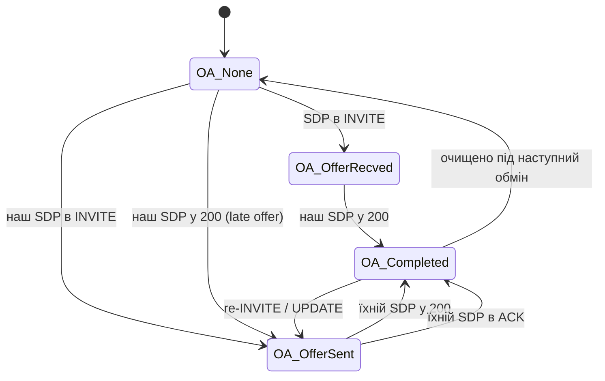

# 4.3 Offer/answer

> [!IMPORTANT]
> RFC 3264 — це машина станів, а не обмін, і SEMS моделює його саме так. `AmOfferAnswer` —
> невеликий клас: один enum, чотири стани, вісім гачків — і це єдине місце, де ухвалюється кожне
> рішення щодо SDP у всій системі.

## Чотири стани

```cpp
class AmOfferAnswer
{
public:
  enum OAState {
    OA_None=0,
    OA_OfferRecved,
    OA_OfferSent,
    OA_Completed,
    __max_OA
  };
private:
  OAState      state;
  OAState      saved_state;
  unsigned int cseq;
  AmSdp        sdp_remote;
  AmSdp        sdp_local;
  AmSipDialog* dlg;
  ...
};
```

| Стан | Значення |
|---|---|
| `OA_None` | Узгодження не триває. Початкова точка й точка після очищення завершеного |
| `OA_OfferRecved` | Дальній бік запропонував; ми винні answer |
| `OA_OfferSent` | Запропонували ми; чекаємо на їхній |
| `OA_Completed` | Обидві половини обміняні; опис медіа усталений |

Обидві схеми з [1.2](01b-sip-media-primer.md) випадають із цих чотирьох станів:



Зверніть увагу: той самий стан обслуговує і «ми запропонували в INVITE», і «ми запропонували в
200». З погляду машини станів late offer не є окремим випадком — саме тому загорнути це в
машину станів і було варто.

Enum супроводжують лише **три** одиниці стану: два SDP-тіла і CSeq. CSeq — це те, що прив'язує
узгодження до транзакції, яка його несе, тож відповідь зі старішої транзакції не може зіпсувати
свіжіше узгодження.

## Збереження й відновлення

```cpp
  OAState      saved_state;
  void saveState();
  int  checkStateChange();
  void clearTransitionalState();
```

`saveState()` запам'ятовує стан до обробки повідомлення; `checkStateChange()` порівнює після і
діє за різницею. Це та сама ідея «переходи важать більше за стани», що й `old_dlg_status` в
`onSipReply` ([4.1](12-amsession.md)): сесії треба знати, що узгодження *завершилось*, а не
просто що воно завершене.

`clearTransitionalState()` існує для шляхів відмови. Узгодження, недороблене на момент відмови
запиту, не має лишити діалог у переконанні, що є непогашений offer; re-INVITE, який отримав
`488`, мусить відкотитись до раніше погодженого медіа, а не в нікуди.

## Вісім гачків, двома парами пар

```cpp
  int onRequestIn(const AmSipRequest& req);
  int onReplyIn(const AmSipReply& reply);
  int onRequestOut(AmSipRequest& req);
  int onReplyOut(AmSipReply& reply);
  int onRequestSent(const AmSipRequest& req);
  int onReplySent(const AmSipReply& reply);
  void onNoAck(unsigned int ack_cseq);
```

Дві осі: вхід проти виходу і — лише для вихідних повідомлень — **`Out` проти `Sent`**.

`onRequestOut()` виконується, поки повідомлення будується; параметр не `const`, бо саме тут
чіпляється SDP-тіло. `onRequestSent()` виконується після того, як воно справді пішло на дріт.

> [!IMPORTANT]
> Ця відмінність не педантизм. Між `Out` і `Sent` відправка може провалитись — немає маршруту,
> відмовив DNS, помилка сокета ([3.2](08-transport.md)). Якби стан просувався на `Out`, невдала
> відправка лишила б діалог у переконанні, що він запропонував, тоді як із машини нічого не
> вийшло, і наступне узгодження стартувало б із зіпсованого стану. **Стан рухається на `Sent`.**

`onNoAck(ack_cseq)` закриває останню прогалину. У схемі з late offer answer приїжджає в ACK —
тож якщо ACK не приїде ніколи, узгодження застрягне в `OA_OfferSent` назавжди. Гачок бере CSeq,
щоб знати, яке саме узгодження кидати, і працює в парі з `AmSession::onNoAck()`
([4.1](12-amsession.md)).

Приватні помічники — місце, де відбувається справжня робота:

```cpp
  int  onRxSdp(unsigned int m_cseq, const AmMimeBody& body, const char** err_txt);
  int  onTxSdp(unsigned int m_cseq, const AmMimeBody& body);
  int  getSdpBody(string& sdp_body);
```

`onRxSdp()` бере `AmMimeBody`, а не рядок: SDP може бути однією з частин multipart-тіла поруч
із, скажімо, ISUP-навантаженням, і знайти потрібну частину — робота класу тіла. Вихідний
параметр `const char** err_txt` несе людиночитану причину назад тому, хто викликав, щоб
відхилений offer давав змістовне SIP-попередження, а не голий 488.

## Де живе сам SDP

`AmSdp` (`core/AmSdp.h`) — це розібране представлення: поля рівня сесії, список медіа-описів і
списки payload'ів на кожне медіа з їхніми `rtpmap` і `fmtp`. Два примірники висять на об'єкті
offer/answer — `sdp_local` і `sdp_remote` — і разом вони тримають усе, що потрібно
медіа-площині.

Передача одностороння й відбувається один раз після завершення узгодження: медіа-процесор і
RTP-потік вичитують погоджені адреси, порти й типи payload'ів із цих двох об'єктів і
налаштовуються ([5.1](16-media-processor.md), [5.2](17-rtp-stream.md)). Ніщо в медіа-площині SDP
не переparsить.

## Запуск нового узгодження

Із застосунку узгодження запускається непрямо ([4.1](12-amsession.md)):

```cpp
  virtual bool refresh(int flags = 0);
  virtual int sendReinvite(bool updateSDP = true, const string& headers = "", ...);
  virtual void setOnHold(bool hold);
  virtual void setRemoteHold(bool remote_hold);

  enum SessionRefreshMethod {
    ...
  };
```

`setOnHold()` — щоденний випадок: утримання є не функцією SIP, а функцією SDP — новий offer із
`a=sendonly` або з обнуленою адресою з'єднання. Це звичайне переузгодження, і саме тому
утримання може провалитись так само, як будь-який re-INVITE.

`SessionRefreshMethod` обирає між re-INVITE і `UPDATE`. `UPDATE` (RFC 3311) уміє змінити сесію
без нової INVITE-транзакції, і це важить у ранньому діалозі: медіа може знадобитись змінити до
відповіді на дзвінок, а re-INVITE тоді недоступний.

## Що йде не так

**Обидві сторони пропонують одночасно.** Спробувати законно, розв'язати неможливо; один бік
мусить відступити з `491 Request Pending`. Колізію виявляє саме CSeq в `AmOfferAnswer`.

**`488` на re-INVITE.** Наявне медіа мусить вижити. Це те, що захищає
`clearTransitionalState()`: без нього відхилена зміна кодека рознесла б робочий дзвінок.

**ACK, який не приїхав, за late offer.** Покривається `onNoAck()` — і саме тому цей гачок є і на
цьому класі, і на сесії.

**Медіа до завершення узгодження.** Early media реальне й легітимне, і саме тому діалог
розрізняє `Early` і `Proceeding` ([3.5](11-dialog-layer.md)), а сесія має окремий
`onEarlySessionStart`. Аудіо може текти в `OA_Completed`, досягнутому через `183`, задовго до
того, як хтось відповів.
