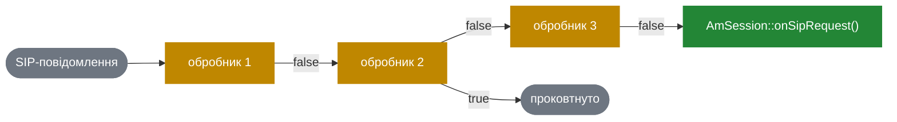
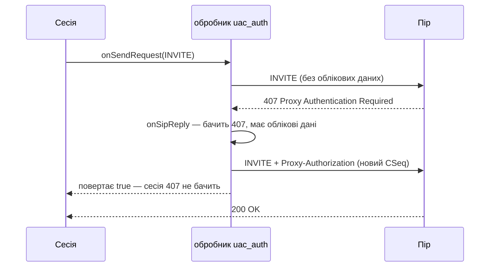

# 4.4 Обробники подій сесії

> [!NOTE]
> Обробник подій сесії — це перехоплювач: невеликий об'єкт, прикріплений до сесії, який бачить
> кожне SIP-повідомлення раніше за неї і може його змінити, відреагувати на нього або проковтнути.
> Це відповідь SEMS на «мені потрібна ця поведінка в багатьох застосунках, не редагуючи жодного».

## Інтерфейс

Увесь контракт — один заголовок, і кожен метод має реалізацію за замовчуванням:

```cpp
class AmSessionEventHandler
  : public AmObject
{
public:
  bool destroy;

  AmSessionEventHandler()
    : destroy(true) {}

  virtual int configure(AmConfigReader& conf) { return 0; }

  virtual bool process(AmEvent*) { return false; }

  virtual bool onSipRequest(const AmSipRequest& req) { return false; }
  virtual bool onSipReply(const AmSipRequest& req,
                          const AmSipReply& reply,
                          AmBasicSipDialog::Status old_dlg_status) { return false; }

  virtual bool onSendRequest(AmSipRequest& req, int& flags) { return false; }
  virtual bool onSendReply(const AmSipRequest& req, AmSipReply& reply, int& flags) { return false; }

  virtual void onRequestSent(const AmSipRequest& req) {}
  virtual void onReplySent(const AmSipRequest& req, const AmSipReply& reply) {}
  virtual void onRemoteDisappeared(const AmSipReply& reply) {}
  virtual void onLocalTerminate(const AmSipReply& reply) {}
  virtual void onFailure() {}
};
```

Звідси варто вичитати три речі.

**Вхідні гачки беруть `const`, вихідні — ні.** `onSipRequest()` може дивитись, але не змінювати
те, що приїхало. `onSendRequest()` бере не-`const` `AmSipRequest&` і `int& flags` — саме тут
обробник додає заголовки, переписує тіло або міняє поведінку відправки. Перехоплення асиметричне
навмисно: ви формуєте те, що шлете, а не те, що вам надіслали.

**`Send` і `Sent` розділені** з тієї ж причини, що й в offer/answer ([4.3](14-offer-answer.md)):
`onSendRequest()` виконується, поки повідомлення будується, і ще може його змінити;
`onRequestSent()` виконується, коли воно вже на дроті, і нічого не повертає, бо впливати вже
нема на що.

**Повернення `bool` — найважливіше.** Це не успіх і не помилка.

## Ланцюжок і що означає `true`

Обробники тримаються у векторі на сесії й викликаються через один макрос:

```cpp
#define CALL_EVENT_H(method,...) \
            do{\
                vector<AmSessionEventHandler*>::iterator evh = ev_handlers.begin(); \
                bool stop = false; \
                while((evh != ev_handlers.end()) && !stop){ \
                    stop = (*evh)->method( __VA_ARGS__ ); \
                    evh++; \
		} \
		if(stop) \
                    return; \
            }while(0)
```

Уважно прочитайте три останні рядки.

> [!WARNING]
> Повернути `true` означає не просто зупинити ланцюжок — макрос далі виконує `return`, кидаючи
> **весь метод сесії, який його викликав**. Обробник, що повернув `true` з `onSipRequest()`,
> означає: власний `onSipRequest()` сесії не виконається ніколи, і застосунок не побачить
> повідомлення взагалі. Це і є задумана сила механізму, і це ж — те, як тихий баг починає
> ковтати трафік. Повертайте `true`, лише коли ви справді обробили повідомлення, і саме з того
> гачка, з якого треба.

Порядок має значення, і це порядок реєстрації. Поля пріоритету немає.



## Час життя: прапорець `destroy`

```cpp
  bool destroy;
  AmSessionEventHandler() : destroy(true) {}
```

Типово `true`: сесія видаляє обробник, коли завершується. Це пасує звичному випадку — один
примірник обробника на сесію.

Виставте `false`, і сесія об'єкт не чіпатиме — для обробника, спільного між сесіями, або
такого, яким володіє модуль, що його створив. Помилка тут дає або витік, або подвійне
звільнення, і жодна з відмов не гучна. Вирішуйте свідомо.

## `AmUACAuth` — показовий приклад

Автентифікація — канонічний обробник, бо має рівно ту форму, під яку механізм і будувався:
наскрізна, з станом між двома повідомленнями, і потрібна багатьом непов'язаним застосункам.

```cpp
class AmUACAuth {
  ...
  static UACAuthCred* unpackCredentials(const AmArg& arg);
  static bool enable(AmSession* s);
};
```

`AmUACAuth::enable(session)` — увесь публічний API. Що він робить:

1. Дістає `AmSessionEventHandlerFactory` модуля `uac_auth` з `AmPlugIn`.
2. Створює примірник обробника для цієї сесії.
3. Додає його у вектор обробників сесії.

Далі потік такий:



Застосунок попросив дзвінок і отримав дзвінок. Він так і не дізнався, що був челендж. У цьому
вся цінність: `AmSipRegistration` ([9.1](31-registrar-client.md)), автентифікація A- і B-ноги в
SBC ([6.3](23-sbc.md)) і кожен вихідний застосунок ділять одну реалізацію digest-автентифікації,
і в жодному з них немає жодного її рядка.

Це ще й чиста ілюстрація того, коли повернення `true` є правильним: 407 *справді* був повністю
оброблений, і передати його застосунку було б активно шкідливо — той вирішив би, що дзвінок
провалився.

## Коли писати свій

Обробник подій сесії — правильний інструмент, коли поведінка є **наскрізною, рівня SIP і
посесійною**:

- додавання чи зрізання заголовків на всьому, що сесія шле,
- відповідь на челенджі, як робить `uac_auth`,
- session timers, refresh'і, keepalive,
- логування або генерація CDR, що мусить бачити кожне повідомлення,
- політика, здатна відхилити повідомлення до того, як його побачить застосунок.

Це неправильний інструмент, коли поведінка належить одному застосунку (кладіть у застосунок),
коли їй треба бачити медіа (це ланцюжок `AmAudio`, [5.3](18-audio-pipeline.md)) або коли це
насправді маршрутизація дзвінків (їй місце в проксі або в модулі call control у SBC,
[6.5](23c-sbc-call-control.md)).

## Реєстрація фабрики

Обробники — плагіни, як і все інше ([4.2](13-session-container-and-factories.md)):

```cpp
class AmSessionEventHandlerFactory: public AmPluginFactory
{
  ...
  virtual bool onInvite(const AmSipRequest& req, AmConfigReader& cfg)=0;
  virtual bool onInvite(const AmSipRequest& req, AmArg& session_params, AmConfigReader& cfg);
};
```

```cpp
EXPORT_SESSION_EVENT_HANDLER_FACTORY(MyHandlerFactory, "my_handler");
```

Зверніть увагу: `onInvite()` фабрики повертає `bool`, а не вказівник на обробник — у неї
питають «ти хочеш прикріпитись до цього дзвінка?». Обробник може відмовитись на конкретному
дзвінку, спираючись на запит — наприклад, автентифікувати дзвінки в один домен і не
автентифікувати в інший — і сесії не треба знати цю політику.
