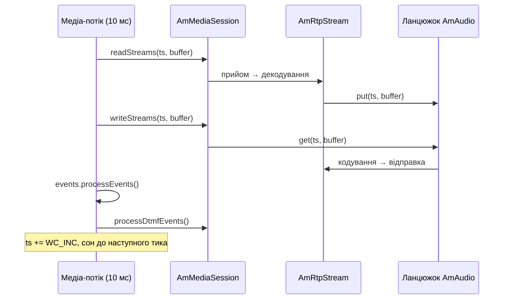

# 5.1 Медіа-процесор

> [!IMPORTANT]
> Медіа-площина керується **годинником**, а не подіями. Ніщо в ній не чекає на пакет.
> Фіксований набір потоків прокидається кожні 10 мс, обходить свій список сесій і тягне та
> штовхає аудіо для кожної. Уся поведінка медіа в SEMS під навантаженням випливає з цього одного
> рішення.

## `AmMediaSession`

Щоб опинитись на медіа-шляху, об'єкт реалізує один інтерфейс:

```cpp
class AmMediaSession
{
  private:
    AmCondition<bool> processing_media;
  public:
    virtual int readStreams(unsigned long long ts, unsigned char *buffer) = 0;
    virtual int writeStreams(unsigned long long ts, unsigned char *buffer) = 0;
    virtual void processDtmfEvents() = 0;
    virtual void clearAudio() = 0;
    virtual void clearRTPTimeout() = 0;
    virtual void onMediaProcessingStarted() { processing_media.set(true); }
    virtual void onMediaProcessingTerminated() { processing_media.set(false); }
    virtual bool isProcessingMedia() { return processing_media.get(); }
    virtual bool isDetached() { return !isProcessingMedia(); }
};
```

Його реалізує `AmSession` ([4.1](12-amsession.md)), і його ж реалізує `AmB2BMedia`
([6.2](22-b2b-media.md)) — саме так B2BUA кладе на процесор *один* медіа-об'єкт на дві ноги
замість двох.

Зверніть увагу: буфер **передається ззовні**, а не належить сесії. Він належить потоку процесора
й перевикористовується для кожної сесії на цьому потоці, кожного тика:

```cpp
  unsigned char   buffer[AUDIO_BUFFER_SIZE];
```

де `AUDIO_BUFFER_SIZE` визначено в `amci/amci.h` як `(1<<13)` — 8 КБ, один спільний чернетковий
буфер на потік. Сесії нічого не алокують на тик, і ніщо не має права тримати вказівник у нього
після повернення з `readStreams()`/`writeStreams()`.

`isDetached()` — прапорець, яким решта системи питає «а аудіо цієї сесії справді працює?»: сесія
може існувати, тримати діалог і не бути в жодному медіа-списку.

## Тик

```cpp
void AmMediaProcessorThread::run()
{
  ...
  tick.tv_sec  = 0;
  tick.tv_usec = 1000*WC_INC_MS;

  gettimeofday(&now,NULL);
  timeradd(&tick,&now,&next_tick);

  while(!stop_requested.get()){

    gettimeofday(&now,NULL);

    if(timercmp(&now,&next_tick,<)){

      struct timespec sdiff,rem;
      timersub(&next_tick,&now,&diff);

      sdiff.tv_sec  = diff.tv_sec;
      sdiff.tv_nsec = diff.tv_usec * 1000;

      if(sdiff.tv_nsec > 2000000) // 2 ms
	nanosleep(&sdiff,&rem);
    }

    processAudio(ts);
    events.processEvents();
    processDtmfEvents();

    ts = (ts + WC_INC) & WALLCLOCK_MASK;
    timeradd(&tick,&next_tick,&next_tick);
  }
}
```

Три порції роботи на тик, у такому порядку: аудіо, потім власна черга подій потоку, потім DTMF.
Вони ділять один бюджет у 10 мс ([2.5](06-sizing-and-tuning.md)).

Мітка часу — це не секунди настінного годинника:

```cpp
#define WALLCLOCK_RATE 102400LL
#define WALLCLOCK_MASK 0xFFFFFFFFFFFFLL // 48 bit mask
#define WC_INC_MS 10LL /* 10 ms */
#define WC_INC ((WALLCLOCK_RATE*WC_INC_MS)/1000LL)
```

48-бітний лічильник на 102 400 тиків за секунду, що зростає на `WC_INC` (1024) за прохід.
102 400 ділиться націло на кожну частоту дискретизації, з якою працює SEMS — 8000, 16000, 32000,
48000 — тож переведення системної мітки в годинник будь-якого кодека є точною цілочисельною
арифметикою без дрейфу. Це і є вся причина дивної на вигляд константи.

`SYSTEM_SAMPLECLOCK_RATE` дорівнює 32000: усередині аудіо носиться на 32 кГц і ресемплиться на
краях ([5.3](18-audio-pipeline.md)).

## Callgroups

Це та частина медіа-процесора, яка справді розумна, і з конфігурації її не видно:

```cpp
class AmMediaProcessor
{
  unsigned int num_threads;
  AmMediaProcessorThread**  threads;
  std::map<string, unsigned int> callgroup2thread;
  std::multimap<string, AmMediaSession*> callgroupmembers;
  std::map<AmMediaSession*, string> session2callgroup;
  AmMutex group_mut;
  ...
public:
  void addSession(AmMediaSession* s, const string& callgroup);
  void changeCallgroup(AmMediaSession* s, const string& new_callgroup);
};
```

Сесії розподіляються по потоках не поодинці, а **групами дзвінків**, і кожна сесія групи
потрапляє на *той самий* потік.

Причина — конференції. Десять учасників мікшера читають із одного `AmMultiPartyMixer` і пишуть у
нього ([5.3](18-audio-pipeline.md)). Якби вони були розкидані по десяти потоках, кожен семпл
перетинав би лок. Прибиті до одного потоку, мікшер чіпає рівно один потік, і на аудіо-шляху лок
не потрібен зовсім.

Те саме стосується двох ніг B2BUA: та сама група, той самий потік, тож релей A→B є копіюванням
пам'яті, а не синхронізованою передачею ([6.2](22-b2b-media.md)).

`changeCallgroup()` існує тому, що дзвінки переміщуються: викликач, переведений у конференцію,
мусить мігрувати на потік цієї конференції.

> [!WARNING]
> Callgroups означають, що навантаження розподіляється **на групу, а не на сесію**. Конференція
> на 200 учасників — це одна група і, отже, один потік, скільки б `media_processor_threads` ви
> не налаштували. `AmMediaProcessorThread::getLoad()` існує, щоб процесор міг обрати найменш
> завантажений потік для *нової* групи, але розділити наявну він не може. Якщо одна конференція
> насичує потік, більше потоків не допоможе — потрібно менше учасників на мікшер або інша
> топологія ([11.2](41-topologies-and-ha.md)).

## Прикріплення й від'єднання

```cpp
  enum { InsertSession, RemoveSession, SoftRemoveSession, ClearSession };

  void addSession(AmMediaSession* s, const string& callgroup);
  void removeSession(AmMediaSession* s);
  void clearSession(AmMediaSession* s);
  void softRemoveSession(AmMediaSession* s);
```

Чотири способи піти, бо йти справді делікатно: власний потік сесії хоче завершитись, тоді як
медіа-потік може бути посеред тика й тримати на неї вказівник.

| Операція | Значення |
|---|---|
| `InsertSession` | Прикріпити, створивши групу за потреби |
| `RemoveSession` | Від'єднати з підтвердженням — той, хто кличе, чекає, поки медіа-потік відпустить |
| `SoftRemoveSession` | Від'єднати без очікування; коли той, хто кличе, не може блокуватись |
| `ClearSession` | Від'єднати й очистити аудіо |

Запити кладуться як події `SchedRequest` у власну чергу медіа-потоку, а не змінюють його
множину сесій напряму. Тому множину чіпає лише той потік, який її обходить — та сама дисципліна,
що й скрізь у SEMS ([2.2](03-event-system.md)).

`onMediaProcessingStarted()` і `onMediaProcessingTerminated()` — це сповіщення сесії про
прикріплення чи від'єднання, а `AmCondition<bool>` за `processing_media` — те, на чому
блокується той, кому потрібно, щоб від'єднання справді сталося.

## Увесь тик, намальований



Спершу напрямок читання, потім запису. Цей порядок важить для релея чи конференції: аудіо,
прийняте цього тика, можна переслати цього ж тика, тож мікшер додає 10 мс затримки, а не 20.

## Експлуатація

**Типово потік один.** `NUM_MEDIA_PROCESSORS` дорівнює `1` ([2.5](06-sizing-and-tuning.md)).
Піднімайте до появи реального медіа-навантаження, а не після.

**Слідкуйте за непопаданням у тик, а не за CPU.** `next_tick` зсувається безумовно; потік, що
зриває дедлайни, просто перестає спати й крутиться безперервно. Середній CPU може виглядати
комфортно, тоді як сплески вже запізнюються, а запізніле аудіо чутно.

**Поріг у 2 мс.** Потік не робитиме `nanosleep` коротший за 2 мс, з міркування, що джитер
планувальника нижче цього коштує більше, ніж economить сон. Тому слабко завантажений потік усе
одно трохи крутиться — це нормально, а не баг.

**Розмір групи — справжня одиниця ємності.** Через callgroups при сайзингу думайте про
«найбільшу групу», а не про «всього сесій».
