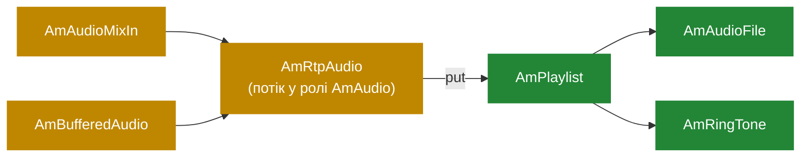

# 5.3 Аудіо-конвеєр

> [!IMPORTANT]
> Усе, що породжує або споживає аудіо в SEMS, є `AmAudio`. Файли, плейлисти, мікшери,
> генератори тонів, сам RTP-потік — один і той самий інтерфейс. Застосунок компонує їх у
> ланцюжок, а медіа-процесор тягне цей ланцюжок з одного кінця.

## Інтерфейс і дві його половини

У `AmAudio` є дві пари методів, які легко сплутати, і різниця між ними важлива:

```cpp
class AmAudio
{
  ...
protected:
  virtual int read(unsigned int user_ts, unsigned int size) = 0;
  virtual int write(unsigned int user_ts, unsigned int size) = 0;

public:
  virtual int get(unsigned long long system_ts, unsigned char* buffer, ...);
  virtual int put(unsigned long long system_ts, unsigned char* buffer, ...);
};
```

**`get()` і `put()` — публічний інтерфейс**, який кличе медіа-процесор. Вони беруть 48-бітну
системну мітку часу ([5.1](16-media-processor.md)) і спільний буфер потоку.

**`read()` і `write()` — те, що реалізує підклас.** Вони беруть *користувацьку* мітку — годинник
семплів саме цього аудіо-об'єкта — і розмір у байтах.

Між двома рівнями `get()`/`put()` роблять роботу, яку інакше повторював би кожен аудіо-об'єкт:
переводять системну мітку в годинник семплів цього об'єкта, застосовують формат і ресемплять,
якщо частоти різні. Автор підкласу пише `read()` і `write()` і ніколи не думає про переведення
годинників.

Назви — з погляду *процесора*: `get()` витягує аудіо назовні, у мережу, `put()` заштовхує
прийняте всередину. `read()` підкласу кличеться з `get()`, а `write()` — з `put()`.

## Формат і ресемплінг

```cpp
class AmAudioFormat { ... };

class AmResamplingState { ... };
class AmLibSamplerateResamplingState: public AmResamplingState { ... };
class AmInternalResamplerState: public AmResamplingState { ... };

  enum ResamplingImplementationType {
    ...
  };
```

Дві реалізації. `libsamplerate` дає високу якість і коштує більше; внутрішній ресемплер дешевший
і достатній для вузькосмугової телефонії. Який вживається — вибір збірки й конфігурації, і це
реальний важіль CPU на машині, що працює з широкою смугою.

Усередині аудіо носиться на `SYSTEM_SAMPLECLOCK_RATE`, **32 000 Гц**. Потік G.711 на 8 кГц
підвищується на вході й знижується на виході. Звучить марнотратно, і для чистого релею на 8 кГц
так і було б — саме тому режим релею оминає аудіо-ланцюжок узагалі ([5.2](17-rtp-stream.md)).
Щойно ви справді мікшуєте або обробляєте аудіо, спільна внутрішня частота є тим, що дозволяє
поєднати викликача на 8 кГц із викликачем на 16 кГц без спеціальних випадків.

## Ланцюжок



Сесія встановлює вхід і вихід, кожен — `AmAudio`. Програти промпт означає «встановити виходом
`AmAudioFile`». Програти три промпти поспіль — «встановити `AmPlaylist` із трьох елементів».

## `AmPlaylist`

```cpp
struct AmPlaylistItem { ... };

class AmPlaylist: public AmAudio
{
  ...
  int read(unsigned int user_ts, unsigned int size){ return -1; }
  int write(unsigned int user_ts, unsigned int size){ return -1; }
  ...
  void addToPlaylist(AmPlaylistItem* item);
  void addToPlayListFront(AmPlaylistItem* item);
  void close();
};
```

Зверніть увагу на заглушки: `read()` і `write()` беззастережно повертають `-1`. `AmPlaylist`
натомість перевизначає `get()`/`put()`, бо сам аудіо не породжує — він делегує поточному
елементу й просувається, коли той вичерпався. Це маршрутизатор, а не джерело.

`addToPlayListFront()` — це те, як перебивають: покладіть промпт наперед, і він зіграє наступним,
раніше за все, що було в черзі.

```cpp
class AmPlaylistSeparatorEvent : ...
class AmPlaylistSeparator { ... };
```

Сепаратор — маркерний елемент, який кладе подію в чергу сесії, коли відтворення до нього доходить
([2.2](03-event-system.md)). Це і є механізм «зіграти три промпти, потім щось зробити»:
застосунок не опитує завершення, а отримує подію на власному потоці.

## Мікшер

`AmMultiPartyMixer` — конференц-міст ([9.2](32-conference-and-mixing.md)):

```cpp
class AmMultiPartyMixer
{
  ...
  unsigned int addChannel(unsigned int external_sample_rate);
  void removeChannel(unsigned int channel_id);

  void PutChannelPacket(unsigned int channel_id, ...);
  void GetChannelPacket(unsigned int channel, ...);

  void mix_add(int* dest,int* src1,short* src2,unsigned int size);
  void mix_sub(int* dest,int* src1,short* src2,unsigned int size);
  void scale(short* buffer,int* tmp_buf,unsigned int size);
};
```

Алгоритм класичний, і весь фокус у `mix_sub`. Замість мікшувати N−1 входів окремо для кожного з
N учасників — що є O(N²) — мікшер тримає **одну суму всіх** і для кожного учасника віднімає його
власний внесок. Це робить алгоритм O(N), і саме тому мікшер тягне сотні каналів.

Проміжна сума має тип `int`, а не `short`: додавання багатьох 16-бітних семплів переповнюється,
тож мікшування йде на 32 бітах, а `scale()` в кінці повертає результат назад.

```cpp
  unsigned int addChannel(unsigned int external_sample_rate);
  std::deque<MixerBufferState>::iterator findOrCreateBufferState(unsigned int sample_rate);
```

Учасники можуть прийти з різними частотами, тож мікшер тримає `MixerBufferState` на кожну
частоту й мікшує в межах кожної. `cleanupBufferStates()` списує ті, що простоюють.

Тут же окупаються callgroups: кожен канал мікшера сидить на одному медіа-потоці, тож нічого з
цього не потребує лока на аудіо-шляху ([5.1](16-media-processor.md)).

## Решта деталей

| Клас | Що робить |
|---|---|
| `AmAudioFile` | Читає й пише файли через файловий інтерфейс `amci` ([5.4](19-codecs-and-plugins.md)) |
| `AmCachedAudioFile` | Те саме, але файл тримається в пам'яті — для промптів, що грають тисячі разів |
| `AmPrecodedFile` | Файл уже в кодеку дроту, тож відтворення оминає кодування взагалі |
| `AmAudioMixIn` | Підмішує друге джерело в основне — фон, шепіт, біп при записі |
| `AmBufferedAudio` | Відв'язує виробника від тика, поглинаючи джитер на локальному боці |
| `AmRingTone` | Генерує тони з параметрів, а не читає файл |
| `AmAudioFileRecorder` / `AmAudioMixer` | Запис і простіше мікшування ([9.3](33-msg-storage-and-voicemail.md)) |
| `AmRtpAudio` | RTP-потік в одязі `AmAudio`, щоб він ланцюжився як усе інше |

`AmPrecodedFile` вартий уваги, якої йому рідко приділяють. Сервер анонсів, що грає той самий
промпт G.711 тисячі викликачів, може зберігати його вже закодованим і economити тисячу кодувань
на тик. На машині, навантаженій анонсами, це різниця між комфортом і насиченням.

## Як писати джерело аудіо

Реалізуйте `read()`; лишіть `write()` таким, що повертає `-1`, якщо це лише вихід. Заповніть
`size` байтів за вказаною користувацькою міткою і поверніть, скільки породили. Від'ємне значення
сигналізує кінець потоку — саме воно каже `AmPlaylist` перейти до наступного елемента.

> [!WARNING]
> `read()` виконується на потоці медіа-процесора в межах бюджету 10 мс, спільного з усіма іншими
> сесіями цієї callgroup ([5.1](16-media-processor.md)). Він не має права блокуватись. Ні
> синхронного відкриття файлу, ні запиту до бази, ні мережевого виклику. Якщо аудіо мусить
> надходити звідкись повільного — буферизуйте на іншому потоці, а `read()` хай вичерпує буфер.
> `async_file_writer` є тим самим патерном для напрямку запису ([2.4](05-lifecycle.md)), і це ж
> обмеження мусив би поважати будь-який майбутній стрімінговий приймач
> ([13.4](50-media-forking-stt-tts.md)).
