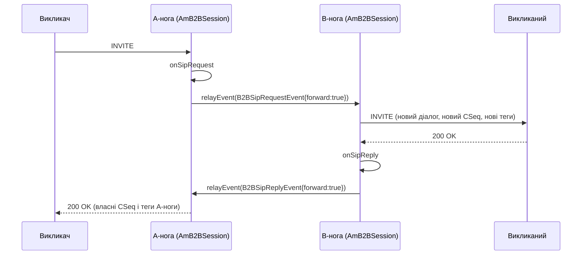

# 6.1 AmB2BSession

> [!IMPORTANT]
> B2BUA — це **дві незалежні сесії, які домовились говорити одна з одною**. Немає спільного
> діалогу, немає спільної транзакції, немає спільного стану — лише події, що перетинають межу
> між двома об'єктами `AmSession`, кожен зі своїм потоком. Кожне проєктне рішення в
> `AmB2BSession` випливає з відмови зліпити дві ноги в один об'єкт.

## Форма

```cpp
class AmB2BSession: public AmSession, protected RelayController
{
  ...
  string other_id;
  bool sip_relay_only;
  bool a_leg;
  ...
};
```

Три поля несуть увесь зв'язок:

- **`other_id`** — це *local tag* іншої ноги, а не вказівник. Ноги адресують одна одну через
  `AmEventDispatcher` рівно так само, як це робили б дві не пов'язані сесії
  ([2.2](03-event-system.md)). Якщо інша нога вже завершилась, `post()` поверне `false`, і ніщо
  не розіменує мертвий об'єкт.
- **`a_leg`** каже, який ви бік. A-нога дивиться на викликача, B-нога — на викликаного.
- **`sip_relay_only`** повністю вимикає роботу з медіа: SIP перетинає межу, аудіо — ні.

`RelayController` успадковується `protected` і має єдиний метод:

```cpp
class RelayController {
    virtual void computeRelayMask(const SdpMedia &m, bool &enable, PayloadMask &mask) = 0;
};
```

Маючи один медіа-опис із SDP, вирішити, чи релеїти його взагалі і які типи payload можуть
перетинати межу. Ця `PayloadMask` — та сама 128-бітна карта, яку енфорсить RTP-потік
([5.2](17-rtp-stream.md)): тут політика обчислюється, там застосовується.

## Події між ногами

```cpp
enum { B2BTerminateLeg,
       B2BConnectLeg,
       B2BSipRequest,
       B2BSipReply,
       B2BMsgBody };

struct B2BEvent: public AmEvent
{
  enum B2BEventType {
    B2BCore,
    B2BApplication,
  } ev_type;

  map<string, string> params;
  ...
};
```

П'ять ідентифікаторів подій і двозначний тег типу. Поділ `B2BCore` / `B2BApplication` важливий:
core-події — це машинерія B2BUA, що говорить сама з собою, application-події — власні
повідомлення застосунку, що їдуть тим самим каналом. Застосунок може вигадати власні події й
класти їх в іншу ногу, не сутикаючись із фреймворковими, а `params` дає місце для даних без
оголошення нового класу.

`B2BSipRequestEvent` і `B2BSipReplyEvent` обидва несуть `bool forward`:

```cpp
struct B2BSipEvent: public B2BEvent
{
  bool forward;
  ...
};
```

Цей прапорець і є всім рішенням про релей. Подія завжди доходить до іншої ноги; `forward` каже,
чи має та нога покласти її на дріт, чи лише спостерігати. Застосунок, який хоче побачити `180`
від викликаного, не релеючи його викликачу, ставить `forward = false`.

`B2BSipReplyEvent` додатково несе `relayed_invite`, щоб нога-отримувач знала, чи відповідь
стосується запиту, який сам прийшов з іншого боку.

## `relayEvent()`

```cpp
  virtual int relayEvent(AmEvent* ev);
```

Один метод, і це єдині двері між ногами. Він резолвить `other_id` через диспатчер подій і кладе
подію. Перевизначення — це спосіб перехопити все, що перетинає межу; саме так робить SBC
([6.3](23-sbc.md)).



Зверніть увагу, що перетинає межу, а що ні. *Повідомлення* перетинає як подія; *ідентичність
діалогу* — ніколи. INVITE B-ноги має власний Call-ID, власні теги, власний лічильник CSeq і
власний route set. Саме тому B2BUA приховує топологію задарма ([1.1](01-introduction.md)) — у
B-нозі просто немає нічого з A-ноги, чому б витікати.

## Завершення

```cpp
  virtual void terminateOtherLeg();
  virtual bool onOtherBye(const AmSipRequest& req);
  virtual bool onOtherReply(const AmSipReply& reply);
```

`terminateOtherLeg()` кладе `B2BTerminateLeg`. Інша нога сама вирішує, як це виконати — зазвичай
надіславши `BYE` і зупинившись, але застосунок може захотіти спершу зробити щось інше.

`onOtherBye()` і `onOtherReply()` обидва повертають `bool`, і конвенція та сама, що й деінде в
SEMS ([4.4](15-session-event-handlers.md)): `true` означає «оброблено, зупини типову обробку».
Застосунок, який хоче, щоб `BYE` на одній нозі *не* розносив іншу, повертає `true` з
`onOtherBye()` і лишає ногу, що вижила, живою — саме так працюють паркування дзвінка й
переспрямування.

Є ще пара помічників для нещасливого шляху:

```cpp
  void relayError(const string &method, unsigned cseq, bool forward, int sip_code, const char *reason);
  void relayError(const string &method, unsigned cseq, bool forward, int err_code);
```

Релейований запит, який не вдалося надіслати — немає маршруту, відмовив DNS
([3.2](08-transport.md)) — мусить усе одно породити відповідь на нозі-джерелі. Без цього викликач
сидів би, чекаючи відповіді, яка не може прийти.

## Три режими медіа

```cpp
  enum RTPRelayMode {
    /* audio will go directly between caller and callee
     * SDP bodies of relayed requests are filtered */
    RTP_Direct,

    /* audio will be realyed through us
     * SDP bodies of relayed requests are filtered
     * and connection addresses are replaced by us
     */
    RTP_Relay,

    /*
     * similar to RTP_Relay, but additionally transcoding
     * might be used depending on payload IDs
     */
    RTP_Transcoding
  };
```

| Режим | Медіа-шлях | Вартість | Коли |
|---|---|---|---|
| `RTP_Direct` | Викликач ↔ викликаний, повз нас | Майже нуль | Обидва ендпоінти досяжні один одному |
| `RTP_Relay` | Крізь нас, пакети пересилаються недоторканими | Одне читання + один запис на пакет | NAT, приховування топології, прив'язка медіа |
| `RTP_Transcoding` | Крізь нас, із декодуванням і перекодуванням | Чотири кроки на пакет ([5.4](19-codecs-and-plugins.md)) | Ноги не можуть домовитись про кодек |

Навіть у `RTP_Direct` SDP-тіла фільтруються — B2BUA все одно вирішує, які кодеки бачить кожен
бік. Це варто засвоїти: **політика кодеків не залежить від того, чи тече крізь вас медіа.** Ви
можете обмежити те, про що домовляться два кінці, не пронісши жодного пакета.

Супутні прапорці один-в-один лягають на прапорці `AmRtpStream` ([5.2](17-rtp-stream.md)):

```cpp
  bool rtp_relay_force_symmetric_rtp;
  bool rtp_relay_transparent_seqno;
  bool rtp_relay_transparent_ssrc;

  bool enable_dtmf_transcoding;
  bool enable_dtmf_rtp_filtering;
  bool enable_dtmf_rtp_detection;
```

Три прапорці DTMF розділені, бо це три справді різні речі: *детекція* — розпізнати цифру й
віддати її застосунку; *фільтрація* — прибрати payload'и RFC 2833 із релейованого потоку;
*транскодинг* — конвертувати між способами перенесення DTMF. Можна детектувати без фільтрації
(бачити цифри й пропускати їх далі) або фільтрувати без детекції (зрізати, не цікавлячись, які
вони були).

## Викликач і викликаний

```cpp
class AmB2BCallerSession: public AmB2BSession
{
  enum CalleeStatus {
    None=0,
    NoReply,
    Ringing,
    Connected
  };
  ...
  bool sip_relay_early_media_sdp;
};

class AmB2BCalleeSession;
```

Бік викликача несе невелику машину станів про викликаного: ще нічого, подзвонили й тиша,
дзвонить, відповіли. Це предок багатшого `CallStatus` у SBC ([6.3](23-sbc.md)), і причина, чому
SBC знадобився багатший, видна просто тут: `CalleeStatus` ніяк не виражає ні «з'єднані з одним
із кількох кандидатів», ні «від'єднуємось».

`sip_relay_early_media_sdp` — перемикач політики щодо справді незручного питання: викликаний
надіслав `183` із SDP, тож early media доступне. Релеїти цей SDP викликачу й дати ringback
текти, чи притримати до відповіді на дзвінок? Обидва варіанти законні, і жоден не виводиться —
тож це прапорець.

## `AmB2ABSession`

`AmB2ABSession` — інший варіант, і його легко прочитати як одруківку. B2**A**B: дві ноги
зшиваються **через аудіо-рівень**, а не релеєм RTP.

Кожна нога термінує медіа нормально, а зв'язує їх аудіо-міст у ланцюжку `AmAudio`
([5.3](18-audio-pipeline.md)). Це дорожче за релей — обидві ноги декодують і кодують — але
кладе аудіо туди, куди застосунок може дотягнутись, чого релей не робить. Анонс, програний у
живий дзвінок, відгалуження на запис, шепіт лише одній стороні — для цього потрібне аудіо в
ланцюжку, а не в шляху пересилання.

Обирайте `AmB2BSession` з `RTP_Relay`, коли задача — переносити пакети, і `AmB2ABSession`, коли
задача — *щось зробити* з аудіо.

## Що перевизначає застосунок

```cpp
  virtual void onB2BEvent(B2BEvent* ev);
  virtual bool onOtherBye(const AmSipRequest& req);
  virtual bool onOtherReply(const AmSipReply& reply);
  virtual int relayEvent(AmEvent* ev);
  virtual void terminateOtherLeg();
  virtual bool saveSessionDescription(const AmMimeBody& body);
  virtual bool updateSessionDescription(const AmMimeBody& body);
  virtual void computeRelayMask(const SdpMedia &m, bool &enable, PayloadMask &mask);
```

`saveSessionDescription()` і `updateSessionDescription()` — гачки, щоб утримати погоджений SDP і
застосувати його пізніше. Вони потрібні тому, що B2BUA має тримати узгодженими *дві* машини
offer/answer ([4.3](14-offer-answer.md)), і re-INVITE на одній нозі часто означає re-INVITE на
іншій.

Саме про цю проблему двох машин і йде наступний розділ ([6.2](22-b2b-media.md)): медіа не можна
налаштувати, доки обидві ноги не мають обох половин свого узгодження, а неповним це може бути
чотирма способами.
