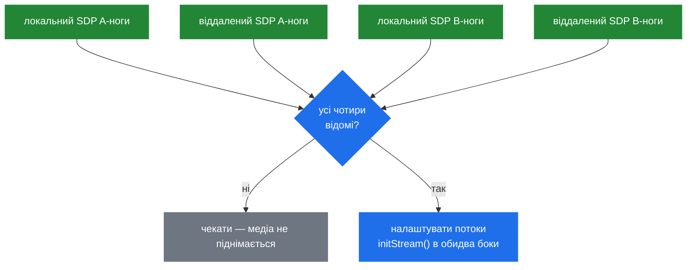

# 6.2 B2B-медіа

> [!IMPORTANT]
> `AmB2BMedia` — це **один медіа-об'єкт, що обслуговує дві ноги**. Він реалізує
> `AmMediaSession`, тож медіа-процесор прикріплює його один раз і крутить обидва напрямки з
> одного тика ([5.1](16-media-processor.md)). Дві ноги, одне прикріплення, одна callgroup, один
> потік — саме це робить B2B-медіа дешевим.

## Чому один об'єкт

```cpp
class AmB2BMedia: public AmMediaSession
{
  ...
    struct AudioStreamPair {
      AudioStreamData a, b;
      ...
      bool requiresProcessing() { return a.getInput() || b.getInput(); }
    };

    struct RelayStreamPair { ... };
    ...
    std::vector<RelayStreamPair*> relay_streams;
    AmMutex mutex;
    bool a_leg_muted, b_leg_muted;
};
```

Якби кожна нога володіла власною медіа-сесією, пакет, що приїхав на A і призначений для B,
перетинав би межу між двома медіа-потоками. Callgroups уже гарантують, що обидві ноги ділять
потік ([5.1](16-media-processor.md)); спільний медіа-*об'єкт* прибирає передачу зовсім. Релей
стає копіюванням усередині одного тика.

Об'єкт рахує посилання й тримає власний `AmMutex` — власні потоки ніг усе одно чіпають його при
зміні SDP, хоча аудіо-шляхом володіє медіа-потік.

## `AudioStreamData`

Один напрямок однієї ноги. Коментар у заголовку відверто пояснює, навіщо клас існує: параметри,
що описують потік, були розкидані, і цей клас їх збирає:

```cpp
class AudioStreamData {
    bool initialized;
    bool force_symmetric_rtp;
    bool enable_dtmf_transcoding;
    bool enable_dtmf_rtp_filtering;
    bool enable_dtmf_rtp_detection;
    bool relay_enabled;
    bool relay_paused;
    bool muted;
    bool receiving;
    ...
public:
    void setRelayStream(AmRtpStream *other);
    void setRelayPayloads(const SdpMedia &m, RelayController *ctrl);
    void setRelayDestination(const string& connection_address, int port);
    void setRelayPaused(bool paused);
    bool initStream(PlayoutType playout_type, AmSdp &local_sdp, AmSdp &remote_sdp, int media_idx);
    int writeStream(unsigned long long ts, unsigned char *buffer, AudioStreamData &src);
    void mute(bool set_mute);
    void setReceiving(bool r);
    void setInput(AmAudio *_in);
    void setDtmfSink(AmDtmfSink *dtmf_sink);
    void setLogger(msg_logger *logger);
};
```

Дві речі варті уваги.

**`setRelayPayloads()` бере `RelayController`.** Саме тут політика, обчислена в
[6.1](21-b2b-session.md), перетворюється на `PayloadMask`, яку енфорсить RTP-потік
([5.2](17-rtp-stream.md)). Контролера питають на кожен медіа-опис, тож аудіо й відео можуть мати
різні правила.

**`writeStream()` бере *джерельний* потік параметром:**

```cpp
    int writeStream(unsigned long long ts, unsigned char *buffer, AudioStreamData &src);
```

Щоб записати один напрямок, потрібні дані іншого. Ця сигнатура і є релеєм, вираженим методом.

`relay_paused` вартий окремої нотатки: потік може бути relay-enabled, але тимчасово не
пересилати — під час утримання або поки ногу переспрямовують — без розбирання й перебудови
релею.

## Два контейнери, дві вартості

```cpp
    struct AudioStreamPair { AudioStreamData a, b; ... };
    struct RelayStreamPair { ... };

    std::vector<RelayStreamPair*> relay_streams;
```

`AudioStreamPair` — повний шлях: обидва напрямки доступні аудіо-ланцюжку, декодування й
кодування, playout-буфери, усе з [частини 5](16-media-processor.md).

`RelayStreamPair` — дешевий шлях: два RTP-потоки, зшиті один з одним, і більше нічого.

А ось тест, що обирає між ними:

```cpp
      bool requiresProcessing() { return a.getInput() || b.getInput(); }
```

**Обробка потрібна, лише якщо щось подає аудіо всередину.** Відсутність входу з обох боків
означає, що нічого не породжується і не інспектується, тож увесь аудіо-ланцюжок зайвий, і пара
може релеїти. Цей один рядок і є причиною, чому SBC із десятьма тисячами дзвінків робить майже
нічого: у жодного немає входу, тож жоден не чіпає аудіо-конвеєр.

Причепіть анонс, запис або тон до будь-якого боку — і `requiresProcessing()` перемикається. Це і
є чесна ціна кожного запиту «та просто додайте біп».

## Проблема чотирьох SDP

```cpp
    bool have_a_leg_local_sdp, have_a_leg_remote_sdp;
    bool have_b_leg_local_sdp, have_b_leg_remote_sdp;
```

Одній сесії потрібне одне завершене offer/answer, перш ніж медіа зможе стартувати
([4.3](14-offer-answer.md)). B2BUA потрібно **два**, і вони завершуються незалежно й у будь-якому
порядку.



Адреси, які анонсує кожна нога, залежать від узгодження іншої ноги, тож нічого не можна
фіналізувати, доки не існують усі чотири половини. Чотири булеві прапорці, що перевіряються на
кожній SDP-події, — це весь механізм. І саме тому баг із порядком у B2BUA проявляється як тиша,
а не як помилка: прапорці просто ніколи не стали всі істинними.

Late offer ([4.3](14-offer-answer.md)) робить це наочним. B-нога відповідає, поклавши offer у
свій `200 OK`, тож `have_b_leg_remote_sdp` стає істинним лише коли приїде ACK — а доти й A-нозі
нема чим відповідати.

## Релей чи транскодинг — рішення на кожен потік

Вибір не глобальний. `AmB2BSession` обирає режим ([6.1](21-b2b-session.md)), але реальність на
рівні потоку така:

1. Якщо в жодного боку немає входу і маски payload перетинаються → релей. Без декодування.
2. Якщо в будь-якого боку є вхід → повна обробка, бо щось треба підмішати.
3. Якщо погоджені payload'и не перетинаються → транскодинг, бо іншого способу зшити їх немає.

Випадок 3 варто інженерно усувати. Якщо обидві ноги можна підвести до спільного кодека, дзвінок
релеїться; якщо ні — він коштує приблизно вчетверо ([5.4](19-codecs-and-plugins.md)). Саме для
цього й потрібна фільтрація кодеків у SBC ([6.4](23b-sbc-profiles.md)) — не заради обмеження як
такого, а щоб змусити перетин існувати.

## Утримання, заглушення і SDP, що повертається

```cpp
    bool a_leg_muted, b_leg_muted;
```

Заглушення — на кожну ногу окремо, і живе воно тут, а не на сесії, бо під час утримання
медіа-об'єкт мусить далі існувати: потоки лишаються виділеними, порти прив'язаними,
`relay_paused` стає істинним. Розібрати медіа на утриманні й перебудувати на поверненні означало
б нову пару портів і нове offer/answer — а це рівно те, що користувачі відчувають як «після
утримання звук не повернувся».

SDP для відновлення при поверненні тримає нога дзвінка, а не цей клас — `non_hold_sdp` у
`CallLeg` ([6.3](23-sbc.md)) — бо це властивість історії дзвінка, а не поточної конфігурації
медіа.

## Статистика

```cpp
class B2BMediaStatistics
{
    AmMutex mutex;
    ...
};
```

Невеликий окремий клас із власним локом, що рахує, чим займається медіа-рівень. Це природне
джерело для будь-якого експортера — і одна з конкретних відповідей на питання «що саме SEMS має
експортувати» в [13.3](49-metrics-and-observability.md).

## Логування медіа

```cpp
    void setLogger(msg_logger *logger) { a.setLogger(logger); b.setLogger(logger); }
```

І `AudioStreamPair`, і `RelayStreamPair` пробрасують `msg_logger` в обидва боки. Це той самий
інтерфейс `msg_logger`, що вживається для захоплення SIP ([3.1](07-sip-stack-overview.md)), і
виставити його на медіа-парі — це спосіб записати дзвінок у pcap на рівні пакетів.

Це ж і наявний гачок, який розширювала б реалізація HEP, замість вигадувати новий
([13.2](48-hep-and-capture.md)).
