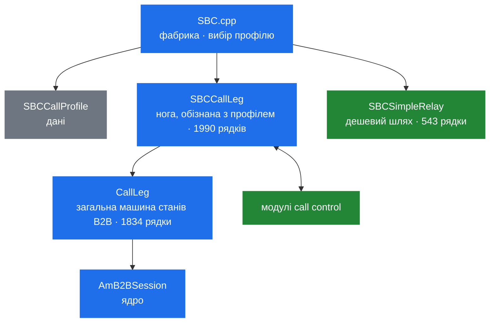

# 6.3 Застосунок SBC: архітектура

> [!IMPORTANT]
> `apps/sbc` — це близько 14 000 рядків: найбільший застосунок у дереві, більший за кілька
> частин ядра. Це не програма, що робить SBC-речі; це **фреймворк для побудови SBC**, керований
> даними, а не кодом. Прочитайте його саме так — і розмір стане зрозумілим.

## Рівні



`SBCCallProfile` — це [6.4](23b-sbc-profiles.md); модулі call control —
[6.5](23c-sbc-call-control.md); `AmB2BSession` — [6.1](21-b2b-session.md).

Поділ між `CallLeg` і `SBCCallLeg` тут головний. `CallLeg` — **загальна** машина станів ноги
B2B-дзвінка, яка нічого не знає ні про профілі, ні про заголовки, ні про політику SBC: вона
могла б обслуговувати будь-який застосунок-B2BUA. `SBCCallLeg` додає зверху все, кероване
профілем. Якщо ви пишете власний B2BUA і ядерний `AmB2BSession` для вас надто сирий — вам
потрібен саме `CallLeg`.

## Статус дзвінка — не статус діалогу

```cpp
    /** B2B call status.
     *
     * This status need not to be related directly to SIP dialog status in
     * appropriate call legs - for example the B2B call status can be
     * "Connected" though the legs have received BYE replies. */
    enum CallStatus {
      Disconnected, //< there is no other call leg we are connected to
      NoReply,      //< there is at least one call leg we are connected to but without any response
      Ringing,      //< this leg or one of legs we are connected to rings
      Connected,    //< there is exactly one call leg we are connected to, in this case AmB2BSession::other_id holds the other leg id
      Disconnecting //< we were connected and now going to be disconnected (waiting for reINVITE reply for example)
    };
```

Цей коментар у заголовку робить справжню роботу. Це вже **третя** машина станів над тим самим
дзвінком — стани транзакцій ([3.4](10-transaction-layer.md)), стани діалогу
([3.5](11-dialog-layer.md)) і тепер статус B2B-дзвінка — і вони навмисно незалежні.

Уважно прочитайте коментарі до окремих значень:

- `NoReply` каже «at least one call leg» — **множина**.
- `Connected` каже «exactly one», і лише тоді `other_id` має сенс.

Що підводить до речі, яка дивує всіх.

## SBC форкає паралельно

```cpp
    /** List of legs which can be connected to this leg, it is valid for A leg until first
     * 2xx response which moves the A leg to Connected state and terminates all
     * other B legs.
     *
     * Please note that the A/B role may change during the call leg life. For
     * example when a B leg is parked and then 'rings back on timer' it becomes
     * A leg, i.e. it creates new B leg(s) for itself. */
    std::vector<OtherLegInfo> other_legs;
```

**A-нога може мати багато B-ніг одночасно.** Їм дзвонять паралельно; перша `2xx` перемагає,
переводить A-ногу в `Connected`, а всі інші B-ноги термінуються.

Це справжній паралельний форк, реалізований у застосунку, а не в модулі маршрутизації. Це варто
знати, перш ніж робити висновок, що SEMS не вміє розкидати дзвінок по кандидатах — уміє, на
дзвінок, з ноги SBC. Чого йому бракує — це *списку пірів зі станом здоров'я*, з якого цих
кандидатів брати ([13.5](51-peer-dispatching.md)).

Друга половина коментаря дивніша й варта прочитання двічі: **ролі не фіксовані**. B-нога, яку
запаркували й яка потім передзвонює за таймером, стає A-ногою і створює власні B-ноги. Тобто
`a_leg` ([6.1](21-b2b-session.md)) описує поточну роль, а не ідентичність, і будь-який код, що
припускає інше, ламається на переведенні й паркуванні.

```cpp
    struct OtherLegInfo {
      /** local tag of the B leg */
      string id;

      /** once the B leg gets connected to the A leg A leg starts to use its
       * corresponding media_session created when the B leg is added to the list
       * of B legs */
      AmB2BMedia *media_session;

      void releaseMediaSession() {
	if (media_session) {
	  media_session->releaseReference();
	  media_session = NULL;
	}
      }
    };
```

Кожен кандидат несе **власний** `AmB2BMedia` ([6.2](22-b2b-media.md)), створений при додаванні
кандидата. Форк на три напрямки виділяє три медіа-об'єкти й три пари портів; двоє програвших
звільняються, коли переможець відповів. Тобто паралельний форк не безкоштовний — він множить
медіа-ресурси на весь час дзвінка.

## Чому кожна зміна статусу несе причину

```cpp
    struct StatusChangeCause
    {
      enum Reason {
        SipReply,
        SipRequest,
        Canceled,
        NoAck,
        NoPrack,
        RtpTimeout,
        SessionTimeout,
        InternalError,
        Other
      } reason;

      union {
        const AmSipReply *reply;
        const AmSipRequest *request;
        const char *desc;
      } param;
      ...
    };

    void updateCallStatus(CallStatus new_status, const StatusChangeCause &cause = StatusChangeCause());
```

Дев'ять причин, із union'ом, що несе об'єкт-тригер. Кожен перехід анотований тим, *чому*, і ця
причина передається в `onCallStatusChange()` і далі в модулі call control
([6.5](23c-sbc-call-control.md)).

Саме це робить можливими корисні CDR. «Дзвінок завершився» — не подія, варта запису; «дзвінок
завершився, бо вичерпався таймаут RTP» проти «бо дальній бік надіслав BYE» проти «бо не приїхав
ACK» — це три різні операційні проблеми, і enum тримає їх окремо аж до логу.

## Утримання як машина з трьох станів

```cpp
    bool on_hold; // remote is on hold
    AmSdp non_hold_sdp;
    enum { HoldRequested, ResumeRequested, PreserveHoldStatus } hold;
```

`on_hold` — поточний стан; enum — це *намір, що очікує*. `PreserveHoldStatus` — цікаве третє
значення: re-INVITE, що відбувається з якоїсь непов'язаної причини, не має випадково зняти
дзвінок з утримання, тож намір явно каже «які ми є, такими й лишаймося».

`non_hold_sdp` — медіа-опис для відновлення при поверненні. Тримати його тут, а не в
`AmB2BMedia`, — свідомо ([6.2](22-b2b-media.md)): це факт історії дзвінка, а не поточної
конфігурації медіа.

Шість із гачків call control існують саме заради цього — `holdRequested`, `holdAccepted`,
`holdRejected` і те саме для повернення — бо утримання є узгодженням, яке може провалитись, а
модулю політики треба знати, яким саме чином.

## Гачки

```cpp
    virtual void onCallStatusChange(const StatusChangeCause &cause) { }
    virtual void onCallConnected(const AmSipReply& reply) { }
    virtual void onBLegRefused(const AmSipReply& reply) { }
    virtual void onCallFailed(CallFailureReason reason, const AmSipReply *reply) { }
    virtual void onTransFinished();
    virtual void onRtpTimeout();
    virtual void onSessionTimeout();
    virtual void onNoPrack(const AmSipRequest &req, const AmSipReply &rpl);
    virtual bool getSdpOffer(AmSdp& offer) { return false; }
    virtual bool getSdpAnswer(const AmSdp& offer, AmSdp& answer) { return false; }
```

`onBLegRefused()` відокремлений від `onCallFailed()` через той самий форкінг: **відмова однієї
B-ноги не є відмовою дзвінка**, поки лишаються кандидати.

```cpp
    enum CallFailureReason {
      CallRefused, //< non-ok reply received and no more B-legs exit
      CallCanceled //< call canceled
    };
```

Коментар це проговорює: `CallRefused` вимагає «no more B-legs exit».

`getSdpOffer()` і `getSdpAnswer()` типово повертають `false`, тобто «я не маю думки, вживай
релейований SDP». Підклас, що повернув `true`, перебирає узгодження медіа для цієї ноги на себе
— саме так ногу можна відповісти локально, скажімо анонсом, а не зшивати з іншою.

## Додавання викликаного

```cpp
    void addCallee(CallLeg *callee, const AmSipRequest &relayed_invite);
    void addCallee(const string &session_tag, const AmSipRequest &relayed_invite);
    void addCallee(const string &session_tag, const string &hdrs);
    void addCallee(CallLeg *callee, const string &hdrs);
```

Чотири перевантаження за двома осями: за об'єктом чи за session tag, і з релейованим INVITE чи
лише з заголовками.

Варіант **за session tag** варто помітити — він під'єднується до ноги, яка *вже існує* десь у
процесі. Це і є механізм переведення, паркування й перехоплення: наявну запарковану ногу
чіпляють до нової A-ноги, не перестворюючи жодної.

Кожен `addCallee()` додає запис у `other_legs` і створює `AmB2BMedia` цього кандидата. Викликати
його тричі до того, як хтось відповів, — і є способом виразити паралельний форк.

## `SBCSimpleRelay`

543 рядки, які існують тому, що для типового випадку повна машинерія надлишкова. Коли дзвінку не
потрібні ні обчислення профілю, ні медіа, ні call control — лише SIP, пересланий між двома
діалогами — `SBCSimpleRelay` робить це, не конструюючи ні `SBCCallLeg`, ні `SBCCallProfile`, ні
`AmB2BMedia`.

У нього власний скорочений набір гачків в `ExtendedCCInterface` (`initUAC`, `initUAS`,
`onSipRequest`, `onSipReply`, `onB2BRequest`, `onB2BReply` — [6.5](23c-sbc-call-control.md)), тож
модуль усе одно може спостерігати релейований трафік без повноцінної ноги.

## Події між ногами

`sbc_events.h` і `CallLegEvents.h` визначають словник поверх п'яти B2B-подій ядра
([6.1](21-b2b-session.md)) — `ConnectLegEvent` видно просто в `addCallee()`:

```cpp
    void addCallee(CallLeg *callee, const AmSipRequest &relayed_invite)
      { addNewCallee(callee, new ConnectLegEvent(relayed_invite)); }
```

A-нога не кличе в B-ногу. Вона конструює подію й кладе її, а власний потік B-ноги на неї реагує.
Навіть тут, усередині одного застосунку, ноги говорять лише через систему подій
([2.2](03-event-system.md)).

## Порядок читання

`SBC.cpp` заради точки входу, далі `CallLeg.h` заради машини станів, далі `SBCCallLeg.h` заради
того, що додає профіль. `SBCCallProfile.h` — це [6.4](23b-sbc-profiles.md);
`SBCCallControlAPI.h` і `ExtendedCCInterface.h` — [6.5](23c-sbc-call-control.md).

`RegisterCache.cpp` на першому проході пропустіть — це самодостатня підсистема, розібрана в
[6.5](23c-sbc-call-control.md) разом із модулем `registrar`.
